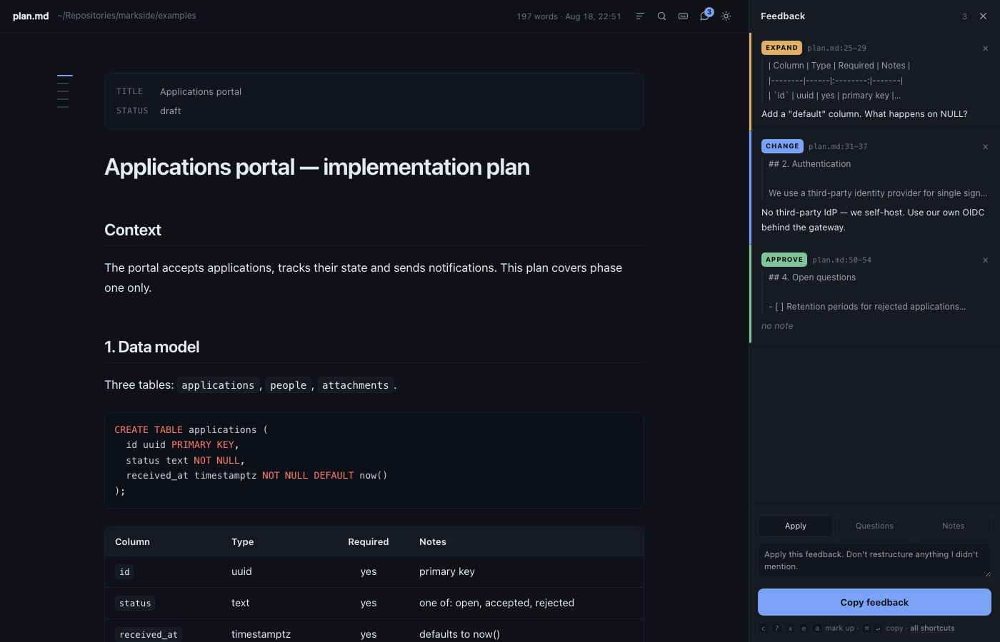
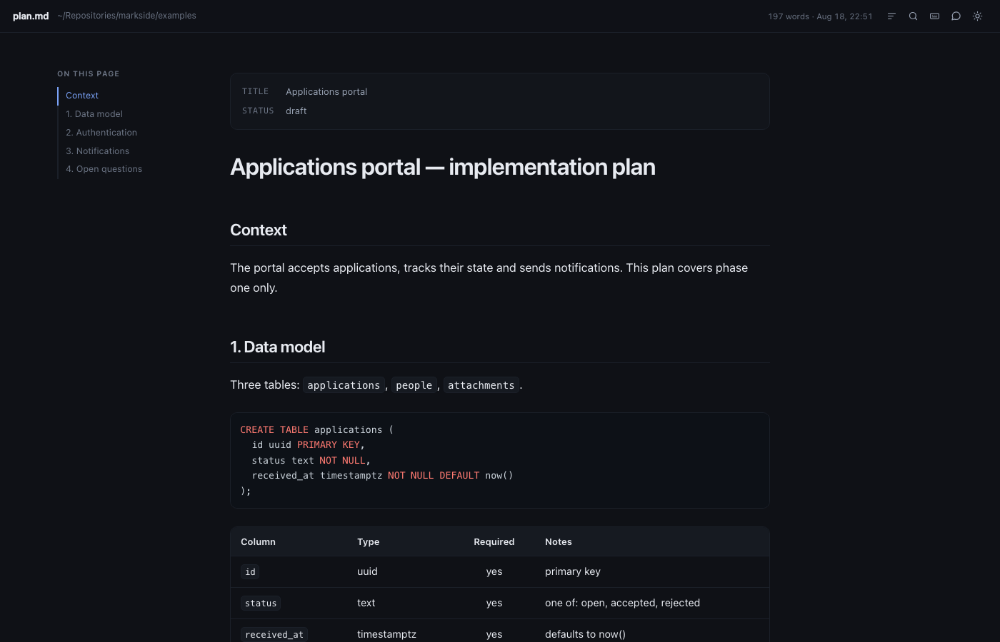

# rubricator

Read markdown in a beautiful window, mark it up like a document reviewer, and send the
notes straight to your AI coding agent.

*A rubricator was the scribe who went through a finished manuscript adding the red marks —
the headings, the corrections, the notes in the margin. Same job, different century.*

Built for one job: an agent writes a plan, you read it, and you need to say *"this bit —
no"* without retyping it into a terminal.



```bash
md                    # the workspace for this directory, README already open
md README.md          # render and open one file
md docs/              # the workspace, scoped to a subdirectory
md docs/spec.md -b    # a normal browser tab instead of an app window
git show HEAD:NOTES.md | md -
```

The argument decides which door you come in by: a file opens the reader, a directory —
or nothing at all — opens the workspace. Documents opened from the workspace carry the
full review layer, so you can mark them up without leaving it.

One bash script and a page. No build step, no runtime dependency beyond what macOS ships.
Rendering happens in the browser from pinned local copies of the libraries, so it works
offline and the page you generate with `-o` is a single self-contained file you can send
to someone.

**Two tiers.** A single file opens as a static page — self-contained, shareable, no server.
The workspace starts a small local server instead, which is what lets it fetch documents as
you open them, reindex without regenerating, and keep your notes in the repo. It listens on
127.0.0.1 with a per-run token, refuses anything cross-site, and exits by itself when you
close the window — nothing is left running. `md --static` opts out and gives you a file
again; `-o` and `-n` always do.

## Install

```bash
git clone https://github.com/TheRealVale/rubricator.git
cd rubricator
./install.sh            # or: ./install.sh --link   (edits here take effect immediately)
```

Then open a new terminal. `install.sh` puts `md` in `~/.local/bin`, fetches the three
render libraries (pinned and checksum-verified), and adds a small block to `~/.zshrc` for
tab completion.

> [!NOTE]
> oh-my-zsh binds `md` to `mkdir -p`. rubricator takes the name and gives you `mkd` instead,
> so you lose nothing. Prefer to keep it? `./install.sh --no-shell` and alias it yourself.

Requires macOS, bash and curl. `python3` is needed only for the review modes below.
Uninstall with `./uninstall.sh` — it removes what it added and leaves your documents alone.

## Reading



- dark by default, `t` toggles; the choice is remembered
- `/` or `⌘F` searches the document — every hit highlighted, `⏎` steps through, with a count
- `o` cycles the outline: full → a mini rail of ticks that expands on hover → hidden
- GitHub-flavoured markdown: tables, task lists, footnotes, syntax highlighting for ~40
  languages, mermaid diagrams, GitHub alerts (`> [!WARNING]`), YAML front matter
- `⌘P` prints with a clean light stylesheet
- `⌘/` lists every shortcut

## Reviewing

Select any text for the verb popover, or hover a block and press a key:

| Key | Verb | Means |
|:---:|------|-------|
| `c` | Change | rewrite this, here's how |
| `?` | Question | explain or justify this |
| `x` | Cut | remove this |
| `e` | Expand | too thin, go deeper |
| `n` | Note | context you want recorded — asks for nothing |
| `a` | Approve | explicitly keep as-is |

`a` and `x` save instantly; the rest open a note box. Press a verb on a **heading** and it
covers that whole section. `f` opens the panel, which you can drag wider.

`⌘⏎` copies the lot as a numbered, line-anchored prompt:

```
Feedback on docs/plan.md — 2 items.
Apply this feedback. Don't restructure anything I didn't mention.

1. QUESTION — plan.md:12-18 — "1. Data model"
   > ```sql
   > CREATE TABLE applications (
   > … (7 lines)
   Why no created_by? And shouldn't status be indexed?

2. CHANGE — plan.md:31-37 — "2. Authentication"
   > ## 2. Authentication
   > … (7 lines in this section)
   No third-party IdP — we self-host. Use our own OIDC behind the gateway.
```

Paste that into any agent. Line numbers are exact: they come from the markdown parser's
own token offsets, not guesswork.

**Notes are different.** A `n` Note records context rather than asking for a change, so it
never appears as a numbered instruction — it rides along in an appendix:

```
Notes — context, not change requests:

— plan.md:17-23 — "1. Data model"
   > ```sql
   > CREATE TABLE applications (
   > … (7 lines)
   Ties into the migration guard work from #211.
```

Which means a note can't accidentally reject a plan: with only notes outstanding the button
reads **Approve with notes**, and the approval carries them along as context.

**Across revisions.** Notes are stored per file and re-anchored by *content*, not line
number. After the agent rewrites the document, reopen it: untouched notes follow their text
to its new lines, and notes whose text is gone are marked *resolved* and greyed out. What's
left is your open-items list.

## Workspace mode

A bare `md` points rubricator at a whole repo instead of one file. `-w` does the same
thing explicitly, which is what you want in a script.

```bash
md                       # index this repo and open it
md ~/code/thing          # somewhere else
md --sessions            # also index your own agent history (local only)
md -w                    # the same thing, named explicitly
```

It walks every markdown file the repo tracks, reads `git log`, and indexes 328 documents
and 3,800 prompts in about a second — so there is nothing to cache and nothing to
invalidate. That opens as the live tier described above; `md --static` gives you the
self-contained file instead.

### The shell

One window: the **navigator** down the left, **panes** in the middle, the review **tray**
down the right, and a status strip along the bottom that says what the server is doing.

A **pane** holds any surface — a document, a session, a search, the graph, settings — and
keeps its own tabs and its own history. `⌘\` splits the window; ⌘-click anything to open it
in the split rather than here. Tabs sit at the top of each pane rather than along the bottom
of the window, because with two panes a single strip cannot say which pane a tab belongs to.
A tab owns its DOM for as long as it lives, so leaving a document for something else and
coming back keeps its annotations, its diagrams and where you were reading.

The **tray follows focus**. The review layer is one chrome for many documents, so rather
than a tray per pane there is one tray showing whichever document you are looking at, with
its name in the header. Notes are stored per document, so nothing is lost when focus moves.

`⌘K` is **find anything** — documents, sessions, your own notes and the surfaces of this
window in one list, because when you are hunting for something you rarely know which of
those it is. `⏎` opens it here, `⌘⏎` in a split, `⇥` filters by kind.

`⌘B` collapses the navigator to a rail · `⌘E` cycles its modes · `⌘1`–`⌘9` focus a pane ·
`⌘W` closes a tab · `⌘⌥[` and `⌘⌥]` step through them · `/` puts the caret in the
navigator's filter · every divider is draggable.

**All** is the navigator's first mode: one field over documents, sessions and
your own notes at once, because when you are hunting for something you remember
what it was about, not whether you wrote it down, said it to Claude, or
scribbled it in a margin. With the field empty it shows the most recent of each.

**Documents** is the tree, and the only mode that nests — directories are
how you remember where a file is. Note counts and a mark where the code a document describes
has moved on; sorting and filters are behind *sort & filter*, because most of the time you
are looking for a name. The two carets beside *tree* open and close every folder at once. Selecting a document opens it in the focused pane with the full
review layer, so marking something up never means leaving the workspace.

**Sessions**, the second mode, is your own history as something you can walk through. Every session you have
run, newest first, scoped to this repo by default. Each one shows what you asked, which
files it changed, and which documents it bears on — worked out from the overlap between the
files a session touched and the files each document describes.

**Reading one.** `history.jsonl` only ever held your half of the conversation; the other
half is in the transcript, which is read on demand — 17 MB parses in 0.05 s — and rendered
as what it was: your turns on the right, Claude's on the left, thinking collapsed to a
count, tool calls behind a disclosure, and the files it wrote as chips you can open. A
reply is not one message, so an autonomous stretch reads as the dozen exchanges it was
rather than one wall of prose. Compactions, interruptions and pasted images are marked
where they happened.

Only what you actually typed shows up as yours. A `user` record in a transcript is only a
prompt when it carries a `promptSource`; without that test a third of your half is
slash-command echoes, skill preambles and the summary injected after a compaction.

A session is **resumable** while its transcript is still on disk and **archived** once it is
gone: the prompts survive far longer than the transcripts, so most of your history can be
read and searched but not picked up again. An archived session still shows everything you
said, from the prompt index. The browser says which is which instead of
offering you a resume command that would fail — for the live ones it hands you
`cd <project> && claude -r <id>`, ready to paste.

**Search**, a surface of its own, covers every document at once, by name or by content — typing part of a filename finds
that file first, and works before its body has even been read. Matches come with context;
click a result to read it.

**Finding a conversation you half-remember.** The Sessions mode searches everything you have
ever typed, across every repository, and tells you which one it was in. That is usually the
question: not *what did I say* but *where was I when I said it*. Results carry the line that
matched, the repository, and how long ago; opening one jumps straight to that prompt with
the word highlighted. Prompt hits in the Search surface are clickable for the same reason.
Scoped to the current repository by default, with a count of how many more are elsewhere and
one button to widen.

**Stale** lists documents whose code moved on without them. Churn is counted only in the
files each document actually mentions or links, so it flags *"this spec describes code that
changed 392 times since you last touched it"* rather than *"this repo is busy"*.

**Notes**, the third mode, collects your annotations across every document — every open Question, everything
marked Cut — because what you are hunting is often your own reaction, not the text.

**With `--sessions`** a topic also resolves to the sessions that discussed it and the code
those sessions changed, ranked by how specific each file is to the topic rather than by
whether it was touched. Then **Copy dossier** puts the whole picture — documents, your open
notes, what you asked before, the files — on the clipboard for your agent.

> [!IMPORTANT]
> Session data never leaves the machine. Prompt text is scrubbed of keys, tokens, JWTs,
> private keys, `.env` lines and connection strings at index time, and `--sessions` refuses
> `--out` outright so it cannot be written to a shareable file.

## The Claude Code loop

With the hook installed you never copy anything.

```bash
./install-hook.sh          # adds one PreToolUse/ExitPlanMode hook; backs up your settings
./install-hook.sh --remove # undo
```

Claude finishes a plan → the review window opens by itself → Claude waits while you read.

| You do | Claude gets |
|---|---|
| **Approve** (`⌘⇧⏎`) | `allow` — and then Claude Code's own approval menu anyway (see below) |
| **Send feedback** (`⌘⏎`) | `deny` + your annotated notes, and it revises the plan |
| close the window | `ask` — falls back to the normal prompt |
| walk away | `ask` after nine minutes |

> [!WARNING]
> **Approve may still not skip the prompt — a fix is in, and unconfirmed.**
> Measured 2026-08-25 on `claude` 2.1.241: the hook returned
> `permissionDecision: "allow"`, the window closed, and Claude Code showed its
> approval menu regardless, so Approve cost a window and changed nothing. The
> hooks page is explicit that `allow` needs `updatedInput` paired with it for
> `ExitPlanMode`, and the hook sent none. As of 2026-08-26 it pairs the plan
> back unchanged, which should settle it — but *should* is not *does*, and
> confirming it needs one human, one plan and one keypress. This note stays up
> until someone takes it. **Send feedback** returns `deny`, needs no pairing,
> and has always worked as described. See [K5b](docs/tasks.md).

`ExitPlanMode` doesn't carry the plan text — the plan is a file the agent wrote — so the
hook reads the session transcript to find it. Feedback then anchors into that real file,
and because notes key off its path, they survive the rewrite.

Nothing here can wedge a session. Missing plan, malformed input, no `python3`, crashed
runner: every failure exits quietly and leaves the normal flow untouched. Closing the window
is never read as consent.

**Without the hook**, for any agent:

```bash
claude "$(md --review docs/plan.md)"   # blocks until you decide, prints your notes
```

## How it works

```
bin/md              bash + awk: inlines the template, libraries and your markdown
                    (base64) into one self-contained HTML file, then opens it
share/template.html the reader page: CSS, chrome, TOC, theme
share/render.js     markdown into the reader's DOM — shared by both pages, so a
                    document behaves the same wherever it is opened
share/review.*      annotation layer — anchors, verbs, storage, export
share/ui.*          outline modes, search, resizable panel, shortcuts
share/shell.*       the window: navigator, panes, tabs, palette, status strip
share/workspace.*   the repo index, and what each surface looks like
share/serve.py      the local server: ephemeral port, per-run token, idle exit
share/actions.py    the verb allowlist — the only place the page can cause anything
share/extract.py    PDF and Word into text, cached on mtime and size
share/transcript.py one conversation, parsed on demand
share/hook.py       blocking review server for --review and --hook
```

In the live tier, annotations are written to `.rubricator/notes.json` in the repo, so they
survive a cleared browser and can be grepped, diffed or committed. Rubricator adds that path
to `.git/info/exclude` rather than your `.gitignore`: nothing tracked is touched, the file
never shows up as untracked noise, and committing it stays your choice. In the static tier
they live in the browser's local storage, keyed by the document's absolute path —
the same key from either page, so a note written in the workspace is there when you open
the file on its own. Nothing is written into your files and nothing leaves the machine.

Everything is written down. [`docs/tasks.md`](docs/tasks.md) is the register — one line
per task, and a table at the top saying where each plan stands. The plans themselves keep
the reasoning and are not rewritten once shipped; when reality disagreed with one, the
disagreement is recorded in it rather than edited out.

## Watching, and the rest

The live workspace watches the files it indexed. Change one on disk and the page
says so; change the one you are reading and it reloads in place, keeping your
scroll position. Nothing to enable.

**Graph** draws which documents belong together, from the files they describe and
the sessions that touched them. It asks before laying out, because that is a real
computation and you should be the one to ask for it.

Every document carries a small **timeline**: commits as grey marks, sessions that
touched it in accent, the last edit in green. Click a session mark to open it.

```bash
md serve --port 7777        # a workspace that stays up, on a port you can bookmark
md . ../other-repo          # more than one repo in one workspace
md --deep                   # count what subagents changed, not just the main thread
```

`--deep` matters more than it sounds: work you delegated is recorded in separate
transcripts, so without it a session that did most of its editing through subagents
looks like it touched nothing. Here it is the difference between 1,286 files
attributed and 1,579.

### Extending it

Two directories, both optional:

- `~/.config/rubricator/views/*.js` — each file may call
  `RB.view({id, label, render})` and becomes a surface of its own, reachable from ⌘K
  and the surface menu. `RB` hands you the index,
  the helpers and `RB.open(rel)`.
- `~/.config/rubricator/providers/*.py` — each file may define `provide(root)`,
  and whatever it returns lands in the page as `D.extra[name]`.

## Letting it start things

Off by default. With `md --allow-launch` — or `{"allow_launch": true}` in
`~/.config/rubricator/config.json` — the workspace can hand work to a terminal:

- **Send to Claude** on an open document: a new session at the repo root, with the
  notes you just took as its first prompt. Read a plan, mark six passages, press the
  button — the conversation starts where you left off thinking.
- **Resume** or **fork** a past session, offered only where a transcript still exists.
- **Reveal** a file in Finder, or open it in your editor.

Sessions open in **iTerm** if you have it, otherwise Terminal — or whichever terminal you
pick under **Settings**. The launcher is a `.command` file handed to that application
through LaunchServices, which runs it and needs no Automation permission, so macOS never
interrupts with a dialog.

### Why it is off by default

Not ceremony. A markdown document is untrusted input — it comes from a repo you cloned, a plan
an agent wrote, a file someone sent you — and markdown carries raw HTML. Rubricator renders it
into a page that can talk to a local server, so `` in a document is not a
curiosity.

That is now blocked twice: the renderer strips scripts, event handlers and `javascript:` URLs
inside an inert `<template>` before anything is inserted, and the served page runs under a
content security policy where only scripts carrying that page's nonce may execute. Both were
tested against real payloads.

The gate stays anyway, because two walls are better than one and the second wall is code
written by the same hand as the first. Turn it on once under **Settings** and it stays on —
`--allow-launch` is for a single window, the setting is the durable answer.

### What keeps that safe

The page sends a verb and an id. It never sends a path and never sends a command; every
path is resolved on the server against the index it already holds, and every argument
goes into `argv` directly. The one thing the page may hand over is the prompt text for a
new session, and that is written to a file and read back as a single argument — a prompt
containing `$(…)`, backticks or `;` arrives as literal text, because no shell ever parses
it.

On top of that the server is loopback-only, token-gated per run, refuses anything
cross-site, and exits when the window closes. Session ids are matched against a strict
pattern before they reach a command line, and a session with no transcript is refused
rather than attempted.

## Not only markdown

PDFs and Word files are indexed, searched and read alongside markdown. Both extractors ship
with macOS — `textutil` for Word, PDFKit through the JXA bridge for PDF — so this adds no
dependency, and results are cached against mtime and size.

Extraction never holds up the index: a workspace opens on its markdown as fast as it always
did, and a document is read the first time something actually needs it. What comes back is
rendered as an ordinary document — one block per paragraph, a heading per page — which means
the reader, the review layer, the outline, search and the export all work on it unchanged. You
can mark up a page of a contract and send the quote to Claude, and it will say which page it
came from.

A PDF with no text layer says so rather than opening blank, and a password-protected one is
named rather than retried.

## Switching project

Click the repository name in the bar. The menu lists the projects you have opened before and
offers a folder chooser; picking one opens it in **its own window**, the way an editor opens a
second project — the workspace you were in keeps its panes, its notes and its watch.

This matters more than it sounds, because session search already spans every repository on the
machine: you find the conversation in `hypergol` from a `werdewaerts` workspace, and now there
is somewhere to go with it.

The page never sends a path. It either asks the server to open the chooser — a native dialog,
Standard Additions rather than app scripting, so macOS asks for nothing — or it names a project
the server itself remembered. Anything else is refused, including a traversal dressed up as a
recent one. Opening a project is deliberately *not* behind `--allow-launch`: the only thing it
can start is rubricator, on a folder you picked.

## Themes

Three, and each has a rule rather than a mood:

- **Rubric** *(default)* — warm graphite and vermilion. A rubricator was the scribe who added
  the red marks, so red here is reserved for *your* annotations and status wears earth
  pigments instead. The two never argue over the same colour.
- **Slate** — near-monochrome and cool. One steel signal; status is told by lightness and
  shape rather than hue, so nothing on screen is coloured for decoration.
- **Bone** — the light theme taken seriously: warm paper and iron-gall text, not an inverted
  dark UI.

Pick one under **Settings**, press `t` to cycle, or `md --theme slate`. The choice is stored
in the settings file *and* in the browser, so a document you open on its own matches the
workspace you chose it in.

## Settings

The workspace has a **Settings** surface: the theme, which terminal sessions open in, whether the
page may start anything at all, your editor, and whether indexing counts subagent work. Changing
what may be launched takes effect at once — no restart, and the buttons appear and
disappear with it.

Settings are stored in `~/.config/rubricator/config.json`, mode `0600`: your own config
directory, readable only by you. Nothing is written into the repositories you index and
nothing leaves the machine. The page can ask for a change but cannot invent one — only
known keys are accepted, and each value is checked before it is stored, so an editor that
is not a real program or a terminal that is not a terminal is refused by the server rather
than written to disk.

A flag on the command line beats the file: `md --allow-launch` enables launching for that
window only, and the screen says so rather than pretending the setting changed.

## Prior art

If you want this loop with more breadth than one person maintains, look at
[plannotator](https://github.com/backnotprop/plannotator) — code diffs, PR review, many
agents, team sharing. [md-annotator](https://github.com/konradmichalik/md-annotator) and
[Imark](https://imarkmd.com) solve neighbouring problems; Imark's approach of storing notes
inside the `.md` file is better than local storage if you move between machines.

rubricator's bet is different: no server, no daemon, no install beyond a script, and small
enough that you can read all of it and change the parts you don't like. The palette is one
CSS block at the top of `share/template.html`.

## Limitations

- macOS only in practice (uses `open`; the Chrome app window is a nicety, any browser works)
- notes from the workspace live in the repo, at `.rubricator/notes.json`; a static page
  keeps them in that browser profile instead. Neither syncs between machines on its own —
  the repo file does if you commit it
- a conversation can be read but not yet annotated: the review layer binds to a document,
  and a chat bubble is not one. See §7b of `docs/conversations-plan.md`
- continuing a session from the window is designed but unbuilt — `docs/continue-plan.md`
- the Claude Code hook is Claude Code specific; the clipboard and `--review` paths are not

This list used to say that raw HTML in markdown was rendered unsanitised. That stopped
being true when an `` executed during testing — see *Why it is off by
default* above for what replaced it.

## Licence

MIT — free to use, modify and sell, **at your own risk and with no warranty of any kind**.
See [LICENSE](LICENSE). The bundled render libraries have their own permissive licences,
reproduced in [THIRD-PARTY-LICENSES.md](THIRD-PARTY-LICENSES.md).
