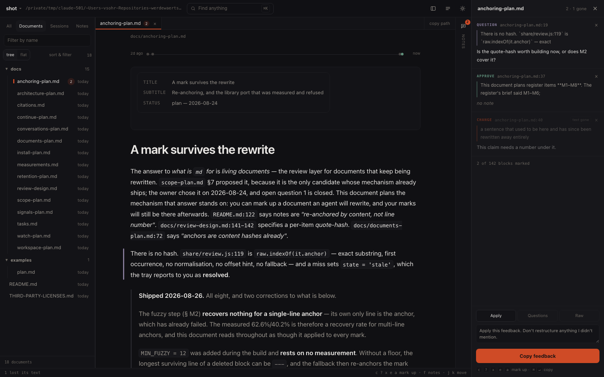
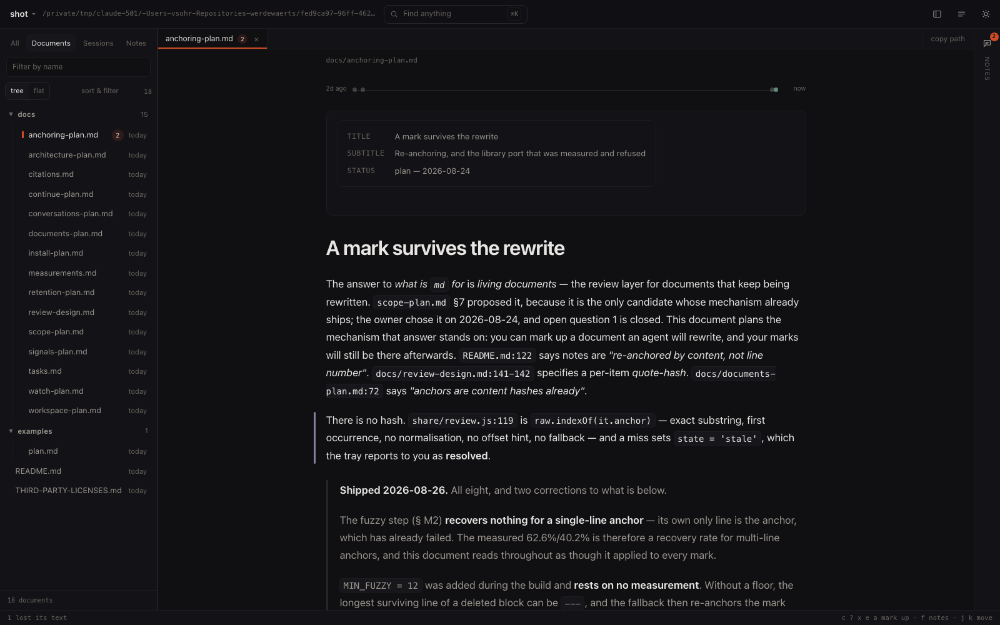

# rubricator

[](https://github.com/TheRealVale/rubricator/actions/workflows/ci.yml)
[](LICENSE)

**Mark up a document an agent is going to rewrite, and still have your marks afterwards.**
Read it, mark the parts that matter, send the marks to your agent. When it rewrites the
file, your notes follow their text to the new lines — and the ones whose text is gone say
so.

That last clause is the point. A mark that quietly relocates to the wrong paragraph, or
gets filed under *resolved* because its text was deleted, is worse than no mark. So there
are three states and the tray shows all three: **attached** (the text is still there),
**moved** (the exact text is gone, its longest surviving line was found), **text gone**.
An approval whose text changed gets a line of its own, because an approval you didn't give
is the one that costs you.

Living *documents*, not just living plans — the ADR from March, the requirements document
rewritten four times, the sixty-page vendor PDF. **PDFs and Word files are read alongside
markdown**, with no extra dependency, and they carry the whole review layer: you can mark a
paragraph of a contract, and the export tells your agent which page it came from.

It also indexes **every prompt you have typed** — 4,327 of them here, across 19 project
directories over 131 days, searchable in one field in about a second. That half is durable:
the prompt log outlives the transcripts, so you can find what you asked six weeks ago in a
repository you have since renamed.

*A rubricator was the scribe who went through a finished manuscript adding the red marks —
the headings, the corrections, the notes in the margin. Same job, different century.*



*Three marks on a document an agent has since rewritten. Two are still on their text. The
third is tagged **text gone** — the tray says `2 · 1 gone`, the status strip says `1 lost
its text`, and nothing anywhere calls it resolved.*

```bash
md                    # the workspace for this directory, README already open
md README.md          # render and open one file
md docs/              # the workspace, scoped to a subdirectory
md --sessions         # …and correlate it with your Claude Code history
md docs/spec.md -b    # a normal browser tab instead of an app window
git show HEAD:NOTES.md | md -
```

The argument decides which door you come in by: a file opens the reader, a directory —
or nothing at all — opens the workspace. Documents opened from the workspace carry the
full review layer, so you can mark them up without leaving it.

**How much of it there is.** 8,432 lines across 18 files, plus 4,935 in the five vendored
libraries it renders with. It is a bash entry point, a browser page, a small HTTP server, a
subprocess launcher and a document extractor — not, as this page used to say, *one bash
script and a page*. There is no build step and no runtime dependency beyond what macOS
ships. Rendering happens in the browser from pinned, checksum-verified local copies, so it
works offline, and the page you generate with `-o` is a single self-contained file you can
send to someone.

**What it does with your material.** Nothing leaves the machine — there is no account, no
telemetry, no network call after the one-time library fetch. Your marks are written to
`.rubricator/notes/` inside the repository they belong to, as plain JSON you can read,
diff and commit; that is the only sync there is, and it is deliberate. The prompt index
lives in `~/.cache/rubricator`, mode 0700, files 0600, excluded from Time Machine, and
expires after seven days. Credentials in prompt text are scrubbed at index time against a
shared list. A static page built with `-o` leaves your prompt corpus out entirely rather
than baking it into a file you might send, and says so on the page.

**Two tiers.** A single file opens as a static page — self-contained, shareable, no server.
The workspace starts a small local server instead, which is what lets it fetch documents as
you open them, reindex without regenerating, and keep your notes in the repo. It listens on
127.0.0.1 with a per-run token, refuses anything cross-site, and exits by itself when you
close the window — nothing is left running. `md --static` opts out and gives you a file
again; `-o` and `-n` always do.

## Install

```bash
git clone https://github.com/TheRealVale/rubricator.git
cd rubricator
./install.sh            # or: ./install.sh --link   (edits here take effect immediately)
```

Then open a new terminal. `install.sh` puts `md` in `~/.local/bin`, fetches the three
render libraries — five files, pinned and checksum-verified — and adds a small block to
`~/.zshrc` for
tab completion.

> [!NOTE]
> oh-my-zsh binds `md` to `mkdir -p`. rubricator takes the name and gives you `mkd` instead,
> so you lose nothing. Prefer to keep it? `./install.sh --no-shell` and alias it yourself.

Requires macOS, bash and curl. `python3` is needed only for the review modes below.
Uninstall with `./uninstall.sh` — it removes what it added and leaves your documents alone.

## Reading


- dark by default, `t` toggles; the choice is remembered
- `/` or `⌘F` searches the document — every hit highlighted, `⏎` steps through, with a count
- `o` cycles the outline: full → a mini rail of ticks that expands on hover → hidden
- GitHub-flavoured markdown: tables, task lists, footnotes, syntax highlighting for ~40
  languages, mermaid diagrams, GitHub alerts (`> [!WARNING]`), YAML front matter
- `⌘P` prints with a clean light stylesheet
- `⌘/` lists every shortcut

## Reviewing


Select any text for the verb popover, or hover a block and press a key:

| Key | Verb | Means |
|:---:|------|-------|
| `c` | Change | rewrite this, here's how |
| `?` | Question | explain or justify this |
| `x` | Cut | remove this |
| `e` | Expand | too thin, go deeper |
| `n` | Note | context you want recorded — asks for nothing |
| `a` | Approve | explicitly keep as-is |

`a` and `x` save instantly; the rest open a note box. Press a verb on a **heading** and it
covers that whole section. `f` opens the panel, which you can drag wider.

`⌘⏎` copies the lot as a numbered, line-anchored prompt:

```
Feedback on docs/plan.md — 2 items.
Apply this feedback. Don't restructure anything I didn't mention.

1. QUESTION — plan.md:12-18 — "1. Data model"
   > ```sql
   > CREATE TABLE applications (
   > … (7 lines)
   Why no created_by? And shouldn't status be indexed?

2. CHANGE — plan.md:31-37 — "2. Authentication"
   > ## 2. Authentication
   > … (7 lines in this section)
   No third-party IdP — we self-host. Use our own OIDC behind the gateway.
```

Paste that into any agent. Line numbers are exact: they come from the markdown parser's
own token offsets, not guesswork.

**Notes are different.** A `n` Note records context rather than asking for a change, so it
never appears as a numbered instruction — it rides along in an appendix:

```
Notes — context, not change requests:

— plan.md:17-23 — "1. Data model"
   > ```sql
   > CREATE TABLE applications (
   > … (7 lines)
   Ties into the migration guard work from #211.
```

Which means a note can't accidentally reject a plan: with only notes outstanding the button
reads **Approve with notes**, and the approval carries them along as context.

**Across revisions.** Notes are stored per file and re-anchored by *content*, not line
number. Reopen a document the agent has rewritten and it says what happened before you
scroll — *7 of your marks moved, 2 lost their text*.

Three states, because one bit was not enough. **Attached**: the text you marked is still
there, verbatim, and the mark is on it. **Moved**: the exact text is gone, but the longest
surviving line of it was found, so the mark is at that line and the tray shows both the
text you marked and what the document says there now. **Text gone**: nothing of it
survived. That last one is *not* the same as resolved, and calling it resolved — which this
tool did until phase M — reports a deletion as an accomplishment. An `approve` that moved
or lost its text is counted in a line of its own at the top of the tray, because an
approval you did not actually give is the expensive one.

The quote you marked is never overwritten. What's left is your open-items list.

## Workspace mode

A bare `md` points rubricator at a whole repo instead of one file. `-w` does the same
thing explicitly, which is what you want in a script.



```bash
md                       # index this repo and open it
md ~/code/thing          # somewhere else
md --sessions            # also index your own agent history (local only)
md -w                    # the same thing, named explicitly
```

It walks every markdown file the repo tracks, reads `git log`, and indexes 328 documents
and 3,800 prompts in about a second — so there is nothing to cache and nothing to
invalidate. That opens as the live tier described above; `md --static` gives you the
self-contained file instead.

### The shell

One window: the **navigator** down the left, **panes** in the middle, the review **tray**
down the right, and a status strip along the bottom that says what the server is doing.

A **pane** holds any surface — a document, a session, a search, your notes, settings — and
keeps its own tabs and its own history. `⌘\` splits the window; ⌘-click anything to open it
in the split rather than here. Tabs sit at the top of each pane rather than along the bottom
of the window, because with two panes a single strip cannot say which pane a tab belongs to.
A tab owns its DOM for as long as it lives, so leaving a document for something else and
coming back keeps its annotations, its diagrams and where you were reading.

The **tray follows focus**. The review layer is one chrome for many documents, so rather
than a tray per pane there is one tray showing whichever document you are looking at, with
its name in the header. Notes are stored per document, so nothing is lost when focus moves.

`⌘K` is **find anything** — documents, sessions, your own notes and the surfaces of this
window in one list, because when you are hunting for something you rarely know which of
those it is. `⏎` opens it here, `⌘⏎` in a split, `⇥` filters by kind.

`⌘B` collapses the navigator to a rail · `⌘E` cycles its modes · `⌘1`–`⌘9` focus a pane ·
`⌘W` closes a tab · `⌘⌥[` and `⌘⌥]` step through them · `/` puts the caret in the
navigator's filter · every divider is draggable.

**All** is the navigator's first mode: one field over documents, sessions and
your own notes at once, because when you are hunting for something you remember
what it was about, not whether you wrote it down, said it to Claude, or
scribbled it in a margin. With the field empty it shows the most recent of each.

**Documents** is the tree, and the only mode that nests — directories are
how you remember where a file is. Note counts and a mark where the code a document describes
has moved on; sorting and filters are behind *sort & filter*, because most of the time you
are looking for a name. The two carets beside *tree* open and close every folder at once. Selecting a document opens it in the focused pane with the full
review layer, so marking something up never means leaving the workspace.

**Sessions**, the second mode, is your own history as something you can walk through. Every session you have
run, newest first, scoped to this repo by default. Each one shows what you asked, which
files it changed, and which documents it bears on — worked out from the overlap between the
files a session touched and the files each document describes.

**Reading one.** `history.jsonl` only ever held your half of the conversation; the other
half is in the transcript, which is read on demand — the largest one here is 105.0 MB and
parses in 0.32 s (measured 2026-08-26) — and rendered
as what it was: your turns on the right, Claude's on the left, thinking collapsed to a
count, tool calls behind a disclosure, and the files it wrote as chips you can open. A
reply is not one message, so an autonomous stretch reads as the dozen exchanges it was
rather than one wall of prose. Compactions, interruptions and pasted images are marked
where they happened.

Only what you actually typed shows up as yours. A `user` record in a transcript is only a
prompt when it carries a `promptSource`; without that test a third of your half is
slash-command echoes, skill preambles and the summary injected after a compaction.

A session is **resumable** while its transcript is still on disk and **archived** once it is
gone: the prompts survive far longer than the transcripts, so most of your history can be
read and searched but not picked up again. An archived session still shows everything you
said, from the prompt index. The browser says which is which instead of
offering you a resume command that would fail — for the live ones it hands you
`cd <project> && claude -r <id>`, ready to paste.

**Search**, a surface of its own, covers every document at once, by name or by content — typing part of a filename finds
that file first, and works before its body has even been read. Matches come with context;
click a result to read it.

**Finding a conversation you half-remember.** The Sessions mode searches everything you have
ever typed, across every repository, and tells you which one it was in. That is usually the
question: not *what did I say* but *where was I when I said it*. Results carry the line that
matched, the repository, and how long ago; opening one jumps straight to that prompt with
the word highlighted. Prompt hits in the Search surface are clickable for the same reason.
Scoped to the current repository by default, with a count of how many more are elsewhere and
one button to widen.

**Stale** lists documents whose *named* files kept changing after the document stopped —
counted only in the paths each one mentions in backticks or links, so it says *"this spec
describes code that changed 392 times since you last touched it"* rather than *"this repo
is busy"*. Read it as what a document claims about code, not as a quality score: it ranks
by commits, which correlates far more with how many paths a document quotes than with its
age. It also says how many documents it could not judge at all — a document that names no
file is not fresh, it is unmeasured, and on a prose-heavy repository that is most of them.

**Notes**, the third mode, collects your annotations across every document — every open Question, everything
marked Cut — because what you are hunting is often your own reaction, not the text.

**With `--sessions`** a topic also resolves to the sessions that discussed it and the code
those sessions changed, ranked by how specific each file is to the topic rather than by
whether it was touched. Then **Copy dossier** puts the whole picture — documents, your open
notes, what you asked before, the files — on the clipboard for your agent.

> [!IMPORTANT]
> Session data never leaves the machine. Both halves of a conversation — yours and
> Claude's — are scrubbed of keys, tokens, JWTs, private keys, `.env` lines, auth headers
> and connection strings against one shared list, and `--sessions` refuses `--out` so the
> corpus cannot be written to a shareable file. A static workspace leaves prompts out
> entirely rather than baking them into a page, which costs you prompt search on that page
> and is the right trade. The index lives at `~/.cache/rubricator`, mode 0700, files 0600,
> excluded from Time Machine, and the session index expires after seven days.
>
> Three of those were not true before 2026-08-26. Claude's half of a transcript was
> assigned raw while a comment claimed otherwise; a static build wrote 8 MB of prompt text
> to a world-readable file with no flag; and the cache was `0644` and never pruned. The
> list is shared now rather than copied, which is how the first one drifted.

## The Claude Code loop

With the hook installed you never copy anything.

```
/plugin marketplace add TheRealVale/rubricator
/plugin install rubricator@rubricator
```

That is the whole install, typed inside Claude Code, and it edits nothing of yours. If you
would rather not use plugins, the script still does it the old way:

```bash
./install-hook.sh          # adds one PreToolUse/ExitPlanMode hook; backs up your settings
./install-hook.sh --remove # undo
```

Claude finishes a plan → the review window opens by itself → Claude waits while you read.

| You do | Claude gets |
|---|---|
| **Approve** (`⌘⇧⏎`) | `allow` — and then Claude Code's own approval menu anyway (see below) |
| **Send feedback** (`⌘⏎`) | `deny` + your annotated notes, and it revises the plan |
| close the window | `ask` — falls back to the normal prompt |
| walk away | `ask` after nine minutes |

**About that first row.** On 2026-08-25, measured against `claude` 2.1.241, Approve did
not skip the terminal prompt: the hook returned `permissionDecision: "allow"`, the window
closed, and Claude Code showed its approval menu anyway — so Approve cost you a window and
changed nothing. The cause is documented: for `ExitPlanMode`, `allow` has to be paired with
`updatedInput`, and the hook sent none. Since 2026-08-26 it pairs the plan back unchanged,
which should settle it. *Should* is not *does*, and the only way to know is one person, one
plan, one keypress; until someone does that, this paragraph says what is known rather than
what is hoped. **Send feedback** needs no pairing and has always worked as described.

`ExitPlanMode` hands the hook the plan directly — `planFilePath` for where the agent wrote
it, `plan` for the text — and the hook reads the path in preference to the text, because
your marks are keyed to the document's path and a plan read from its real file keeps them
across the rewrite. Searching the session transcript is still in there as a fallback for
builds that send neither, and it is a fallback rather than the mechanism: it can only find
*a* recent plan, and on a machine running two sessions that is not necessarily yours.

Nothing here can wedge a session. Missing plan, malformed input, no `python3`, crashed
runner: every failure exits quietly and leaves the normal flow untouched. Closing the window
is never read as consent.

**Without the hook**, for any agent:

```bash
claude "$(md --review docs/plan.md)"   # blocks until you decide, prints your notes
```

## How it works

```
bin/md              bash + awk: inlines the template, libraries and your markdown
                    (base64) into one self-contained HTML file, then opens it
share/template.html the reader page: CSS, chrome, TOC, theme
share/render.js     markdown into the reader's DOM — shared by both pages, so a
                    document behaves the same wherever it is opened
share/review.*      annotation layer — anchors, verbs, storage, export
share/ui.*          outline modes, search, resizable panel, shortcuts (reader only)
share/shell.*       the window: navigator, panes, tabs, palette, status strip
share/workspace.*   the repo index, and what each surface looks like
share/serve.py      the local server: ephemeral port, per-run token, idle exit
share/actions.py    the verb allowlist — the only place the page can cause anything
share/extract.py    PDF and Word into text, cached on mtime and size
share/transcript.py one conversation, parsed on demand
share/hook.py       blocking review server for --review and --hook
docs/platform.md    what is macOS-bound here, and what a Linux port would cost
.claude-plugin/     the Claude Code plugin manifest; hooks/hooks.json is the hook
```

In the live tier, annotations are written to `.rubricator/notes/<path>.json` in the repo —
one file per document, keyed by the document's path **relative to the enclosing git
repository**. That is what makes them portable: a store written in one clone loads in
another at a different path, `md .` and `md docs/` read the same marks, and `git status`
names the document whose marks changed rather than one shared blob. Each mark carries an
`at` and, where git knows one, a `by`.

They are meant to be committed, so nothing hides them. Earlier versions added `.rubricator/`
to `.git/info/exclude`; this one removes that line the first time it sees it, and says so.
Two people marking different documents never touch the same file, and a conflict, when it
comes, is a small JSON file you can resolve by hand.

In the static tier there is no server to write with, so marks go to the browser's local
storage instead. **They do not cross between the two tiers, and no version of this tool can
make them** — the workspace is served from `http://127.0.0.1:<port>` on a fresh ephemeral
port every run and a static page is `file://`, which are different origins, and different
origins do not share local storage. That is the same-origin policy doing its job, not a
limitation waiting to be fixed.

What does cross is the repository file. A static page built *after* you marked things up
carries the marks with it, because the sidecar is read at build time. So the sidecar is not
a compromise for the live tier — it is the only durable store there is, and local storage
is the fallback for the tier that has nowhere else to put anything.

**What it does write, in full**, because *nothing is written into your files* is the kind of
sentence that is easy to say and hard to keep: `.rubricator/notes/` in the repository you
pointed it at, `~/.config/rubricator/` for settings and saved searches,
`~/.cache/rubricator/` for the prompt index, and `~/.local/state/rubricator/` for the log of
plan reviews. Nothing else, and never a file git already tracks or a file it found by
indexing. Your documents are never modified — a mark is a sidecar, not an edit — and the
notes file is deliberately **not** hidden from you: it appears in `git status`, because
committing it is how two people share marks and you cannot commit a file you do not know is
there. Nothing leaves the machine.

Everything is written down. [`docs/tasks.md`](docs/tasks.md) is the register — one line
per task, and a table at the top saying where each plan stands. The plans themselves keep
the reasoning and are not rewritten once shipped; when reality disagreed with one, the
disagreement is recorded in it rather than edited out.

## Watching, and the rest

The live workspace watches the files it indexed. Change one on disk and the page
says so; change the one you are reading and it reloads in place, keeping your
scroll position. Nothing to enable.

Every document carries a small **timeline**: commits as grey marks, sessions that
touched it in accent, the last edit in green. Click a session mark to open it.

```bash
md serve --port 7777        # a workspace that stays up, on a port you can bookmark
md . ../other-repo          # more than one repo at once (read-only past the first)
md --shallow                # skip subagent transcripts; they are counted by default
```

The rest is in `md --help`, which is where a flag list stays current.

## For an agent, or a script

```bash
md --json .                 # the index, on stdout, as JSON
md --json --sessions .      # …with session ids and the files they touched
```

No server, no protocol, no process to keep alive — a flag. It prints the
documents, their headings, your marks with their anchor states and the text they
were made against, and how many commits have landed in the files each document
names. It exits 0 and starts nothing.

Two things deliberately do **not** come through that door. There is no
staleness *verdict* — the counts are there, under a field called `activity`, and
what they mean is your call, because a machine-readable field called `stale`
would be this tool deciding for you through an interface where nobody reads the
caveat. And there is no prompt text: it tells you how many prompts it withheld
and nothing else, which is the same rule that stops `--out` writing them.

Your marks are also just files. `.rubricator/notes/<path>.json` is small, plain
JSON with a version field — an agent can `cat` it without asking rubricator
anything.

## Letting it start things

Off by default. With `md --allow-launch` — or `{"allow_launch": true}` in
`~/.config/rubricator/config.json` — the workspace can hand work to a terminal:

- **Send to Claude** on an open document: a new session at the repo root, with the
  notes you just took as its first prompt. Read a plan, mark six passages, press the
  button — the conversation starts where you left off thinking.
- **Resume** or **fork** a past session, offered only where a transcript still exists.
- **Reveal** a file in Finder, or open it in your editor.

Sessions open in **iTerm** if you have it, otherwise Terminal — or whichever terminal you
pick under **Settings**. The launcher is a `.command` file handed to that application
through LaunchServices, which runs it and needs no Automation permission, so macOS never
interrupts with a dialog.

### Why it is off by default

Not ceremony. A markdown document is untrusted input — it comes from a repo you cloned, a plan
an agent wrote, a file someone sent you — and markdown carries raw HTML. Rubricator renders it
into a page that can talk to a local server, so `` in a document is not a
curiosity.

That is now blocked twice: the renderer strips scripts, event handlers and `javascript:` URLs
inside an inert `<template>` before anything is inserted, and the served page runs under a
content security policy where only scripts carrying that page's nonce may execute. Both were
tested against real payloads.

The gate stays anyway, because two walls are better than one and the second wall is code
written by the same hand as the first. Turn it on once under **Settings** and it stays on —
`--allow-launch` is for a single window, the setting is the durable answer.

### What keeps that safe

The page sends a verb and an id. It never sends a path and never sends a command; every
path is resolved on the server against the index it already holds, and every argument
goes into `argv` directly. The one thing the page may hand over is the prompt text for a
new session, and that is written to a file and read back as a single argument — a prompt
containing `$(…)`, backticks or `;` arrives as literal text, because no shell ever parses
it.

On top of that the server is loopback-only, token-gated per run, refuses anything
cross-site, and exits when the window closes. Session ids are matched against a strict
pattern before they reach a command line, and a session with no transcript is refused
rather than attempted.

## Not only markdown

PDFs and Word files are indexed, searched and read alongside markdown. Both extractors ship
with macOS — `textutil` for Word, PDFKit through the JXA bridge for PDF — so this adds no
dependency, and results are cached against mtime and size.

Extraction never holds up the index: a workspace opens on its markdown as fast as it always
did, and a document is read the first time something actually needs it. What comes back is
rendered as an ordinary document — one block per paragraph, a heading per page — which means
the reader, the review layer, the outline, search and the export all work on it unchanged. You
can mark up a page of a contract and send the quote to Claude, and it will say which page it
came from.

A PDF with no text layer says so rather than opening blank, and a password-protected one is
named rather than retried.

## Switching project

Click the repository name in the bar. The menu lists the projects you have opened before and
offers a folder chooser; picking one opens it in **its own window**, the way an editor opens a
second project — the workspace you were in keeps its panes, its notes and its watch.

This matters more than it sounds, because session search already spans every repository on the
machine: you find the conversation in one repository from another repository's workspace, and
now there is somewhere to go with it.

The page never sends a path. It either asks the server to open the chooser — a native dialog,
Standard Additions rather than app scripting, so macOS asks for nothing — or it names a project
the server itself remembered. Anything else is refused, including a traversal dressed up as a
recent one. Opening a project is deliberately *not* behind `--allow-launch`: the only thing it
can start is rubricator, on a folder you picked.

## Settings

The workspace has a **Settings** surface: the theme, which terminal sessions open in, whether the
page may start anything at all, your editor, and whether indexing counts subagent work. Changing
what may be launched takes effect at once — no restart, and the buttons appear and
disappear with it.

Settings are stored in `~/.config/rubricator/config.json`, mode `0600`: your own config
directory, readable only by you. Nothing is written into the repositories you index and
nothing leaves the machine. The page can ask for a change but cannot invent one — only
known keys are accepted, and each value is checked before it is stored, so an editor that
is not a real program or a terminal that is not a terminal is refused by the server rather
than written to disk.

A flag on the command line beats the file: `md --allow-launch` enables launching for that
window only, and the screen says so rather than pretending the setting changed.

## Prior art

Numbers fetched from each project's own API on **2026-08-26**, and they will be stale by
the time you read this.

**[plannotator](https://github.com/backnotprop/plannotator)** — 8,058 stars, 1,074 commits,
148 releases, Apache-2.0, created **2025-12-28**, which is nearly eight months ahead of this
repository. It does everything here and more: PR and MR diff review, team sharing, many
agents. It registers a `PermissionRequest` hook where rubricator registers `PreToolUse`. And
it has a **Version Browser** — it saves each plan submission and shows a change badge when
the agent resubmits — which is the one thing it does that rubricator has no answer to. If
you want this loop with more breadth than one person maintains, use it.

**[PlanBridge](https://github.com/contextbridge/planbridge)** — 27 stars, MIT, localhost,
created 2026-04-29. *Precision feedback for coding agent plans*: the same idea at a similar
size.

**Moat** — hosted rather than local, which is the whole difference. No figures here because
it is not a repository to count.

**[Imark](https://imarkmd.com)** — 48 stars, MIT, created 2026-08-05. A native macOS
markdown reader that stores its notes **inside the `.md` file** as HTML comments. That is a
better answer than local storage if you move between machines, and a worse one if you mind
your documents being edited. [md-annotator](https://github.com/konradmichalik/md-annotator)
solves a neighbouring problem.

**The tools you already have.** Claude Code opens the plan in `$EDITOR` with `Ctrl+G`, and
the vendor's own VS Code extension opens it as a full Markdown document with inline
comments. Both are free, installed, and enough for many people. rubricator is worth a
window only if the verb grammar and the marks-survive-the-rewrite part are worth it to you.

**Session viewers**, if that is the half you want: [recensa](https://github.com/S40911120/recensa)
(70), [universal-session-viewer](https://github.com/tad-hq/universal-session-viewer) (18),
[cc_transcript_viewer](https://github.com/tim-hua-01/cc_transcript_viewer) (12),
[kortex](https://github.com/chicongst/kortex) (7). Several of them read transcripts more
carefully than this does.

rubricator's bet is different: no server you leave running, no account, no daemon, and a
codebase small enough to read in an evening and change the parts you don't like.

## Limitations

- **macOS.** Not *not yet* — a decision, with the six places it is load-bearing and the
  honest Linux answer to each written down in [`docs/platform.md`](docs/platform.md)
- **a mark on a single rewritten sentence is not recovered.** The fallback tries the
  anchor's own lines, longest first, so a paragraph survives its opening being rewritten —
  but a one-line mark whose one line is gone is orphaned, and says so
- notes from the workspace live in the repo, under `.rubricator/notes/`; a static page
  keeps them in that browser profile instead. Neither syncs between machines on its own —
  the repo files do if you commit them, which is the supported path and the only transport
  there is: no server, no account, no locking
- a conversation can be read but not yet annotated: the review layer binds to a document,
  and a chat bubble is not one. See §7b of `docs/conversations-plan.md`
- continuing a session from the window is designed but unbuilt — `docs/continue-plan.md`
- the Claude Code hook is Claude Code specific; the clipboard and `--review` paths are not
- **a multi-root workspace is read-only past the first repository**, and cannot be
  reopened. Deliberate: finishing it was measured against how it is actually used — four
  recent workspaces, all single paths — and refused

This list used to say that raw HTML in markdown was rendered unsanitised. That stopped
being true when an `` executed during testing — see *Why it is off by
default* above for what replaced it.

## Licence

MIT — free to use, modify and sell, **at your own risk and with no warranty of any kind**.
See [LICENSE](LICENSE). The bundled render libraries have their own permissive licences,
reproduced in [THIRD-PARTY-LICENSES.md](THIRD-PARTY-LICENSES.md).
