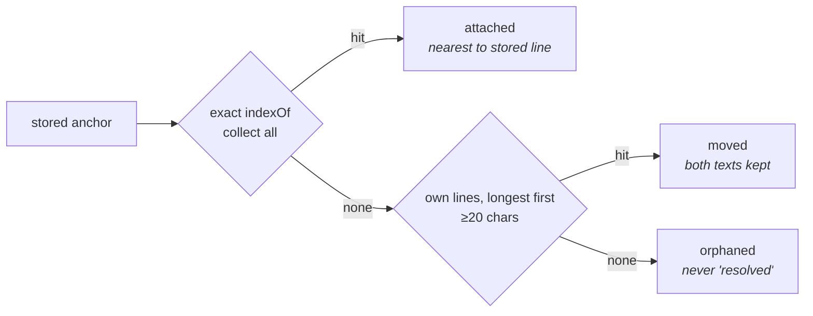

# A mark survives the rewrite

The answer to *what is `md` for* is *living documents* — the review layer for
documents that keep being rewritten. `scope-plan.md` §7 proposed it, because it
is the only candidate whose mechanism already ships; the owner chose it on
2026-08-24, and open question 1 is closed. This document plans the mechanism that
answer stands on: you can mark up a document an agent will rewrite, and your marks will
still be there afterwards. `README.md:122` says notes are *"re-anchored by
content, not line number"*. `docs/review-design.md:141-142` specifies a per-item
*quote-hash*. `docs/documents-plan.md:72` says *"anchors are content hashes
already"*.

There is no hash. `share/review.js:119` is `raw.indexOf(it.anchor)` — exact
substring, first occurrence, no normalisation, no offset hint, no fallback — and
a miss sets `state = 'stale'`, which the tray reports to you as **resolved**.

This document plans register items **M1–M8**. The register's brief said M1–M6;
M7 is here because it is a bug in the single-document invariant everything above
depends on (§11), and M8 because it falls out of M4's counting and belongs
nowhere else. Two of the eight are the whole mechanical fix and come to about
fifteen lines. The rest is the accounting: three states instead of one bit, a
record shape that survives a second checkout, and a tray that says what happened
instead of claiming an accomplishment.

It also records a refusal. There is a 525-line library that recovers somewhat
more than the fifteen lines do. The register declines it (**X23**). That decision
only survives contact with a future maintainer if the numbers behind it are on
the page, so they are, including the ones that argue the other way.

The argument is local measurement over five repositories on one machine, and it
should be re-run before it is trusted a year from now. The external facts on this
page are confined to §6 — line counts and licences fetched 2026-08-23, recorded
as `M-ANC-13` in `measurements.md` — plus one vendor claim in §11, quoted from
`citations.md` F1.

---

## 1. What was measured, not assumed

Run 2026-08-23 against `HEAD` = `a63e540`, 27 commits. The corpus is every
git-tracked `*.md` in `rubricator`, `repo A`, `repo D`, `repo B` and
`repo C` — 1,009 files, 579 of them with more than one revision.

| | measured |
|---|---|
| the re-anchor | `raw.indexOf(it.anchor)` — `share/review.js:119` |
| `hash()` in `review.js` | **one** definition (`:29`), **one** call site (`:44`), and it builds the localStorage key from the document *path* |
| substantive anchors over 2,985 consecutive commit pairs | **104,341** |
| survive a revision | **93.4%** — 6,896 (**6.6%**) vanish |
| of the vanished, similar to a surviving block | 38.6% at 0.90 · 45.9% at 0.85 · 58.0% at 0.75 · **68.7%** at 0.60 |
| ten lines — longest surviving line, plain `indexOf` | recovers **62.6% / 40.2%** at **98.6% / 96.5%** precision |
| the 525-line port, same set, 0.90 threshold | **42.1%** |
| whitespace normalisation | **0.2% / 0.0%** |
| fuzzy re-attachment vs independent ground truth | 97.7% correct at 0.60, 98.9% at 0.90 (three repos) · 94.8% / 94.6% (repo B) |
| repo B wrong-match rate, 0.60 → 0.75 → 0.90 | **5.2% → 5.0% → 5.4%** — flat |
| first-occurrence mis-anchors on realistic anchors | **8 in 25,094 (0.03%)** |
| thematic breaks (`---`) that mis-anchor | **1,636 of 1,851 (88.4%)**; 127 land on byte 0 |
| fields in a stored item | **11**, none of them a timestamp |
| `.rubricator/notes.json` on this machine | 1,412 bytes, one key, an absolute path, two items |

Two caveats travel with this table and are not negotiable.

**The two recovery tables come from a different block extractor and a different
set of repositories.** The 6.6% survival funnel is produced by an exact port of
`mapLines()` + `srcSlice()` + `addItem()` driven by rubricator's own vendored
marked 15.0.12 — the faithful unit, a whole marked block. The recovery and
precision figures come from a blank-line block splitter with its own filters.
Both restrict to substantive anchors of 40 characters or more, but not by the
same rule: the funnel drops marked's `hr` tokens, while the recovery run drops
any block opening with `---`, `|` or a code fence, so it also loses tables and
fenced code that the funnel keeps. The sets are not identical — 444 and 1,056
vanished blocks against the funnel's 6,896. The recovery table further omits
repo C, which contributes **5,044 of the funnel's 6,896** vanished
substantive anchors: every recovery and precision figure in this document is
measured on the other four repositories, and the largest corpus in the funnel was
not run through it. Do not multiply a number from one table by a number from the
other.

**6.6% is a base rate over random commits, and it is the wrong denominator for
the case that matters.** Conditional on the agent doing the thing you asked it to
do — rewriting the passage you marked *Change* — destruction is close to certain.
No corpus-wide rate speaks to that, and the plan does not need it to.

---

## 2. Who hurts, and how often

Honesty first, because it changes what is worth building. There are, on this
machine, **three real annotations on two documents**, plus five on a throwaway
fixture. Thirty-one `md-review:*` storage records exist across twenty-one
origins; five hold any items. Ten real documents were opened with the review
layer live and closed without a single verb pressed.

So nobody is being hurt yet at scale, and this phase is not justified by observed
damage. It is justified by three things that hold at n=1:

1. The README states a mechanism the code does not implement. That is the
   project's characteristic defect, and this is its purest instance.
2. The failure is *silent and reported as success*. A deleted paragraph and a
   corrected typo produce the same state, and the tray calls both **resolved**.
   An Approve that an agent quietly rewrote is removed from your open list and
   counted as an accomplishment.
3. The fix is fifteen lines. There is no version of this argument where fifteen
   lines is the expensive option.

Point 2 is the one that makes this phase come before anything that consumes
annotations. A count you cannot trust is worse than no count, and seven sites
in `workspace.js` already consume this one (`signals-plan.md` §5, register L3).

---

## 3. Step one — the nearest occurrence, not the first (M1)

`indexOf` returns the first match in the file. The item knows where it used to
be. Collect every occurrence, convert each to a line number the way `:122`
already does, and take the one nearest the stored `lineStart`.

Five lines. The honest justification is that it is five lines, because the hazard
it removes is a rounding error — see §7, where a 2.7% headline is retired.

It does fix one dramatic case. Thematic breaks are `---`, identical in every
document, and **1,636 of 1,851 `hr` anchors across the five repositories (88.4%)
resolve to the wrong offset**. **127** of those land on byte 0, because the file
opens with YAML front matter and its opening delimiter is the first `---` in the
buffer. Nobody marks a horizontal rule, so the user-facing cost is nil — but it
is a clean demonstration that the anchor carries no notion of identity at all,
and it makes a good fixture.

*Done when:* a document with `---` at three positions anchors each mark to its
own rule, and a repeated heading anchors to the section the mark was made in.

---

## 4. Step two — the longest surviving line (M2)

When the exact anchor is gone, try the anchor's own lines by plain `indexOf`,
longest first, ignoring lines under 20 characters. On a hit, keep the item alive,
record the new position, and set its anchor status to `moved`.

Measured on the same vanished set as the library port, over the same corpus:

| strategy | three repos, 444 vanished | precision | repo B, 1,056 vanished | precision |
|---|---:|---:|---:|---:|
| whitespace-normalised `indexOf` | 1 (0.2%) | — | 0 (0.0%) | — |
| first line of the block | 210 (47.3%) | 99.5% | 273 (25.9%) | 97.4% |
| **longest surviving line** | **278 (62.6%)** | **98.6%** | **425 (40.2%)** | **96.5%** |
| fuzzy, cutoff 0.90 | 187 (42.1%) | 98.9% | 312 (29.5%) | 94.6% |
| fuzzy, cutoff 0.60 | 345 (77.7%) | 97.7% | 621 (58.8%) | 94.8% |

*Precision* here is the share of re-attachments that land on the block an
independent alignment says is the right one. That alignment is computed over the
block *sequence* — driven by which blocks are identical, not by per-block text
similarity — so it is not a restatement of the thing being measured.

Three results to take from that table.

**Whitespace normalisation is worthless.** 0.2% and 0.0%. It appears in more than
one finding as a cheap win; it is not a win at all. Do not write it.

**The longest-line step beats the 525-line port at the 0.90 threshold** — 62.6%
against 42.1% on three repos, 40.2% against 29.5% on repo B — and it does so at
precision that is no worse: 98.6% against 98.9% on three repos is a wash, 96.5%
against 94.6% on repo B is not.

**First-line is not good enough.** 47.3% / 25.9%, and it is the line an agent is
most likely to have rewritten, because it is usually the topic sentence. Longest
line is the right heuristic for prose: the long line is the one carrying the
detail, and detail survives rewording of the frame.

The ladder, end to end:



*Done when:* a mark on a paragraph whose first sentence was rewritten but whose
longest line survived comes back as `moved`, with the text it was made against
still readable in the tray.

One implementation note that is not optional. `reanchor()` is called from
`openDoc()` at `review.js:564`, which runs on every open, every tab return, every
watch-mode reload and every reindex. Step one is free. Step two is a bounded loop
over one item's own lines and is also effectively free — but the moment anything
more expensive is contemplated, the cost is paid per stale item per event, not
once. Cache the miss.

---

## 5. The result that matters — a threshold does not protect you from duplication

The red team's strongest prior was that fuzzy re-anchoring would produce
*confident wrong* anchors — a mark silently relocated to a passage it was never
about — and that the honest miss was therefore the better failure. The
measurement destroyed that argument. Against independent ground truth, **95–99%
of fuzzy re-attachments land on the correct block**.

The interesting part is what happens when you turn the cutoff up. On the three
smaller repositories the wrong-match rate falls the way intuition says it should:
2.3% at 0.60, 1.7% at 0.75, 1.1% at 0.90. On repo B, the largest and most
boilerplate-heavy corpus, it does not move at all: **5.2% → 5.0% → 5.4%**.

The reason is that the wrong matches there are not noise. They are
*near-duplicates* — repeated boilerplate blocks that score high because they are
almost the same text. Raising the similarity bar excludes edits, which are the
matches you wanted, and does nothing whatever to the duplicates, which are the
matches you feared.

**So the cutoff is not the knob that protects you.** Position is the only
candidate left — near-duplicate boilerplate is distinguished by where it sits,
not by how it reads — but that is an inference from the flat rate, not a
measurement. Nothing here tested position-hinted fuzzy matching, so the
conclusion is stated at the strength the evidence carries: it is an argument
*for* carrying the offset hint and *against* "just pick a high cutoff".

That is why M1 exists as its own step and is written first, even though its own
hazard rate is 0.03%: it is not there to fix duplicate headings, it is there to
be the disambiguator every later step leans on. Any future work in this area —
including a reconsideration of X23 — inherits the rule: *disambiguate by position
or by surrounding text; do not reach for a higher threshold and call it caution.*

---

## 6. What is refused, and what it would cost (X23)

`hypothesis/client` anchors annotations with `match-quote.ts` (163 lines) over
`approx-string-match` (362 lines). 525 lines together, or **268** once comments
and blanks are stripped. Zero runtime dependencies — `approx-string-match`
declares none, and hypothesis/client bundles everything. De-typing is mechanical:
two interfaces, six casts, no generics, no classes. Rubricator would not need the
DOM half at all, because `match-quote` works on plain strings and `raw` is a
plain string.

None of that is an objection. It is refused anyway, and the register kills it as
**X23**.

The case against, in order of weight:

- **It loses to ten lines at the conservative setting.** 42.1% against 62.6%.
  It wins only by lowering the bar to 0.60, where it reaches 77.7% / 58.8% —
  the last 15 to 19 recovery points — at *worse* precision than the ten lines
  deliver.
- **The obligations are permanent and the code is not.** 525 vendored lines that
  a solo maintainer owns forever, hand de-typed with no upstream update path, in
  a project whose stated pitch is that you can read all of it.
- **It brings a product decision nobody can currently answer.** What does the
  tray render for a 0.7-confidence match? There are three annotations on this
  machine; there is no evidence with which to design that surface.
- **It brings a threshold that will be asked about.** §5 says the threshold is
  the wrong knob, and the port makes it a visible one.
- **It is not free at runtime.** `reanchor()` fires on every open, tab return,
  watch reload and reindex, per stale item.

The case for, stated fairly so it can be re-examined rather than re-argued: at
0.60 the port recovers 15 to 19 percentage points more of the vanished marks than
the ladder does, and its exact-match fast path already collects all occurrences and
disambiguates among them, which is M1 for free. If a real user, having used M2,
reports a miss the ladder could not catch, the port is still there, unchanged —
and by then there is a test corpus, which today there is not.

### The licence note, recorded here so it is not got wrong later

If it is ever ported: **`match-quote.ts` is BSD-2-Clause, not MIT.** It comes
from `hypothesis/client`, whose `package.json` declares `"license":
"BSD-2-Clause"` and whose LICENSE reads *"Copyright (c) 2013-2019 Hypothes.is
Project and contributors"* followed by the two BSD clauses. GitHub reports
`NOASSERTION` for the repository. Only `approx-string-match` is MIT.

BSD-2-Clause is permissive and compatible with rubricator's MIT, but
`THIRD-PARTY-LICENSES.md` would need the BSD-2-Clause text and the Hypothes.is
copyright line. The file is already structured for this: a table row per library
and the full text below, and it already carries two non-MIT texts — BSD-3-Clause
for highlight.js and Apache-2.0 for DOMPurify. A BSD-2-Clause row would be
routine.

Budget two costs the 525 lines do not cover: emitting `prefix`/`suffix` at
annotation time (about five lines on a string), and migrating records already on
disk.

A related note, since it will otherwise be repeated: `robertknight/anchor-quote`
is sometimes cited alongside these two. It is a 2019 self-described work in
progress, last pushed 2019-06-30, and **it carries no licence at all**
(`license: null`). It is not a candidate.

---

## 7. The duplicate-heading question, settled

Two lenses of the investigation contradicted each other. One measured a 2.7%
duplicate-heading rate in plan files and called mis-anchoring a real hazard. The
other found zero duplicates in rubricator's and repo A' documents and called
it a non-issue. Both reproduced. Neither was measuring what the code does.

Share of heading lines duplicated within their own file, at `HEAD`:

| repo | plan files | headings | duplicated | other files | headings | duplicated |
|---|---:|---:|---:|---:|---:|---:|
| rubricator | 7 | 87 | 0.00% | 4 | 60 | 0.00% |
| repo A | 55 | 286 | 0.00% | 39 | 172 | 0.00% |
| repo B | 88 | 2,254 | **2.66%** | 240 | 2,140 | 0.37% |
| repo C | 115 | 1,796 | 1.11% | 377 | 3,980 | 0.10% |
| repo D | 30 | 542 | 0.00% | 54 | 593 | 1.69% |

There is no contradiction: different corpora, both counted correctly. The
plan-file effect is real in repo B (7.1×) and repo C (11.1×), absent in
two repositories and *inverted* in repo D. Corpus-wide it is 102 duplicated
headings in 11,910, or 0.86%.

But the metric itself is the wrong one, in three ways.

1. **A duplicate group of two produces one mis-anchor, not two.** The first
   occurrence anchors correctly. Measured as the code behaves, repo B's section
   figure is **1.41%**, not 2.66%, and the five-repo figure is 82 of 11,910
   (**0.69%**).
2. **`indexOf` is a substring test, so headings also collide by prefix and by
   level.** `raw.indexOf("## Scope")` matches inside an earlier `### Scope` or
   `## Scope and limits`. Four of the 82 bad section anchors are substring
   collisions with no exact duplicate anywhere — so counting duplicate heading
   *lines*, which is what both lenses did, structurally undercounts.
3. **The denominator should be anchors a human would plausibly mark.** Restricted
   to anchors of 40 characters or more that are not thematic breaks, across all
   five repositories: **8 mis-anchors in 25,094 (0.03%)**.

That is the number. **The 2.7% headline is retired and must not be repeated** —
it is on the struck list for exactly this reason. First-occurrence ambiguity is a
rounding error; the budget belongs to fuzziness. M1 is built because it is five
lines, and because §5 needs the position hint, not because it fixes a hazard.

What survives from the duplicate-heading lens is a different defect entirely, and
a worse one — §8.

---

## 8. Three states, and the word *resolved* (M3, M4)

### Never overwrite the recorded quote (M3)

`review.js:125`, inside `reanchor()`:

```js
if (!it.partial) it.quote = srcSlice(it.lineStart, it.lineEnd);
```

and `reanchor()` ends with `save()`, so the overwrite is persisted. Tracing all
three `addItem()` call sites — the selection one behaves two ways:

- **partial selection** — guarded by `if (!it.partial)`. Protected.
- **whole-block selection** — a successful re-anchor means `indexOf` matched
  exactly, so the rewrite is a no-op modulo trailing whitespace.
- **block mark** — `quote` and `anchor` are both `srcSlice(a,b)`. No loss.
- **section mark** — `anchor` is the single heading line (`rawLines[a-1]`) and
  `quote` is the whole section. Here, and only here, `sectionEnd()` recomputes
  the span and the recorded text is silently replaced with different content.

So the correct statement is narrow and should be written narrowly: *a mark on a
heading has the text it was made against silently replaced by whatever that
section now says.* The broader claim — that any surviving note loses its text —
is over-stated and a maintainer who notices the `partial` guard will discount the
whole finding.

It is still irreversible local data loss, and the fix is one line: stop writing
`quote`. The current section text does not need a field of its own — it is
`srcSlice(lineStart, lineEnd)` on every open, and standing rule 4 says rebuild it
rather than store it.

### Three anchor states (M4)

Today one bit does two jobs. `review.js:347` prints `N · M resolved`; `:370` tags
the item `gone`; `:414` drops it from the export; and seven sites in
`workspace.js` filter it out of every aggregate view — the query view, the library
badge and its sort and filter, the Notes surface, the navigator, the omnibox, and
**the dossier at `:774`, which is the one that ships wrong data out of the tool
into an agent prompt**. Six of those seven are found by
`grep -n "i.state !== 'stale'"`; the dossier is written without spaces and is
missed by the obvious grep. Split it:

| status | meaning | today |
|---|---|---|
| `attached` | exact anchor found | `state: 'open'` |
| `moved` | recovered by the longest-line step | does not exist |
| `orphaned` | not found | `state: 'stale'`, reported as *resolved* |

This is standing rule 8 applied to the tray: *nothing matched* and *nothing could
be judged* are different answers, and today one bucket holds both. Naming the
rule is what stops a future self collapsing the split again on the grounds that
three states are fussy.

Read a legacy `state: "stale"` as `{anchor: 'orphaned'}` and never write it
again, so an old `notes.json` loads with no migration step.

**An `approve` that has moved or been orphaned is the one case that must be
surfaced rather than hidden.** It is not a new verb set and not a decision
workflow — it is one string in the tray header: *three of your seven approvals
were altered*. That is the honest headline for this whole phase.

Defer any human `done` / `dropped` state until somebody has actually run a second
round. The maintainer asked this exact question at `docs/review-design.md:244` —
*"Does the stale/resolved distinction hold up over several rounds, or does it
need an explicit done state you set yourself?"* — before any of this was
measured. The answer this phase gives is: the distinction does not hold up,
because it was never two distinctions; and the fix is to stop asserting an
outcome, not to add a fourth state nobody has needed yet.

---

## 9. Say what moved, and where you stopped (M5, M8)

`reanchor()` already knows which items moved and which lost their text. Print it
in the status strip on open — *7 of your marks moved, 2 lost their text* — and
stop. No LCS, no diff gutter, no stored snapshots of previous versions. Shadow
copies of prior document versions are killed as **X16**, on the grounds that the
premise is false: across 2,982 markdown revisions on this machine — a separate
run from §1's 2,985 pairs, a different script over a slightly different file set,
hence the difference of three — the median changes 6 to 20 lines and rewrites
2.1%–3.8% of the file, and wholesale rewrites are 0.0%–3.2% of revisions.
`git diff` is already installed and already good at a six-line change. What it
cannot tell you is which of *your marks* moved, and that is the whole of what M5
adds.

M8 is the same instinct applied to the other direction: `review.js` already
builds `blocks` on every `openDoc` and already knows how many carry a mark, so
print `3 of 41 blocks marked`. No percentage bar, no colour, no gate, no nag, no
persistence, and nowhere else in the interface.

Say plainly what this one rests on, because it is not a measured pain. Nobody on
this machine has run the review loop twice on one document — §2 — so the reviewer
who returns to a long document and wants to know where they stopped is a
supposition, not an observation. M8 is here for two other reasons. The number is
already computed: `paint()` at `review.js:162-173` sets `.has-anno` on every
marked block on every open, so printing the count is a line, not a feature. And
dwell-and-scroll telemetry (**X18**) was killed partly on the grounds that this
free version exists — its own evidence conceded the load-bearing joint was
untested, but the displacement was half the argument. If M8 is not built, X18's
kill loses that half and will be re-proposed.

---

## 10. The record on disk (M6)

`write_notes` at `share/workspace.py:526` documents itself as *"one file per repo,
keyed by absolute document path"*, and that is exactly what it does. The one file
on this machine is 1,412 bytes with a single key:

```
/Users/you/Repositories/rubricator/README.md
```

which means it cannot survive a second checkout — while `README.md:459` says
notes sync between machines *"if you commit it"*. That holds only if both
checkouts sit at the identical absolute path, which two machines rarely do. This
is the field that makes it true generally.

Four changes, one commit — and it is four rather than three because standing rule
3 was withdrawn on 2026-08-24. The old rule said rubricator was a single-reader
tool, that committing `notes.json` was permitted and unsupported, and that two
people editing one JSON blob would conflict with no help from the tool. This
document argued from that rule. The register deferred sharing because the story
was not agreed; the owner has now agreed it — multi-person use is a goal,
authorship is wanted, and git is the transport, with no server, no account, no
sync and no locking. The replacement rule's own words are in `scope-plan.md` §5,
which is the one place it is stated; nothing here restates it. So committing the
notes is the supported path, and the shape on disk has to be the shape that
supports it. That reverses one instruction below and adds one change to this
item. Everything measured about the file is unaffected.

**Relative keys.** Key by the path relative to the **enclosing git repository**,
not to the directory the human typed, and migrate absolute keys on read.
Relative to the typed directory, `md .` and `md docs/` in one repository keep two
disjoint stores — which is a nuisance for one reader and a blocker for exactly
the several-people case rule 3 now requires, since two people who invoke the tool
differently never see each other's marks. Both sides move:
`write_notes`/`read_notes` in `workspace.py`, and the client's `DISK[path]`
lookup in `workspace.js`, which currently keys off `d.abs`. The walk-up for
`.git` that the correction below asks for survives with this as its job: it
locates the notes root, falling back to the directory itself outside a
repository.

**One file per document.** `.rubricator/notes/<relative path>.json`, so that a
mark on `docs/tasks.md` lives at `.rubricator/notes/docs/tasks.md.json`. This is
the whole of the merge story and the only reason it is one commit and not a
second project: `git status` names the document whose marks changed, `git log` on
that path is that document's mark history, two people marking different documents
never touch the same file, and a conflict, when it comes, is in the one document
they both marked — a few kilobytes of JSON, which is a problem a developer
already knows how to solve. The file name mirrors the path rather than hashing
it, because the point of the split is that `git status` says *which document* and
a hash does not; the accepted cost is that on a case-insensitive filesystem two
documents differing only in case collide, which is the same limit git itself has
there. **The wire format does not move.** `data["notes"]`
(`workspace.py:576`) stays one object and `/notes` still takes `{path, store}`;
only the disk layout and the `DISK` key (`workspace.js:74`) change. That key is
the line **L3** has just touched — L3 teaches `annosFor` to read `DISK[doc.abs]`,
and M6 changes what it is keyed by — which is one more reason L3 lands first
rather than that line being written twice. Nothing else in this phase reads the
layout: M1–M5 work on items, not on files. The one place they name the file is
M4's instruction to read a legacy `state: "stale"` as `{anchor: 'orphaned'}` so
that *an old `notes.json` loads with no migration step*; that is a per-item read
and it survives untouched, but after M6 the phrase names the store rather than a
file name.

**A per-item `at` and `by`.** Eleven fields are stored per item — `id, verb,
quote, anchor, note, lineStart, lineEnd, partial, section, heading, state` — and
none of them is a timestamp. The only clock in the file is one `store.saved`
epoch per document, written by `save()`. That makes even retrospective analysis
impossible, and unlike everything else here it is *irrecoverable later*: a stamp
not written in 2026 cannot be reconstructed in 2027. One field, one line, do it
now — `at` in epoch milliseconds, like the `store.saved` already written.

`by` is the instruction this document previously gave the other way round, and
the reversal should be read rather than skated over. It said: do not write `git
config user.name` into a file the same change is encouraging you to commit, for
zero benefit while the author set is size one. The measured author set is still
size one. What changed is that a count of today's readers no longer settles the
question — the owner has named multi-person use as a goal, and a mark with no
author is exactly the thing two people cannot use. So `by` is written, for three
reasons: rule 3 makes committing the notes the supported path, `by` is what makes
one-file-per-document worth having rather than merely tidy, and the name is
already in every commit of the repository the file is committed to, so the notes
file adds no exposure the history does not already carry. It is `git config
user.name`, omitted when git does not know one and never invented — no OS account
name, no email, no hostname; a mark with no `by` renders as a mark with no `by`.
Both fields are written at creation and never rewritten, for M3's reason.

**`"v": 1`, and the right to break it.** This is a private file, not an
interface. Say so in the docstring so that the next shape change is a one-line
migration rather than a compatibility argument.

That is four changes, and three of them are still one field or one line. One file
per document is not: it is a schema change with a migration, on both sides of the
Python/JavaScript boundary, which is why M6 is the phase's only **M** (§12). What
keeps it **M** and not **L** is the wire format staying where it is. Anyone who
widens this into a per-document fetch protocol has turned a day into a week for
nothing.

### One correction to the register, from re-running it

The register's M6 says a fresh clone shows untracked noise in `git status` after
the first live run. **That does not reproduce.** `write_notes` appends
`.rubricator/` to the repository's `.git/info/exclude` in the same call that
creates the file:

```
$ git clone -q ~/Repositories/rubricator clonetest && cd clonetest
$ python3 -c "...; W.write_notes(root, str(root/'README.md'), {'items':[{'id':1}]})"
exclude has entry: True
$ git status --porcelain
$
```

Clean. The real hole is one level down, and it does reproduce. Point the tool at
a *subdirectory* of a repository — `md docs/`, which is an ordinary thing to do —
and `root/.git/info` does not exist, so no exclusion is written:

```
$ git clone -q ~/Repositories/rubricator clonetest2 && cd clonetest2
$ python3 -c "...; W.write_notes(pathlib.Path('docs').resolve(), ..., {'items':[{'id':1}]})"
root exclude touched: False
$ git status --porcelain
?? docs/.rubricator/
```

Both transcripts stand as measurements. What has changed is the conclusion they
support, because under rule 3 a clean `git status` is no longer the goal.

**The `.gitignore` half of the fix is retired.** It would put a line in
rubricator's own repository that hides the file rubricator's own maintainers are
now meant to commit — the tool's characteristic defect, in one line of
configuration. `?? docs/.rubricator/` after `md docs/` is not noise to be
suppressed; it is the notes file appearing where it should, and the second
transcript is now a demonstration of correct behaviour rather than a hole.

**The exclusion the first transcript proves also goes.** `write_notes:540-546`
stops appending `.rubricator/` to `.git/info/exclude`, and removes the line it
wrote there on the first run after the upgrade, saying so once. The tool wrote
that line, so the tool takes it back; nothing else in that file is touched.

**The walk-up survives**, with the job the relative keys gave it above: find the
enclosing repository by walking up for a `.git` directory rather than assuming
`root/.git`, and use it as the notes root. It is no longer looking for a file to
write an exclusion into.

*Done when:* a notes file written in one clone loads in a second clone of the
same repository at a different path; `md .` and `md docs/` read and write the
same marks; every new item carries `at`, and `by` wherever git knows a name; two
people marking different documents in one repository can both commit without a
conflict; `.git/info/exclude` gains no `.rubricator/` line and loses the one this
tool wrote; and `git status` after a live run shows `.rubricator/` — the last
clause is inverted from the one it replaces, and that inversion is the point.

### What the migration has to move

Re-run 2026-08-24, repeating §1's count of the notes files on this machine:

- three `.rubricator/notes.json` files exist under the repositories directory.
  One carries data — **1,412 bytes, one key, an absolute path, two items**, which
  is §1's row exactly. The other two are `{}`, two bytes each.
- **none of them is tracked.** `git ls-files` in rubricator's own repository
  returns no `notes.json` at all.
- two of the three sit inside git repositories, and both carry the `.rubricator/`
  line `write_notes` appended — line 7 of the exclude file here, line 18 in the
  other.

So the migration reads one 1,412-byte untracked file on one machine, writes two
files, deletes one, and removes two lines from two exclude files. That is the
whole of it. The third of the three marks this machine holds is not in any notes
file at all — it is the localStorage casualty named at the end of this section,
which **L3** recovers.

It is cheap **now** for the reason this item itself creates. Once the notes are
in somebody's history, a format change is a commit in their history, two people
can run the migration concurrently and conflict on the migration itself, and a
clone still on the old build writes the old shape back on the next save. Today
there is nothing to coordinate with and nobody to coordinate with. That window
closes the first time rule 3 is honoured, and this item is what honours it.

### A boundary this phase moves, and still does not cross

Standing rule 1 permits rubricator to write inside `.rubricator/` in a root it
was pointed at, inside `~/.config/rubricator/`, `~/.cache/rubricator/` and
`~/.local/state/rubricator/` (the last added for N6's review log, and enumerated
in `scope-plan.md` §5), and to a path the human typed. `.git/info/exclude` is
none of those. It is untracked, so nothing in rule 1's second sentence is
violated, and the behaviour was deliberate:
`write_notes`' own docstring says the file is *"kept out of git's way via
.git/info/exclude rather than .gitignore, so nothing tracked is touched and
committing it stays your choice"*, and `README.md:285` says the same. A proposal
to stop force-excluding `.rubricator/` was made during the investigation and
killed on exactly that reasoning; it carries no X number because it never reached
the register.

**The owner's answer to open question 2, on 2026-08-24, reverses that kill.** The
reasoning it was killed on assumed committing the notes was one reader's private
choice. It is now the supported path, and a file the tool hides from `git status`
is a file the tool hides from the person who is meant to commit it. So the append
goes, and the line already written comes back out — above, and in M6's *done
when*. Nothing widens: this is the tool writing less than it did.

What does widen is the walk-up, and the rule-1 question it raises does not
disappear with the exclude line. The notes root is the enclosing repository —
however many levels up that is, since walking for a `.git` directory is
unbounded, and `md docs/deep/nested/` walks three — so `.rubricator/` can land in
a repository the human never named. That is answered in `scope-plan.md` §5, rule
1: the enclosing repository of a root the human typed reads as that root, for
`.rubricator/` itself, which is where the notes go; the appended exclude line the
clause was first written for is withdrawn by M6. The answer is the same shape
rule 1 gives the hook's working directory, and for the same reason. It is not a
licence to widen anything else.

The other thing rule 2 settles: none of this matters if the marks are in
`localStorage`. There is a real casualty already — one genuine note on a
requirements document in another repository, made in the static `file://` tier,
present in Chrome's local storage and in no `notes.json` anywhere on the machine.
That is a storage-routing defect, not an anchoring one, and it is fixed in a
different phase — `signals-plan.md` §5, register L3. Anchoring work lands on top
of it.

---

## 11. A verb cannot land on a document you are not looking at (M7)

This one is in this document rather than a UX document because it is a
correctness bug in the invariant everything above depends on: `review.js` is
**one chrome bound to exactly one document at a time**. Its own header comment
says so, and `workspace.js:1002` repeats it — *"the review layer is one chrome
for many documents — it is re-pointed, never rebuilt"* — with the surface
comment at `:960-961` stating the contract: *"whichever document you are looking
at is the one the review layer is bound to."*

The mouse path honours that. `shell.js:390-396` focuses a pane on `mousedown`, so
the ordinary select-and-mark gesture re-points the layer before anything is
written, and `selInfo()` additionally refuses a selection that is not inside the
bound document (`if (!doc.contains(r.commonAncestorContainer)) return null`).

The keyboard path does not. The verb handler at `review.js:518` is bound to
`document`; its only guard is `live()`, which asks whether the *bound* document
is visible — and with two panes open, both are. When there is no selection it
calls `addFromBlock(v, blocks[focusIdx])`, where `blocks` and `focusIdx` belong
to the bound document and `focusIdx` was last set by `onHover`, a listener
attached only to that document's element (`focusIdx` and `onHover`,
`review.js:503-517`).

To see it: click in pane A and hover one of its blocks, so the ring lands
somewhere. That first hover is a precondition — `openDoc()` resets `focusIdx` to
`-1` at `review.js:556`, and `addFromBlock` guards `if (!el)` at `:272` and toasts
*Hover a block or select text first* rather than writing. Now move the pointer
into pane B without clicking and press a verb. The mark is written against the
block the ring is still sitting on in A, the document you are not looking at.
`x` and `a` are in `SILENT` (`review.js:20`), so the only feedback is a toast
naming a line number; the other four open a composer showing the wrong excerpt.
This is traced in the code, not yet reproduced in a browser.

Two changes, both small:

1. Extend the focus treatment. `shell.css:101` currently marks the focused pane
   only through its active *tab* (`.pane.focus .tab.on`). Mark the pane itself,
   so which document owns the keyboard is visible without reading the tab strip.
2. In the keydown handler, refuse a verb when `blocks[focusIdx]` is not inside
   the focused pane, and toast *click the pane you want to mark*.

**Do not rebind on hover.** That routes through `openDoc()`, whose first act
after re-pointing is `hidePop(); closeComposer();` (`review.js:552`, after nine
assignments) — mouse drift across a pane boundary would eat in-progress composer
text. The register describes this as `openDoc`'s second statement; it is the
tenth, and the argument is unaffected.

*Done when:* pressing `a` while hovering an unfocused pane writes nothing and
says why, and the focused pane is identifiable without reading the tab strip.

### Why this kills annotating a chat turn (X25)

Annotating a conversation turn was proposed and is dead. The reason is here.
Marking a chat bubble needs a **second binding model** in `review.js`, alongside
the document one — and M7 is a live bug in that single-document invariant with
merely two *documents* in play. Adding a second kind of bindable thing before the
first kind is correct is the wrong order.

The second reason is the one this phase is about. Anthropic's documentation
states: *"Claude Code clients store session transcripts locally in plaintext
under `~/.claude/projects/` for **30 days by default** to enable session
resumption. Adjust the period with `cleanupPeriodDays`."* (`citations.md` F1,
quoting code.claude.com/docs/en/data-usage.) The sweep keys on mtime rather than
content age, so the clock is looser than the number suggests —
`retention-plan.md` §1 found 443 transcript files older than thirty days on this
machine, every one readable. But it runs, and a mark anchored into a transcript
has a shelf life the document it was made against does not. Such marks would
silently orphan themselves: a worse version of precisely the problem M1–M4 exist
to fix, in a place where no ladder can help, because the text is not merely
rewritten, it is gone.

---

## 12. Order, effort, and what would reopen this

Seven of the eight are **S** — an evening or less. M6 is **M**, since one file per
document became part of it (§10). Build in this order, because each one makes the
next one's failure visible:

| | | why here |
|---|---|---|
| **M1** | nearest occurrence | the position hint everything later leans on |
| **M3** | never overwrite `quote` | one line, and it must land before M2 starts moving items |
| **M2** | longest surviving line | the recovery; needs M1 to be safe and M3 to be non-destructive |
| **M6** | relative keys, one file per document, `at` and `by`, `v` | independent of the other seven, the phase's only **M**, and the only item another phase waits on — N6's plan-text half; `at` is still the only irrecoverable one here |
| **M4** | three states, stop saying *resolved* | what M1–M3 are for |
| **M5** | say what moved | M4's states, printed once |
| **M7** | the pane invariant | independent correctness fix |
| **M8** | `3 of 41 blocks marked` | one line, last |

M6 moved from sixth to fourth for one reason: it is the only item in this phase
with a dependent outside it, and leaving it behind five evenings' work delays
that dependent for no gain. It stays behind L3, which touches the same client
line.

Two things would justify reopening X23 and vendoring the port. First, a real user
who has used M2 reporting a miss the ladder could not catch — at which point
there is a concrete case, and a test corpus. Second, a corpus where the ladder's
precision drops: 96.5% on repo B is already the low end, and the mechanism
behind that (near-duplicate boilerplate) is the same mechanism behind §5's flat
wrong-match rate. If a repository shows the longest-line step landing on the
wrong block more than a few percent of the time, position alone is no longer
enough and prefix/suffix disambiguation — which `match-quote` implements — starts
to earn its 525 lines.

Neither of those is true today, and the numbers that make them checkable are in
§1. Re-run them before arguing with this document.
