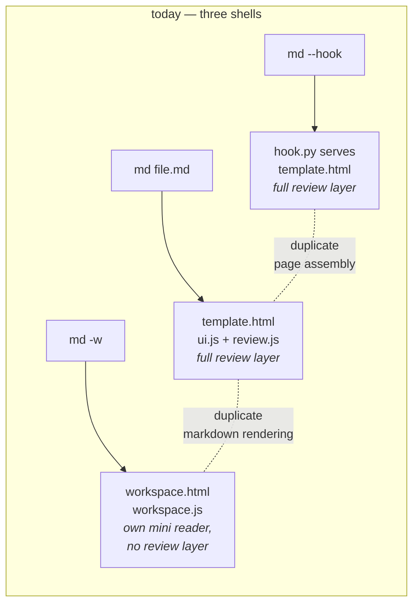
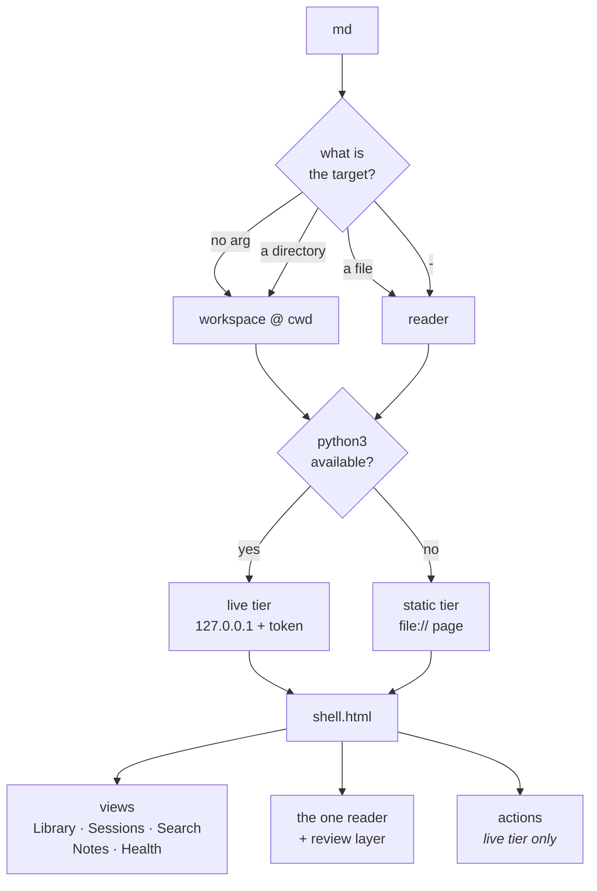
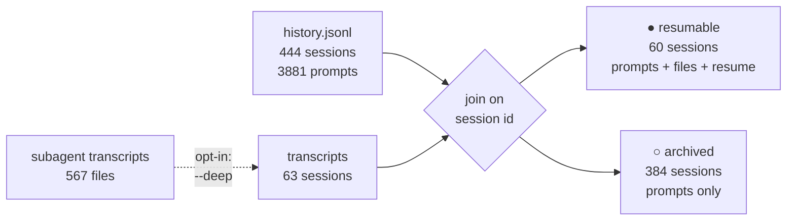
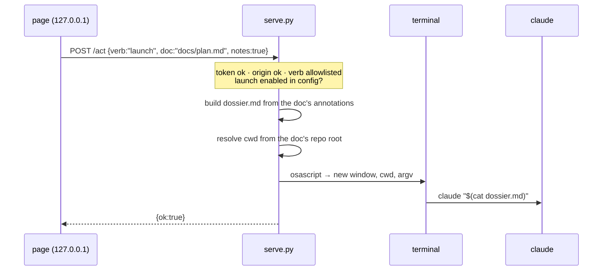
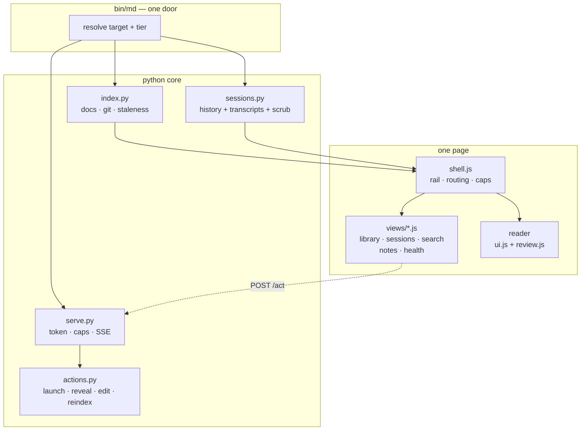
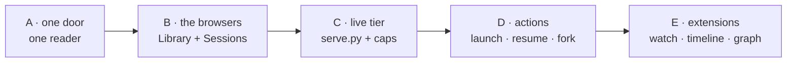

# One door, one shell

Rubricator grew outward-in: a reader first, then a review layer on top of it,
then a workspace beside it. Each step built its own page. The result works, but
there are now **three shells, two readers, and one annotation layer that only
one of them has**. This plan collapses that into one structure — and uses the
room it frees to add the two browsers that are missing (documents, sessions) and
the one capability that closes the loop (launching a Claude session from the
notes you just wrote).

---

## 1. Where we actually are

Measured on this machine, not assumed.

| Question | Answer today |
|---|---|
| How do you start it? | `md <file>` reads a file · bare `md` falls back to `README.md` · `md -w` opens the workspace · `md <dir>` **errors** ("is a directory") |
| Is there a docs browser? | Yes, a `Documents` tab — but it is a flat sortable table with no detail pane |
| Is there a session browser? | A `History` tab that shows **prompt counts per project**. That is a statistic, not a browser |
| Can you read a doc inside the workspace? | Yes, in a preview overlay that re-parses the markdown itself |
| Can you annotate it there? | **No.** The overlay never loads `review.js`. Notes can be read in the workspace but not written |
| Can it launch anything? | No. The workspace is a static `file://` page and cannot talk to anything |

So the user's instinct was right, with one correction: the tabs exist, but only
`Search` has real substance behind it. `Documents` and `History` are lists that
lead nowhere.

### The duplication, drawn



Two of the three can annotate. The one you would actually browse from cannot.

---

## 2. The shape to build

One entry point, one target resolver, two runtime tiers, one shell, N views.



Four moves, in order of how much they buy:

1. **One reader.** The workspace stops rendering markdown itself and mounts the
   real reader — `ui.js` + `review.js` — in its pane. Annotating becomes possible
   everywhere a document can be opened. This deletes code rather than adding it.
2. **One door.** The argument decides: file → reader, directory or nothing →
   workspace. `md <dir>` stops being an error and starts being the obvious thing.
3. **Two tiers made explicit.** The server that `hook.py` already runs becomes a
   shared `serve.py`. The page is told what it may do (`META.caps`) and hides what
   it may not. Static stays the fallback and stays shareable.
4. **An action bus.** Verbs the page may ask for, resolved entirely server-side.
   That is what makes "launch a session from here" possible at all.

---

## 3. Bare `md` — the one breaking-ish change

Requested: typing `md` should open the workspace here.

The cost is that `md` currently means "show me the README". Rather than trade one
for the other, do both:

> **Bare `md` opens the workspace at the current directory, with the README
> already open in the reader pane** (if one exists).

You type `md`, you see the README exactly as before — with the whole workspace
around it. Nothing is lost, and the directory becomes the unit of work.

The new grammar in full:

| Command | Result |
|---|---|
| `md` | workspace at cwd, README pre-opened in the reader |
| `md docs/plan.md` | reader on that file (unchanged) |
| `md docs/` | workspace scoped to `docs/` |
| `md ~/Repositories/foo` | workspace on another repo |
| `md -` | stdin → reader (unchanged) |
| `md -w [dir]` | kept as an explicit alias, never breaks a script |
| `md --review` / `--hook` | unchanged |

`RUBRICATOR_BARE=readme` restores the old behaviour for anyone who scripted
against it. Ships as **2.0.0** because the default changed.

---

## 4. The two browsers

### 4.1 Library — a documents browser

The `Documents` table becomes a two-pane browser: a tree on the left, the real
reader on the right.

```
┌──────────────────────────────┬───────────────────────────────┐
│ ▾ docs/                      │  docs/architecture-plan.md    │
│    architecture-plan.md  ●3  │  ─────────────────────────────│
│    workspace-plan.md         │  # One door, one shell        │
│    watch-plan.md         ⚠   │                               │
│ ▾ anforderungen/             │  Rubricator grew outward-in…  │
│    glossar.md                │                               │
│ README.md                    │  [ the full reader, with the  │
│                              │    review layer live ]        │
│ filter: ◦ has notes ◦ stale  │                               │
│         ◦ untracked          │                               │
└──────────────────────────────┴───────────────────────────────┘
```

- Tree by directory, collapsible, with a flat mode for small repos.
- Per-row signals already computed by the indexer: note count `●`, staleness `⚠`,
  size, last commit.
- Sort by recency · staleness · notes · size · title.
- Facets: has notes · stale · untracked by git · front-matter tag.
- Opening a row mounts the **real reader**, so every verb (change, question, cut,
  expand, note, approve) works, and the tray, outline and search come with it.

### 4.2 Sessions — a real session browser

This one needs a data model, because the raw material is lopsided. Measured:

| Source | What it holds | Count here |
|---|---|---|
| `~/.claude/history.jsonl` | every prompt: text, session id, project, timestamp | 4,617 rows · **444 distinct sessions** · 3,881 usable after dropping slash commands |
| `~/.claude/projects/<proj>/<sid>.jsonl` | the full transcript, incl. every `file_path` touched | **63 sessions** · 44 of them touched files · 863 MB |
| `…/<sid>/subagents/*.jsonl` | subagent and workflow transcripts | 567 files, currently **ignored** |

The consequence is the central design fact: **444 sessions are remembered, but
only 63 still have a transcript**. Only those can show which files they touched,
and only those can be resumed — `claude -r <sid>` needs the transcript.



So the browser must **say which kind a session is**, or the Resume button lies.

```
┌────────────────────────────────────┬──────────────────────────┐
│ ● today   repo A             23 ▸  │  ● resumable             │
│   "…the first prompt, truncated"   │  fed9ca97 · repo A       │
│ ● Aug 20  rubricator         41 ▸  │  23 prompts · 2h 10m     │
│   "lets build it, and then publish"│                          │
│ ○ Aug 12  repo B              8 ▸  │  Prompts                 │
│   "…and the one before it"         │   1. …                   │
│                                    │   2. …                   │
│ [ this repo | all repos ]          │                          │
│ [ ● resumable only ]               │  Files touched (12)      │
│                                    │   share/workspace.py     │
│                                    │   bin/md                 │
│                                    │                          │
│                                    │  [ Resume ] [ Fork ]     │
│                                    │  [ Copy id ]             │
└────────────────────────────────────┴──────────────────────────┘
```

- Title = first non-slash prompt, truncated. Span = first→last prompt timestamp.
- Grouped by day, filterable to the current repo (that is the common case).
- `● / ○` is computed from a file-existence check, so Resume is only offered when
  it will actually work.
- Detail pane: scrubbed prompts, files touched, and the documents in this repo
  that correlate with the session (the existing ranking, run in reverse).
- Everything runs through the existing `scrub()` before it reaches the page.
  `pastedContents` is never indexed at all.

---

## 5. Launching a session — does it work?

Yes. Verified on this machine: a command dispatched through `osascript` created
an iTerm window, ran in a chosen working directory, and reported back. The
mechanism is sound; the design question is what may be dispatched, and by whom.



**The page never sends a command.** It sends a verb and a document id. The server
resolves the working directory, writes the prompt to a file, and builds the argv
itself. Nothing from the page is interpolated into a shell string.

What makes this worth building is not the convenience of not typing `claude` — it
is that the launch **carries the notes**. Read a plan, mark six passages, hit
*Send to Claude*, and a session opens in the right repo with the dossier already
as its first prompt. That is the loop rubricator exists for, closed.

Variants, all cheap once the bus exists:

- **Resume** — `claude -r <sid>` in the session's project directory.
- **Fork** — `claude -r <sid> --fork-session`, to branch off an old session without
  disturbing it.
- **Ask about this document** — a new session in the repo, prompt seeded with the
  doc path and your open notes.

### The guard rails, stated plainly

A local page that can start processes is a real escalation, and it is the one
part of this plan that deserves suspicion.

- **Off by default.** `launch` is enabled by `md --allow-launch` or a line in
  `~/.config/rubricator/config`. A fresh install cannot spawn anything.
- Bound to `127.0.0.1`, ephemeral port, per-run token, `Origin` / `Sec-Fetch-Site`
  checked, `Referrer-Policy: no-referrer` so the token cannot leak onward.
- Verb allowlist. No command, path, or argument is accepted from the page — only
  ids the server can resolve against its own index.
- The server exits when its window closes or after an idle timeout, exactly as
  `hook.py` already does.
- Terminal choice is recorded from `$TERM_PROGRAM` at `md` invocation time (iTerm
  here), persisted, falling back to Terminal.app. Never guessed from the browser.

---

## 6. The structure underneath



Three things become extension points rather than special cases:

- **Providers.** `index.py` and `sessions.py` both answer the same shape:
  *give me things, with text, a timestamp, and a path*. A third provider (git log,
  GitHub issues, a notes directory) plugs in without the shell knowing.
- **Views.** A view is a function from the index to HTML, registered in a list.
  Adding *Timeline* or *Graph* later touches one file.
- **Actions.** A verb is a name, a capability flag, and a server-side handler.

### Caching

Today: the whole index is rebuilt on every launch (1.2 s here, 863 MB scanned) and
embedded into a 2.9 MB page. Fine at this size, but it is the thing that will
break first on a large monorepo.

- `~/.cache/rubricator/index/<roothash>.json`, invalidated by mtime + git HEAD.
- Sessions cached separately, keyed on `history.jsonl` size+mtime and the set of
  transcript mtimes — the expensive half, and the half that rarely changes.
- Document bodies stay out of the page in the live tier: fetch on open. Static
  tier keeps embedding them, because it must.

> **Since then.** The first bullet was never built and the source now argues
> against it. `grep -rn roothash` over the repository returns nothing; the cache
> helpers exist but `_cache_read` and `_cache_write` are called for sessions only —
> so the second bullet shipped, and the expensive half is indeed the half that got
> the cache. `share/workspace.py:6-7` states the reversal in the code:
> *"Everything here is recomputed on every run: at ~0.6s for 500 MB there is
> nothing worth caching, and nothing to invalidate."* That is a defensible position
> at this corpus size and it may stay the answer; the monorepo this section worried
> about has not arrived. What is not defensible is that `docs/tasks.md` carries
> **C7 · Index cache** as `[x]`, describing the invalidation strategy of a file
> that does not exist. It is one of four register lines O1 found in that state.
> Either the line goes or the cache gets built, and the register's answer is that
> the line goes.

### Notes on disk

Annotations live in `localStorage`, keyed by a hash of the absolute path. That
means they vanish with browser data, cannot be grepped, and cannot be committed.
In the live tier the server can own them instead:

- `.rubricator/notes.json` at the repo root (gitignored by default, committable
  by choice), with `localStorage` as the fallback for the static tier.
- Migration reads existing `localStorage` on first live launch and writes it out.
- This is what makes the Notes view worth having across machines.

---

## 7. Phasing



| Phase | Contents | Why this order |
|---|---|---|
| **A** | CLI grammar (`md`, `md <dir>`); workspace mounts the real reader; delete the duplicate preview renderer | Highest value per line, and it is mostly deletion. Annotating from the workspace is the missing half of the tool |
| **B** | Library tree + detail; Sessions browser with the resumable/archived model; session detail pane | Pure front-end on data the indexer already produces, plus session metadata that is a small addition to `sessions.py` |
| **C** | `serve.py` extracted from `hook.py`; capabilities handshake; live reindex; notes to disk | The plumbing every later feature needs. No new user-facing surface except a fresher page |
| **D** | Action bus; launch / resume / fork; open in editor; reveal in Finder — opt-in | Depends on C. This is where the loop closes |
| **E** | Watch mode over SSE (`docs/watch-plan.md` becomes a few lines); per-file timeline; correlation graph; subagent transcripts | Each is now an isolated addition |

---

## 8. Room deliberately left

- **`md serve`** — a persistent workspace on a stable port, so a browser tab can
  stay open across a working day. The tiering makes this a flag, not a rewrite.
- **More providers** — commits, GitHub issues, a plain notes folder.
- **User views** — `~/.config/rubricator/views/*.js` loaded if present.
- **Cross-repo workspace** — the indexer already takes a root; a list of roots is
  a small step, and the session data is already cross-repo.
- **Export a dossier as a file**, not just clipboard — trivial once the server exists.

---

## 9. What was decided

1. **Bare `md`** opens the workspace with the README already in the pane, so
   nothing was lost by changing the default. `RUBRICATOR_BARE=readme` restores
   the old behaviour; shipped as 2.0.0.
2. **Launch is opt-in** — `md --allow-launch`, or `allow_launch` in the config.
   A fresh install can start nothing.
3. **Notes went to disk**, at `.rubricator/notes.json`, kept out of git through
   `.git/info/exclude` rather than `.gitignore` — nothing tracked is touched and
   committing them stays a choice.

> **Since then.** Decision 3 is reversed, and so is the sentence about
> *gitignored by default* under **Caching** above. Both were written on the
> assumption that rubricator is a one-person tool, which was true of its
> measured usage and is no longer true of its purpose: on 2026-08-24 the owner
> named multi-person use as a goal, and standing rule 3 in
> [`scope-plan.md`](scope-plan.md) §5 was rewritten around it — *more than one
> reader, and git is the transport.* So committing the notes stops being a
> tolerated choice and becomes the supported path. **M6** makes the keys
> relative to the enclosing repository (a single absolute key resolves in
> exactly one clone, which is why the file does not travel today), splits the
> one blob into a file per document so that two people's marks merge instead of
> colliding, gives each mark a `by` and an `at`, and removes the
> `.git/info/exclude` line this decision added — including from the two
> repositories that already carry it. What does not change: no server, no
> account, no sync, no locking. Two people who mark the same document get a git
> conflict in a few kilobytes of JSON, and that is the whole of the merge
> story.
4. **All five phases shipped in sequence**, one commit each, rather than as two
   releases. The tiering in C is what made D and E small.

Two things this plan expected that turned out differently. Driving a named
terminal needs macOS Automation permission and that dialog *blocks*, so the
default launcher became a `.command` file opened through LaunchServices, which
needs none. And dropping document bodies from the page was supposed to require a
server-side search; hydrating every body on the first search turned out to be
simpler, keep one code path, and cost one request.
