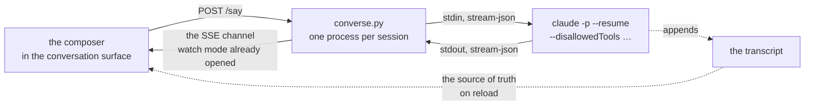

# Continuing a session

Rubricator can read a conversation. The obvious next question is whether you can
add to it without leaving, the way Claude Code for desktop does.

The answer is yes for the half that matters here, and deliberately no for the
other half. This is why.

---

## 1. What was measured, not assumed

Everything below was run against `claude` 2.1.241 on this machine.

| | |
|---|---|
| `claude -p --resume <sid>` | **appends to the same transcript**, keeps the same session id — 13,383 → 16,403 bytes, no fork |
| one process, many turns | works over `--input-format stream-json`; `num_turns` went 1 → 2 on the same pipe |
| a shell tool call in `-p` | **ran, with no prompt and no approval event** |
| the same, with `--permission-mode manual` | **ran anyway** |
| `--permission-prompt-tool` | does not exist in this build |
| `--disallowedTools Bash Write Edit` | **genuinely blocks** — *"No such tool available: Bash. Bash is disabled for this session, in subagents as well as here"* |
| the event stream | `system/init`, `system/status`, `stream_event/*` deltas, `assistant`, `user` tool results, `result` with `total_cost_usd`, `rate_limit_event` |

> **Since then.** Rows three and four were confounded, and since this section is
> the one that says *measured, not assumed*, the correction belongs on the page
> rather than in a commit message. Both rows were run under this machine's own
> `~/.claude/settings.json`, which carries `"permissions": {"defaultMode":
> "auto"}`. What they measured was that setting, not headless Claude. Re-run on
> `claude` 2.1.241 in an untrusted directory, with the default mode and again with
> `--permission-mode manual`, the identical shell call is **denied** — visibly, as
> an entry in `result.permission_denials` on the JSON stream, with the assistant
> saying *"the permission layer flagged it … there's no way for that approval
> prompt to be answered"* and the directory it was told to create not created. So
> the rows should read *auto-denied, and visible in `result.permission_denials`*,
> and this table should carry the build and the date it was taken against:
> **claude 2.1.241, measured 2026-08-23**. One row is missing besides. A
> `PermissionRequest` hook event now exists and is documented — *"Runs when Claude
> Code is about to ask you for permission … in sessions that can't show a prompt
> … if no hook returns a decision, it denies the tool call"* — which is precisely
> the channel this table's silence stood for. On 2.1.241 it **fired zero times**
> under `claude -p` across five configurations: at top level, for a subagent, from
> `--settings`, from project settings, and with `--debug hooks` on, while
> `PreToolUse` from the identical config fired every time. §2 and the read-only
> scope of J1–J4 are unaffected — there is still no prompt to answer and no event
> to answer it with — but they stand for a different reason than the one written
> here: not *headless Claude does not ask*, but *headless Claude refuses, and the
> hook that could speak for it does not run*.

The first line is the one that makes this worth doing: **a turn taken here is
indistinguishable from a turn taken in your terminal.** You can start a thought
in the window, finish it in iTerm, and come back — one session, one transcript,
no reconciliation.

The third and fourth lines are the one that shapes it.

---

## 2. The problem with the obvious version

Headless Claude does not ask. It is not that the prompt goes unanswered — there
is no prompt, and no event on the stream to answer. A window that pipes your
typing into `claude -p` is a local web page that can run arbitrary shell
commands, which is the exact thing the action bus (D1) and the opt-in gate (D6)
were built to prevent. Shipping it would undo the most carefully argued part of
the tool.

There are two ways out.

**Take the SDK.** `@anthropic-ai/claude-agent-sdk` exposes a `canUseTool`
callback, which is the supported way to put a permission prompt in your own UI.
It also means Node and a real npm dependency. Rubricator currently vendors three
render libraries and otherwise runs on bash, python3 and what macOS ships; that
is a property worth more than this feature.

**Narrow the mouth.** `--disallowedTools` is enforced by the agent itself, in
subagents too. A session continued from the window gets Read, Grep, Glob and
WebFetch, and does not get Bash, Write, Edit or NotebookEdit. It can think, read
and answer. It cannot change anything.

---

## 3. What this is for

The second option is not a compromise, it is the right scope. Rubricator is a
reading tool. The question you have while reading a conversation is almost never
*go and do this* — it is:

- what did we decide about X, and why
- you said this contradicts the plan; where
- summarise the part where it went wrong
- what would you do differently now

None of that needs a shell. And when the answer is *go and do it*, the
hand-off already exists and is now free of friction: **Resume in a terminal**,
same session, everything you just discussed already in the context.

So the window is where you think, and the terminal is where you work, and they
are the same conversation. That is a cleaner story than a second, weaker place
to run an agent.

---

## 4. The shape

**`share/converse.py`** — one long-lived process per session id, a lock file so
two windows cannot drive the same one, pumps on stdin and stdout, and a hard
stop. Roughly 150 lines.

**The route** — `POST /say {sid, text}` writes a line to stdin. The stream comes
back over the SSE channel `events` already provides, tagged so the page can tell
it from a file change. Roughly 40 lines.

**The surface** — a composer at the foot of the conversation, a bubble that
fills from `content_block_delta`, finalised on `assistant`; tool lines and the
`did` row already render, so they only need to arrive incrementally. Cost from
`result` goes in the status strip. Roughly 150 lines.

A day, at the standard the rest of this was built to.

---

## 5. What robust has to mean

1. **Two writers, one file.** A session open in a terminal and in the window
   would both append, and transcripts are rewritten, not appended atomically.
   A lock file per session id, plus an honest *open elsewhere* state on the tab.

2. **A turn in flight when the window closes.** The server dies with the page by
   design — the heartbeat is what stops rubricator leaving processes behind.
   Either the turn is killed with it and the transcript keeps whatever
   completed, or the process detaches and the page reattaches by re-reading.
   The transcript is already the source of truth, so reattaching is natural and
   is the version to build.

3. **Cost in the open.** Every `result` carries `total_cost_usd`. The four
   probes behind this document cost about $0.22. If the window can spend money
   it can say so, on the strip, per turn.

4. **The restriction has to be visible.** A composer that silently cannot run
   commands is worse than no composer. The surface says what this session can
   do, and *Resume in a terminal* sits next to it, not three menus away.

5. **Interruption.** Killing the process is enough; the transcript keeps what
   happened up to that point, and re-reading it is the existing code path.

---

## 6. What it is not

The desktop app has a permission UI, plan mode, diffs, todo lists, MCP approval,
model switching and slash commands. This is none of that, and reaching parity is
a different project with a different dependency budget.

This is: **read a conversation, and add one more turn to it.**

---

## 7. Open

1. Should the tool set be configurable in Settings, or fixed? Fixed is safer and
   one fewer way to end up with a shell by accident. *Leaning fixed.*
2. Does a turn taken here get marked in the conversation, so you can tell later
   which turns came from the window? *Leaning yes — it is cheap and it is the
   kind of thing you want to know a month on.*
3. Does the composer offer to fork instead of continue, for a session you do not
   want to disturb? `--fork-session` exists and costs nothing to expose.
