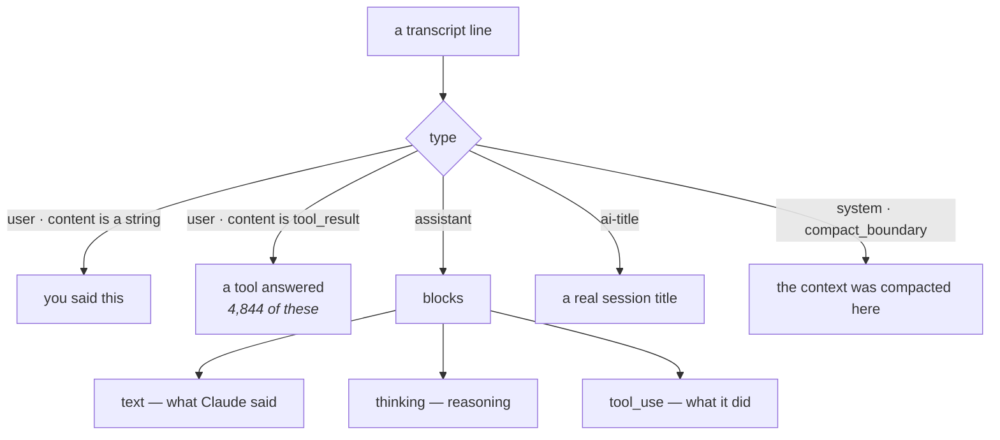
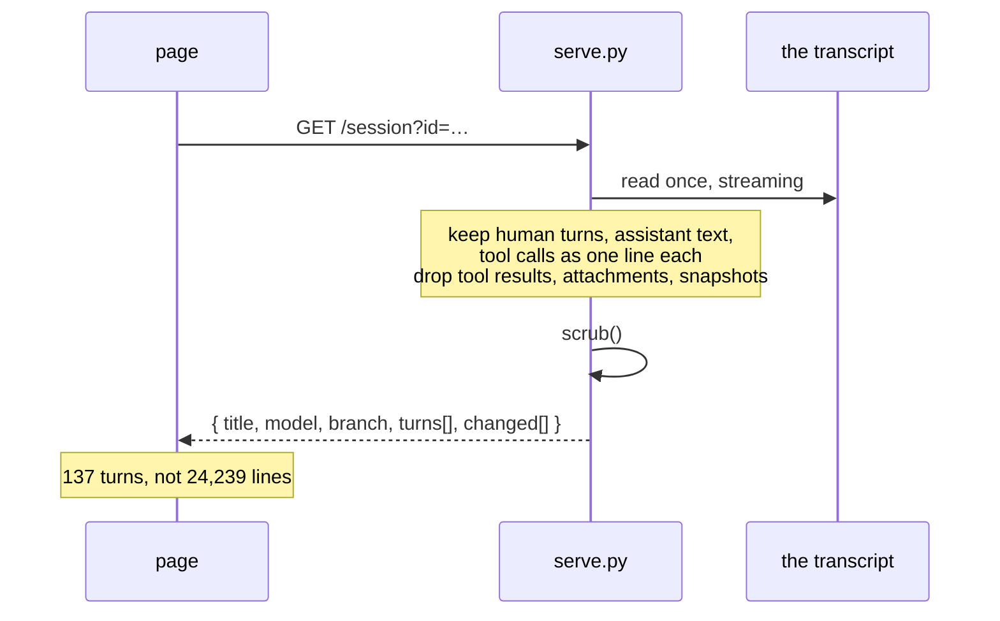
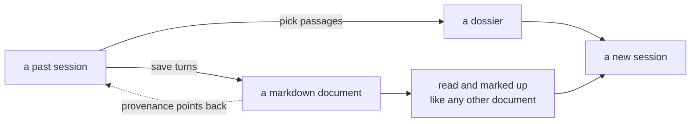
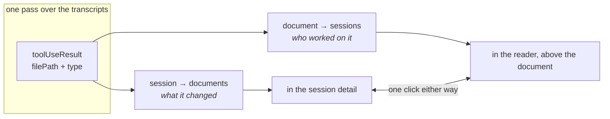
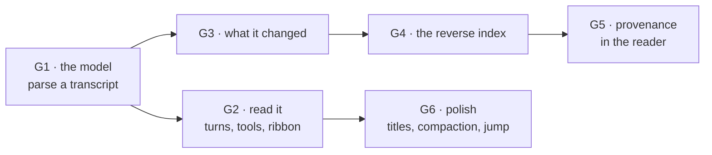

# Reading the conversation

Rubricator can already find a conversation. It cannot show you one. The Sessions
browser lists what you *asked* — the prompts from `history.jsonl` — and stops
there, because that file is all it reads. Everything Claude said, every file it
touched, and the order it happened in is sitting in the transcripts, unread.

This plan closes that, in three connected moves:

1. **Read the session** — your prompts and Claude's replies, in order.
2. **See what it changed** — the documents it created and edited, named as such.
3. **Follow it back** — open a document and see which sessions worked on it.

The third is the one that pays off daily: *this plan exists — who wrote it, and
what were they thinking?*

---

## 1. What the transcripts actually hold

Measured on this machine, not assumed.

| | |
|---|---|
| transcripts on disk | **69**, 780 MB total |
| median size | 2.69 MB · largest **105 MB** |
| full parse of the largest | **0.25 s** |
| whole-corpus markdown pass | **0.97 s** |
| sessions that touched markdown | 38 · **482 document/session pairs** |
| of those | **325 created**, 157 edited |
| human turns in the largest session | 137 (against 4,844 `user` lines) |

Two of those numbers decide the architecture.

**0.25 s to parse the largest transcript** means a conversation can be read on
demand, per session, when you click it. Nothing needs pre-indexing, nothing needs
embedding in the page, and the 105 MB never travels anywhere.

**137 human turns against 4,844 `user` lines** means most of what wears the user
role is machinery — tool results, not you. A conversation view is mostly an
exercise in *leaving things out*.

### The shapes worth knowing



Three finds that change the design:

- **`ai-title`** carries a written title — *"Plan space fighter game with shaders
  and progression"* — instead of the truncated first prompt we show today.
- **`toolUseResult.type`** is literally `create` or `update`, so *created* versus
  *edited* is a fact we can read, not a guess.
- **`system` / `compact_boundary`** marks where the context was compacted, which
  is exactly where a long conversation stops making sense without a marker.

---

## 2. The conversation model

The server parses a transcript on request and returns something small. The page
never sees a raw transcript.



What survives the filter:

| kept | dropped |
|---|---|
| your prompts | tool results (file contents, command output) |
| Claude's replies | attachments, file-history snapshots |
| tool calls, as a name and a target | the arguments, beyond the target |
| thinking, collapsed to a count | the thinking text, unless you open it |
| compaction and away markers | mode, permission-mode, queue bookkeeping |

Everything that survives still goes through the same `scrub()` the prompts do.

### What a turn looks like

```
{ who: 'you',    t, text }
{ who: 'claude', t, text, thought: 4,
  did: [ {tool:'Edit',  target:'docs/plan.md', kind:'edited'},
         {tool:'Bash',  target:'git status'},
         {tool:'Write', target:'docs/new.md',  kind:'created'} ] }
{ mark: 'compacted', t }
```

---

## 3. What you are actually doing here

Nobody opens an eight-week-old session to read it. They open it because
something in the present is unresolved. Nine reasons, and what each one needs:

| you opened it because… | what you need | what you do next |
|---|---|---|
| **you can't remember where something was decided** | the passage, and two turns either side | copy it, or keep it |
| **the code doesn't match your memory of the plan** | your own prompt, verbatim | copy it |
| **you wrote a prompt once that worked** | that prompt, editable | start a new session with it |
| **you want to keep going** | the last few turns | resume, or fork |
| **it went wrong somewhere** | the tool call that failed | expand the result, open the file |
| **you're assembling the next prompt** | three passages from across the session | collect, then hand them over |
| **the reasoning deserves to be written down** | several turns, as prose | save as a document |
| **you want what it produced** | the files, created vs edited | open one in the reader |
| **you're reading a document and wondering where it came from** | the session that wrote it | jump into it, at the right turn |

Two things fall out of that list.

**Almost nobody reads a session linearly.** Eight of the nine arrive with a
target and want to land near it. The design problem is *arrival and extraction*,
not pagination.

**Seven of the nine end in taking something out.** A passage, a prompt, a file, a
document. So the reader is not a viewer with some buttons bolted on — it is an
extraction surface, and the buttons are the point.

### Which makes it the same tool it already is

Rubricator's whole loop is: read something, mark the parts that matter, hand the
marks to an agent. A conversation is just another thing to read that way.



So the conversation is **rendered as markdown and read through the existing
reader**. The review layer, the outline, in-document search, the tray and the
export all work unchanged, because they work on any document. That is one screen
to build rather than two, and one set of habits to learn rather than two.

The verbs change, though. *Change this* and *cut this* are meaningless against a
conversation you cannot edit. Two are enough:

- **pick** — take this passage; it goes in the tray
- **ask** — take it, with a question attached

Same tray, same export, same `⌘⏎`.

---

## 4. Reading it

### Three densities, because the nine reasons want different things

```
 ① transcript   everything: your turns, Claude's replies, what it did
 ② prompts      only what you asked — 137 turns become a page you can skim
 ③ outcomes     only turns that changed a file, with the change named
```

Skimming your own prompts is how you find *where* something was discussed;
outcomes is how you find *what came of it*; transcript is where you read it
properly. One control, three answers to nine questions.

```
┌──────────────────────────────────────────────────────────────────────┐
│ hypergol · Plan the affix redesign                    [⤺ resume] [⑂] │
│ ● fable-5 · main · 137 turns · 4h 20m       ① transcript ② you ③ what│
├────┬─────────────────────────────────────────────────────────────────┤
│ ▎  │ ▸ you                                       14:02   ⧉  ↻  ✎     │
│ ▎  │   lets plan the affix redesign, i want the rolls to …           │
│ ▊  │                                                                 │
│ ▊  │ ▸ claude                                    14:02      ✎        │
│ ▎  │   I'll look at how affixes are rolled today before              │
│ ▎  │   proposing anything.                                           │
│ ▎  │   ┌─────────────────────────────────────────────┐               │
│ ▎  │   │ ⌕ Read   src/affix.ts                       │               │
│ ▎  │   │ ✎ Edit   docs/affixes.md      edited   ⊕diff│               │
│ ▎  │   │ + Write  docs/affix-plan.md   created  ⊕open│               │
│ ▎  │   └─────────────────────────────────────────────┘               │
│ ▎  │   ⋯ 4 thoughts                                                  │
│ ══ │   ── context compacted ──                                       │
│ ▎  │ ▸ you                                       15:41   ⧉  ↻  ✎     │
└────┴─────────────────────────────────────────────────────────────────┘
   ▲                                              ⧉ copy  ↻ reuse  ✎ pick
   the ribbon: the whole session in one column
```

### The actions, by what they act on

**The session** — resume · fork · open that repository's workspace (a session
often happened somewhere else) · save the whole thing as a document.

**A turn** — copy it · reuse it, which opens a new session seeded with that
prompt · continue from here, which resumes with a line saying where to pick up ·
pick it into the tray.

**A tool call** — open the file it touched, in the reader beside you · show what
it changed, from the patch the transcript already stores · reveal the path.

**A selection** — pick · ask · copy. The two verbs, on whatever you highlighted.

**The tray** — the same tray as everywhere else: copy the dossier, send it to a
new session, or **save it as a markdown document** in the workspace. That last
one is what turns archaeology into an artifact, and the document it writes is
then a document like any other — readable, markable, and pointing back at the
session it came from.

### Getting to the right place

- `/` searches inside the conversation, as it does in any document
- `n` / `p` jump between **your** turns, which is how you scan a session
- `1` `2` `3` switch density; your position is kept
- the ribbon is clickable, and marks where files were touched
- arriving from a search lands on the matching turn, highlighted
- every turn has an id, so a note can point at one and come back to it

Everything is collapsed until asked for: thinking is a count, tool results are a
disclosure, and long turns clip with a *more* affordance. The default screen is
readable prose, not a data dump.

---

## 5. Following it back

The reverse index is the same pass, kept: **482 document/session pairs** across
38 sessions, 0.97 s to build for the whole corpus, cached against the transcript
mtimes exactly like the session index.



In the reader, above the document, a single line of provenance:

```
docs/architecture-plan.md
created in “Restructure rubricator around a workspace” · 22 Aug
worked on in 4 sessions since        ●───●──●────────●    [open the last one]
```

The timeline already drawn for each document gains labels: the session marks
become the sessions themselves, hoverable and clickable. Nothing new is
computed — it is the same data, finally named.

### The honest limit

Only **64 of 405 sessions still have a transcript**, and provenance can only come
from those. A document created eight months ago in a session whose transcript is
gone will say so rather than pretend:

```
no session on record created this — the transcript is gone
```

That is also an argument the plan should make plainly: *transcripts are the
perishable half of your history.* Rubricator can show what survives; it should
never imply the rest never happened.

---

## 6. Privacy, again

This is the largest change in what rubricator puts on a screen. Until now it
showed your own prompts. Now it shows what an agent said and did.

- Everything rendered goes through `scrub()` — the same JWT, key, env and
  connection-string patterns.
- **Tool results are collapsed and truncated by default.** That is where file
  contents and command output live.
- Attachments, file-history snapshots and backup payloads are never surfaced.
- Conversations are fetched on demand from the local server; they are never
  embedded in a page and never written to a file. `--sessions` still refuses
  `--out`, and that refusal now matters more.
- The static tier does not get this at all — no server, no conversation. It says
  so rather than showing an empty panel.

---

## 7. Phasing



| | | why here |
|---|---|---|
| **G1** ✅ | `transcript.py` — parse one transcript into turns and changes; `GET /session?id=` | Everything else is a view of this. Nothing to index; 0.05 s worst case |
| **G2** ◐ | The conversation reader: bubbles, tool strips, collapsed thinking. No ribbon, no densities, no per-turn actions — see 7b | The thing you asked for |
| **G3** ◐ | What it changed, as chips on the turn that wrote it. Only as complete as `toolUseResult` — see 7b | Falls out of G1 for free |
| **G4** | The reverse index, cached with the session index | One pass, 0.97 s, 482 pairs |
| **G5** | Provenance line and labelled timeline in the reader | Where it pays off daily |
| **G6** | `ai-title` as the session title, compaction markers, jump-to-turn from a search hit | The details that make it feel finished |

G1–G3 are one sitting. G4–G5 are a second. G6 is small and can wait.

---

## 7b. What actually got built, and where it departs from this

**G1 shipped as planned.** `share/transcript.py` turns one file into turns,
`GET /session?id=` serves it, nothing is indexed. Measured on this machine: the
largest transcript is now 17 MB and parses in **0.05 s** into 350 turns and a
259 KB payload; the page renders it in **120 ms**.

Two things the plan did not know:

- **`promptSource` is the whole game.** A `user` record is only something you
  typed when it carries one. Without that test, a third of "your" half is
  pasted-image descriptors, slash-command echoes, skill preambles and the
  summary injected after a compaction. Filtering on it lands exactly on
  `history.jsonl`'s count — 39 prompts for the session I tested against 51
  naive `user` records.
- **A reply is not a message.** Claude speaks, runs tools, speaks again, many
  times before you answer. Concatenating that into one turn produced a single
  6,700-character block with 81 tool calls attached — unreadable. Speaking again
  after doing something now starts a new bubble, so an autonomous stretch reads
  as the dozen exchanges it was.

**G2 changed shape.** The plan said *rendered as markdown and read through the
existing reader*, to get the review layer for free. What was asked for instead —
and built — is a **conversation**: your turns on the right, Claude's on the
left, thinking as a count, tool calls behind a disclosure, files it wrote as
chips. That is the right call for reading; nobody wants a chat log as one long
document. The cost is real and worth stating: **a conversation cannot be
annotated yet**, because the review layer binds to an `article.md` whose
top-level children carry line numbers, and a bubble is not that.

The way back is open and cheap: each bubble is already a direct child of its
container, so giving it `data-line-start` against a synthesised source is the
same trick `renderExtracted` plays for PDFs. That is what *pick* and *ask*
(§3) will be built on when they land. Until then the ribbon, the three
densities and the per-turn actions of §4 are unbuilt.

**G3 is half there.** Files show up as chips on the turn that wrote them, from
`toolUseResult.type`. But that record only appears for the Write and Edit
tools — a session that edits through Bash produces none, and this one produced
three across 311 replies. The session's full file list, which comes from the
`file_path` scan the index already does, remains the honest answer.

---

## 8. What was decided

1. **The tray sends.** Its primary action hands the picked passages to a new
   session in that repository; *save as a document* and *copy* sit beside it.
   The dossier is the day-to-day output, the document the occasional one.
2. **Names and diffs, no raw output.** One line per tool call, and for an edit an
   expandable diff built from the `structuredPatch` the transcript already
   stores. Command output and file reads are never rendered — that is where the
   danger is and the diff is the useful half anyway.
3. **Thinking is a count.** `⋯ 4 thoughts`, expandable. Invisible until a
   decision needs explaining.
4. **Provenance falls back to git.** When no transcript survives, say so, but
   still name when the document first appeared using
   `git log --diff-filter=A --follow`. "Created 12 March, no session on record"
   beats a blank.

### What we are deliberately not building

- Not a chat client. No avatars, no bubbles, no replay, no editing history.
- No raw tool output, at any depth.
- No pre-indexed conversations. Parsing on demand costs 0.25 s at worst; an
  index would cost correctness the moment a transcript changed.
- Nothing in the static tier. No server, no conversation — and it says so.
