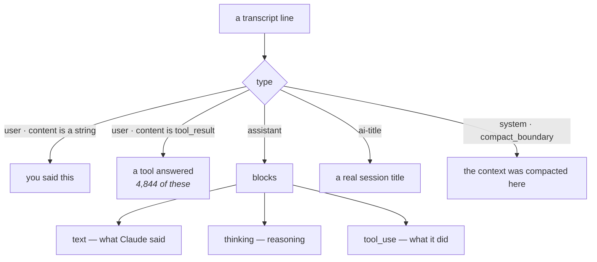
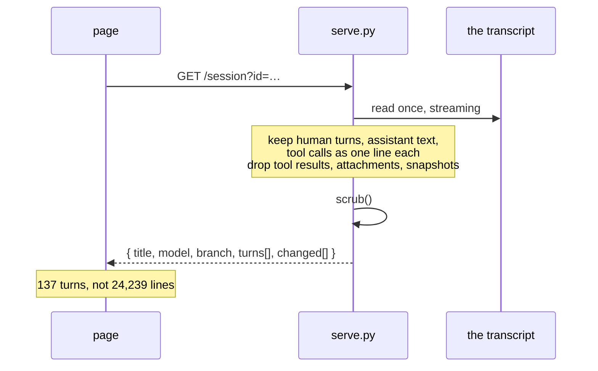
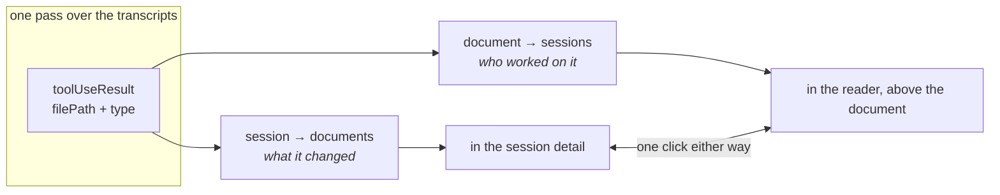
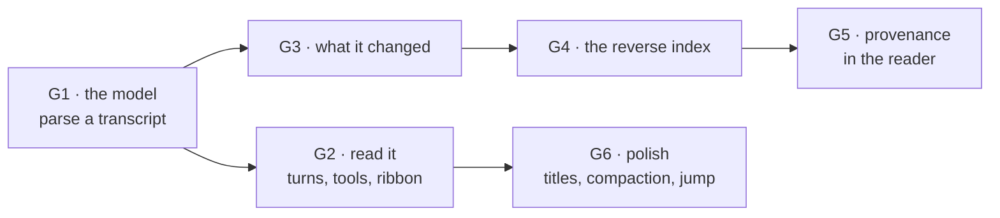

# Reading the conversation

Rubricator can already find a conversation. It cannot show you one. The Sessions
browser lists what you *asked* — the prompts from `history.jsonl` — and stops
there, because that file is all it reads. Everything Claude said, every file it
touched, and the order it happened in is sitting in the transcripts, unread.

This plan closes that, in three connected moves:

1. **Read the session** — your prompts and Claude's replies, in order.
2. **See what it changed** — the documents it created and edited, named as such.
3. **Follow it back** — open a document and see which sessions worked on it.

The third is the one that pays off daily: *this plan exists — who wrote it, and
what were they thinking?*

---

## 1. What the transcripts actually hold

Measured on this machine, not assumed.

| | |
|---|---|
| transcripts on disk | **69**, 780 MB total |
| median size | 2.69 MB · largest **105 MB** |
| full parse of the largest | **0.25 s** |
| whole-corpus markdown pass | **0.97 s** |
| sessions that touched markdown | 38 · **482 document/session pairs** |
| of those | **325 created**, 157 edited |
| human turns in the largest session | 137 (against 4,844 `user` lines) |

Two of those numbers decide the architecture.

**0.25 s to parse the largest transcript** means a conversation can be read on
demand, per session, when you click it. Nothing needs pre-indexing, nothing needs
embedding in the page, and the 105 MB never travels anywhere.

**137 human turns against 4,844 `user` lines** means most of what wears the user
role is machinery — tool results, not you. A conversation view is mostly an
exercise in *leaving things out*.

### The shapes worth knowing



Three finds that change the design:

- **`ai-title`** carries a written title — *"Plan space fighter game with shaders
  and progression"* — instead of the truncated first prompt we show today.
- **`toolUseResult.type`** is literally `create` or `update`, so *created* versus
  *edited* is a fact we can read, not a guess.
- **`system` / `compact_boundary`** marks where the context was compacted, which
  is exactly where a long conversation stops making sense without a marker.

---

## 2. The conversation model

The server parses a transcript on request and returns something small. The page
never sees a raw transcript.



What survives the filter:

| kept | dropped |
|---|---|
| your prompts | tool results (file contents, command output) |
| Claude's replies | attachments, file-history snapshots |
| tool calls, as a name and a target | the arguments, beyond the target |
| thinking, collapsed to a count | the thinking text, unless you open it |
| compaction and away markers | mode, permission-mode, queue bookkeeping |

Everything that survives still goes through the same `scrub()` the prompts do.

### What a turn looks like

```
{ who: 'you',    t, text }
{ who: 'claude', t, text, thought: 4,
  did: [ {tool:'Edit',  target:'docs/plan.md', kind:'edited'},
         {tool:'Bash',  target:'git status'},
         {tool:'Write', target:'docs/new.md',  kind:'created'} ] }
{ mark: 'compacted', t }
```

---

## 3. Reading it

```
┌─────────────────────────────────────────────────────────────┐
│ hypergol · Plan space fighter game with shaders             │
│ ● resumable · fable-5 · main · 137 turns · 4h 20m    [⤺][⑂] │
├───────┬─────────────────────────────────────────────────────┤
│ ▎     │  you                                        14:02   │
│ ▎you  │  lets plan the affix redesign, i want …             │
│ ▎     │                                                     │
│ ▊claude  claude                                     14:02   │
│ ▊     │  I'll look at how affixes are rolled today          │
│ ▎     │  before proposing anything.                         │
│ ▎     │  ┌───────────────────────────────────────┐          │
│ ▎     │  │ ⌕ Read  src/affix.ts                  │          │
│ ▎     │  │ ✎ Edit  docs/affixes.md      edited   │          │
│ ▎     │  │ + Write docs/affix-plan.md   created  │          │
│ ▎     │  └───────────────────────────────────────┘          │
│ ▎     │  ⋯ 4 thoughts                                       │
│ ═══   │  ── context compacted ──                            │
│ ▎you  │  you                                        15:41   │
└───────┴─────────────────────────────────────────────────────┘
```

The left rail is the **ribbon**: the whole session compressed to one column —
your turns, Claude's, and where it did the most work. On a 137-turn conversation
that is the difference between reading and scrolling. Click anywhere on it to
jump.

Everything is collapsed until asked for. Thinking is a count. Tool calls are one
line each: a verb, a target, and — for writes — whether the file was created or
changed. Results are behind a disclosure, truncated and scrubbed, because that is
where file contents and command output live.

---

## 4. What the session changed

The same parse yields the file list, with the verb attached:

```
Documents            created 3 · edited 2
  + docs/affix-plan.md                      created
  ✎ docs/affixes.md                    edited ×7
  ✎ README.md                          edited ×1
Other files          31 in src/, 4 in tests/          ▸
```

Markdown first and named as documents, because that is what this tool is about;
everything else folded into a count per directory, openable but not in the way.
A document that belongs to the workspace opens in the reader beside it — the
split pane already built. One that does not is shown with its repository, since
a session often crosses repositories.

---

## 5. Following it back

The reverse index is the same pass, kept: **482 document/session pairs** across
38 sessions, 0.97 s to build for the whole corpus, cached against the transcript
mtimes exactly like the session index.



In the reader, above the document, a single line of provenance:

```
docs/architecture-plan.md
created in “Restructure rubricator around a workspace” · 22 Aug
worked on in 4 sessions since        ●───●──●────────●    [open the last one]
```

The timeline already drawn for each document gains labels: the session marks
become the sessions themselves, hoverable and clickable. Nothing new is
computed — it is the same data, finally named.

### The honest limit

Only **64 of 405 sessions still have a transcript**, and provenance can only come
from those. A document created eight months ago in a session whose transcript is
gone will say so rather than pretend:

```
no session on record created this — the transcript is gone
```

That is also an argument the plan should make plainly: *transcripts are the
perishable half of your history.* Rubricator can show what survives; it should
never imply the rest never happened.

---

## 6. Privacy, again

This is the largest change in what rubricator puts on a screen. Until now it
showed your own prompts. Now it shows what an agent said and did.

- Everything rendered goes through `scrub()` — the same JWT, key, env and
  connection-string patterns.
- **Tool results are collapsed and truncated by default.** That is where file
  contents and command output live.
- Attachments, file-history snapshots and backup payloads are never surfaced.
- Conversations are fetched on demand from the local server; they are never
  embedded in a page and never written to a file. `--sessions` still refuses
  `--out`, and that refusal now matters more.
- The static tier does not get this at all — no server, no conversation. It says
  so rather than showing an empty panel.

---

## 7. Phasing



| | | why here |
|---|---|---|
| **G1** | `transcript.py` — parse one transcript into turns and changes; `GET /session?id=` | Everything else is a view of this. Nothing to index; 0.25 s worst case |
| **G2** | The conversation reader: turn cards, tool strips, collapsed thinking, the ribbon | The thing you asked for |
| **G3** | What it changed, in the session detail, markdown first with created/edited | Falls out of G1 for free |
| **G4** | The reverse index, cached with the session index | One pass, 0.97 s, 482 pairs |
| **G5** | Provenance line and labelled timeline in the reader | Where it pays off daily |
| **G6** | `ai-title` as the session title, compaction markers, jump-to-turn from a search hit | The details that make it feel finished |

G1–G3 are one sitting. G4–G5 are a second. G6 is small and can wait.

---

## 8. Decisions for you

1. **Thinking** — collapsed to a count and expandable, as drawn? Or left out
   entirely on the grounds that it is Claude's private reasoning and you asked to
   read the *conversation*?
2. **Tool results** — collapsed and truncated behind a disclosure, or not shown
   at all? They are the most useful thing when debugging and the most dangerous
   thing to render.
3. **Other files** — fold non-markdown into a count per directory, as drawn, or
   list them fully? Sessions here touched up to 176 files.
4. **Provenance for missing transcripts** — say "no record" as drawn, or fall
   back to git (`git log --diff-filter=A`) to at least name who created the file
   and when?
