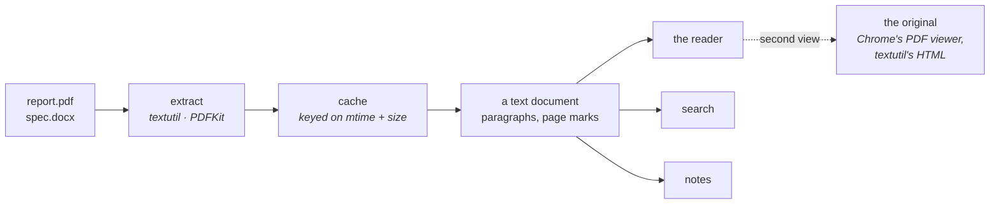
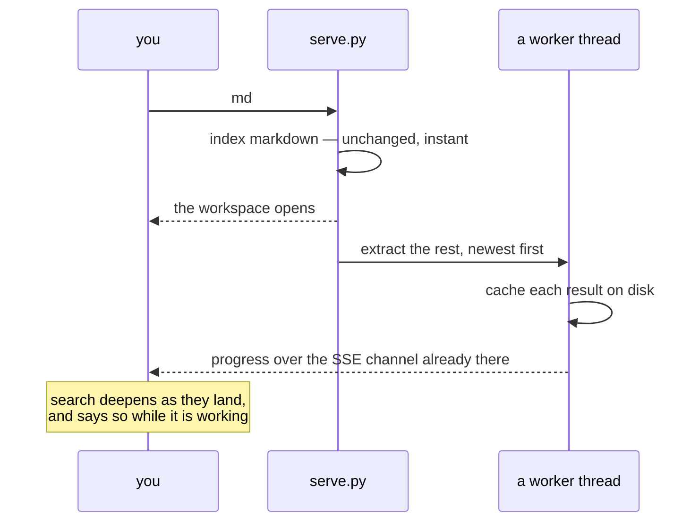
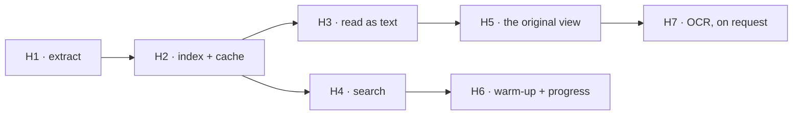

# PDF and Word

Rubricator indexes markdown and ignores everything else. In the repositories on
this machine that means it walks past **16 PDFs and 3 Word files** — a
Leistungsbeschreibung, a Vertragsentwurf, a business plan, the frozen
Anforderungsdokument that a whole project is built on. The requirements a repo
is *for* are often the one document the tool cannot see.

---

## 1. What macOS already gives us

The whole question was whether this adds a dependency. It does not: both
extractors ship with the operating system, and both were measured here.

| | how | measured |
|---|---|---|
| **Word** `.docx .doc .rtf .odt` | `textutil -convert txt` | **3 files, 0.76 s** · up to 127,632 chars |
| **PDF** | PDFKit through the JXA ObjC bridge | **16 files, 3.08 s** · 0.19 s each |
| largest PDF | 35 pages, 918 KB | 59,843 chars in **0.19 s** |
| PDFs with a text layer | | **13 of 16** — the three without are 0–1 KB test fixtures |
| per-page text | `doc.pageAtIndex(i).string` | yes — so a quote can cite a page |

`textutil` is a normal command. PDFKit is reached without PyObjC, which is not
installed and is not going to be:

```js
ObjC.import("Quartz");
var doc = $.PDFDocument.alloc.initWithURL($.NSURL.fileURLWithPath(path));
ObjC.unwrap(doc.string)
```

Run through `osascript -l JavaScript`. Nothing to install, nothing to vendor,
and — like the launcher — no Automation permission, because this is a framework
call rather than scripting another application.

> [!NOTE]
> This is the second time the answer has been "macOS already does it". It is
> worth keeping as a rule: reach for what ships before reaching for a package.

---

## 2. The shape

The temptation is a PDF viewer with its own everything. The better move is the
one that worked for conversations: **turn the file into a document the existing
reader already understands**, and inherit the rest.



Extracted text becomes a document with one block per paragraph and a heading per
page, which means the line mapping, the review layer, in-document search, the
outline and the export all work with no changes at all. A PDF becomes something
you can mark up and hand to an agent — which is the whole point of the tool, and
the thing a PDF viewer would not give you.

Anchors are content hashes already, so a note survives re-extraction. Page
headings make a quote citable: *"p. 12"* rather than *"somewhere in the PDF"*.

---

## 3. Reading one

```
┌──────────────────────────────────────────────────────────────┐
│ context/Leistungsbeschreibung.pdf        ① text  ② original  │
│ 2 pages · 3,483 words · extracted 0.15s                      │
├──────────────────────────────────────────────────────────────┤
│  Page 1                                                      │
│                                                              │
│  Leistungsbeschreibung                                       │
│  Technische Implementierung einer digitalen Prozess-         │
│  management- und CRM-Lösung für Teilnehmer-, Arbeit-         │
│  geber- und Kooperationsprozesse                             │
│                                                              │
│  ▌Der Auftragnehmer erbringt die Leistungen bis zum          │
│  ▌30.09.2026.                                    PICK        │
│                                                              │
│  Page 2                                                      │
│  …                                                           │
└──────────────────────────────────────────────────────────────┘
```

**① text** is the default and is the annotatable one. **② original** is the file
as it really looks: for a PDF, Chrome's own viewer over the asset route the
server already has; for Word, `textutil -convert html`, which is decent and
free. The original is for checking a table or a signature block — reading and
marking up happen in the text view.

---

## 4. Indexing without a stall

0.19 s per PDF is nothing for one file and a wall for a hundred. A repository
with 100 PDFs would take **19 seconds** before the workspace opened, which is
not acceptable for a tool that currently opens in 0.19 s total.

So extraction never blocks the index:



Everything needed for this exists. The cache is the one built for the session
index; the progress channel is watch mode's; the "searching titles while the
bodies arrive" state is the one the live tier already shows. On the second run
nothing is extracted at all — the cache is keyed on mtime and size.

---

## 5. What changes, and what does not

| | |
|---|---|
| **Discovery** | `find_docs` gains `.pdf .docx .doc .rtf`; `git ls-files` still leads |
| **The Library** | one tree, with a mark for the kind and a page count instead of a word count |
| **Search** | unchanged — it searches text, and now there is more of it |
| **Notes** | unchanged — keyed on the absolute path, anchored by content |
| **Provenance** | unchanged — a session that touched a PDF is a session that touched a file |
| **Staleness** | *not* applied to PDFs: a contract does not go stale because the code moved |
| **The static tier** | extraction happens at build time, so a self-contained page still works |
| **`md report.pdf`** | works with no python at all — `textutil` and `osascript` are enough for the reader |
| **CSP** | the original view needs `object-src 'self'`, the one line the policy is missing |

---

## 6. Saying so when there is nothing to read

Three of the sixteen PDFs here have no text layer. They happen to be test
fixtures, but a scanned contract is the real case and it must not look like a
bug:

```
context/scan-2019.pdf
no text layer — this is a picture of a document, not a document
                                              [ read it with OCR ]
```

macOS can do the OCR too — Vision's `VNRecognizeTextRequest` is reachable from
the same JXA bridge — but it is slow enough to be a deliberate act rather than
something that happens during indexing. So: offer it per file, cache the result
like any other extraction, and never do it behind your back.

A password-protected PDF gets the same treatment: named, explained, not retried.

---

## 7. Phasing



| | | why here |
|---|---|---|
| **H1** | `extract.py` — one function per kind, page-aware for PDF, everything cached on mtime+size | Everything else is a view of this |
| **H2** | `find_docs` widens; documents carry `kind` and `pages`; extraction is lazy | The index must stay instant |
| **H3** | Extracted text rendered as a document with page headings — reader, notes, outline for free | The payoff |
| **H4** | Search over the new text, with the hydration state it already has | Falls out of H2 |
| **H5** | The original view: Chrome's PDF viewer, `textutil -convert html` for Word, plus `object-src 'self'` | Wanted less often than you would think |
| **H6** | Background warm-up with progress over SSE | Only matters once a repo has many |
| **H7** | OCR through Vision, per file, on request | The tail |

H1–H4 is the useful half and is one sitting.

---

## 8. Decisions for you

1. **Is the text view annotatable, as drawn?** It is the reason to do this at all
   rather than shelling out to Preview — but it does mean your notes attach to
   *extracted* text, which can differ from what the page looks like.
2. **Spreadsheets?** `.xlsx` is a zip of XML and would be perhaps forty lines —
   there are three of them here. Out of scope as written; say the word and it is
   in.
3. **OCR now or later?** H7 as drawn, or leave scans reported and unread.
4. **Should a PDF be pickable into a dossier the same way?** I assume yes — a
   quote from the Leistungsbeschreibung is exactly the sort of thing you would
   hand an agent — which makes page citations worth getting right.
