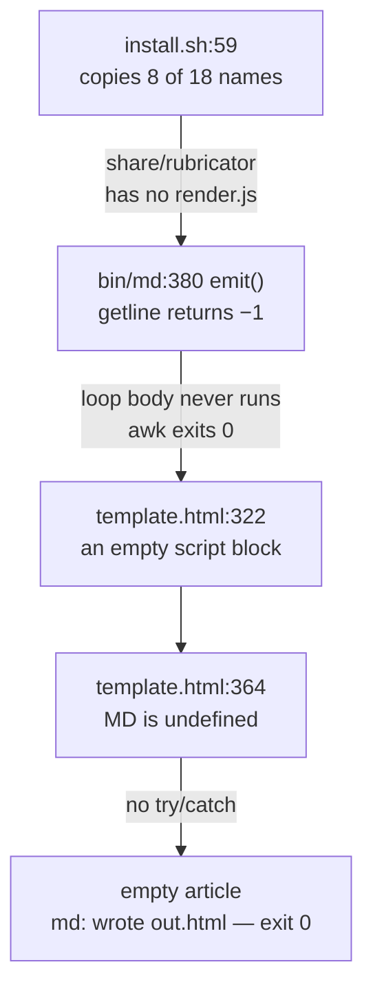

# The install, and how it will be kept honest

The command on the front page of the README does not work, and never has. The
maintainer's own `md` is a symlink into the checkout — `./install.sh --link`,
offered on the same README line as the default (`README.md:43`), and it does
work — so the copy path, the one the README puts first, has never been exercised
by anyone:

```
$ ls -la ~/.local/bin/md
lrwxr-xr-x  … ~/.local/bin/md -> ~/Repositories/rubricator/bin/md
```

The cause is not a typo. It is a hand-maintained list of filenames in a project
with no tests, and the drift of such a list is silent by construction. Four
independent components each had a place to say something and each said nothing.
That chain is the most instructive thing in this document, and the rule it
produces — standing rule 9, *no hand-maintained inventory of files in shipped
code* — is why `md --audit` is dead (X19) and why the fix below is a glob rather
than a longer list.

This document covers register items **K1–K5**. It cites no research literature:
every claim in it is a local measurement, a line of this repository, or a
quotation from Claude Code's own documentation, fetched 2026-08-23. The local
measurements are recorded in `measurements.md`; the two documentation reads
behind §7 are `M-INS-23` and `M-INS-24` there, and every documentation quotation
in this document is quoted from `citations.md` — `G1`, `G2` and `G7` in §7, `G3`
in §8 — in the wording cleared there. That last kind is another product's
documentation about its own behaviour — exactly the sort of claim
standing rule 12 says to re-measure against the build in hand before designing on
it, which is why §7 gates its item on one measurement rather than on the page.

---

## 1. What was measured, not assumed

Measured on this machine on 2026-08-23 against `a63e540`, in sandboxed `HOME`
and `PREFIX` directories under `/private/tmp`. `git status --porcelain` was
empty before and after every run; nothing was written into the repository.
`$COPY` below is one of those scratch prefixes, holding what `install.sh` ships
today; there is no `~/.local/share/rubricator` on this machine to run these
commands against, because `install.sh:54` deletes that directory under `--link`.

| | |
|---|---|
| regular files in `share/`, excluding `vendor/` | **18** |
| copied by `install.sh:59` + `:62` | **8** — `comm -23` names the other ten |
| `md -o out.html sample.md` under the copy install | exit **0**, `md: wrote out.html` |
| that page | **254,436 bytes** · `<article class="md" id="doc">` **empty** |
| the same page from a `--link` install | **267,263 bytes** · the `<h1>` present |
| the difference | **12,827 bytes** — exactly `wc -c share/render.js` |
| `grep -c 'md renderer'` on the two artefacts | **0** copy · **1** link |
| `grep -c 'window.MD'` on the **broken** artefact | **1** — see §4 |
| bare `md` in a git repo under the copy install | exit **1**, raw `[Errno 2]` on `workspace.py` |
| `: > ~/.zshrc && ./install.sh` | exit **1** · no banner · no message · `--with-hook` never runs |
| tests · tags · releases · `.github` | **0 · 0 · 0 · absent**, in **27** commits by **1** author |
| `RUBRICATOR_NO_WINDOW` (`hook.py:108`) | exercised — exit **1**, `md: no feedback given`, under both install modes |
| `RUBRICATOR_DRY_LAUNCH` (`actions.py:230`) | present in the code; **not yet exercised** |

The ten files that do not get installed:

```
$ comm -23 <(ls -p share/ | grep -v '/$' | sort) <(ls "$COPY/share/rubricator" | sort)
actions.py
extract.py
render.js
serve.py
shell.css
shell.js
transcript.py
workspace.html
workspace.js
workspace.py
```

Two of those ten are load-bearing on the first two lines of the README's first
code block. `render.js` is the renderer. `workspace.py` is the workspace — bare
`md`, README line 15.

The byte counts above are `M-INS-4` in `measurements.md`. A re-run today with a
fixture twenty bytes larger gave 254,456 and 267,283: the same 12,827-byte
delta, to the byte (`M-INS-5`).

---

## 2. The chain of silences

Five silences, in order, across four components. None of them raises a
diagnostic.



**The list is not wrong on its own terms.** `install.sh:59` enumerates seven
files and `:62` adds `hook.py`; all eight exist, so `install` succeeds eight
times and the loop is over. Nothing in the script knows that `share/` holds
eighteen. A list can only be wrong against something, and there is nothing to be
wrong against.

**awk's `getline` returns −1 on a file it cannot open, and −1 is not greater
than zero.** The template is assembled by an awk program inside `bin/md`, and
its include primitive is one line:

```awk
function emit(p,   line) { while ((getline line < p) > 0) print line; close(p) }
```

That is `bin/md:380`. The contract of `getline` is three-valued: 1 for a record,
0 for end of file, −1 for an error — and a missing file is an error. The loop
tests `> 0`, so a missing file and an empty file are indistinguishable, and both
are indistinguishable from success. Demonstrated directly:

```
$ awk 'BEGIN { print "getline returned:", (getline line < "/nonexistent") }'
getline returned: -1
$ echo $?
0
```

**The include expands to nothing, and nothing is valid HTML.**
`share/template.html:322` is `<!--@include render.js-->`, sitting between a
`<script>` and a `</script>` on lines 321 and 323. With `emit()` silent, the
browser is handed an empty script element. An empty script element is not an
error in any browser; it is the normal way to write one.

**`MD.render` throws into the console and nowhere else.**
`share/template.html:364` is `var out = MD.render({` with no `try`/`catch`
around it. The page has already painted its chrome by then, so what the reader
sees is the finished shell of a document with `<article class="md" id="doc">`
empty inside it. Under headless Chrome the copy-install artefact contains the
fixture's heading text zero times; the `--link` artefact contains it once
(`measurements.md` `M-INS-8`).

**And `md` says it worked.** `bin/md` prints `md: wrote …/out.html` and exits 0,
because from bash's point of view awk exited 0 and a file appeared.

The one presence check that does exist is instructive:

```bash
[ -f "$TPL" ] || die "template missing at $TPL (is rubricator installed?)"
```

That is `bin/md:300`. The project already knows that a missing asset should be
an error with a sentence attached. It checks exactly one of eighteen — the one
whose absence would produce a zero-byte output file rather than a plausible one.
The failure mode that got a guard is the one that could not hide.

---

## 3. K1 · Install by glob, not by list

Replace the enumeration at `install.sh:59-62` with a loop over the files in
`share/`, installing each with the mode it carries in the checkout. Modes are
cosmetic — nothing in `share/` is ever executed directly; `bin/md:165`, `:185`,
`:248`, `:266` and `:270` all invoke `"$PY" "$SHARE/….py"` — so copy them as they
are rather than flatten them to 0644, and note that the assertion below will not
catch it either way. `diff -rq` compares content: with `chmod 0600` on an
installed `ui.css`, the diff still exits 0.

**Which files, exactly, is the whole of the decision.** The obvious loop skips
the two directories in `share/` that are not source — `vendor/`, which is fetched
and checksummed separately, and `__pycache__/`. But that is a two-name inventory
in shipped code, guarded in §4 by an assertion carrying the same two names, so a
third non-source directory would drift past the installer and past the check
together and in silence. That is standing rule 9 again, inside the fix for
standing rule 9. Both directories are already ignored (`.gitignore` lines 2, 4
and 5), so the loop that carries no list at all is a loop over
`git ls-files share/`, which returns exactly the eighteen. The trade is a
dependency on the checkout being a git clone — which is what `README.md:41` tells
the reader to make — and it is worth taking: the CI diff keeps its two
exclusions, but with the install driven from `git ls-files` a new ignored
directory in `share/` turns the job red instead of shipping quietly. A false red
is a bug report. A silent pass is another 8 of 18.

The assertion needs one correction to the register, which asks for byte-identical
`share/rubricator` contents between a copy install and a `--link` install. That
condition cannot be met, because `--link` does not populate `$PREFIX/share` at
all: `install.sh:54` deletes it and `:56` points `SHARE` at the checkout. The
honest form of K1's *done when* is a comparison of the copy install's
`share/rubricator` against the repository's `share/`, and both halves of it are
measurable today, against the `$COPY` prefix from §1 and a second one, `$GLOB`,
holding the eighteen:

```
$ diff -rq --exclude=vendor --exclude=__pycache__ share/ "$COPY/share/rubricator/"
Only in share: actions.py
Only in share: extract.py
… ten lines …
$ echo $?
1
$ diff -rq --exclude=vendor --exclude=__pycache__ share/ "$GLOB/share/rubricator/"
$ echo $?
0
```

Eighteen files land, the diff is empty, and the assertion is one command with no
browser and no fixture. This is the whole of K1.

**Done when:** the diff above exits 0 for a copy install of the same commit;
`md -o out.html sample.md` in a fresh `HOME` produces a page whose rendered DOM
contains the fixture's `<h1>`; and bare `md` in a git repository exits 0.

### Why a glob rather than a correct list

A correct list is available. Someone could add the ten names this afternoon and
the tool would work. The objection is that the same afternoon's work was already
done once — the list was correct when it was written, and `render.js` was
extracted from `template.html` later (task A2) without anyone updating it. There
is no mechanism by which the list learns about a new file, and no test that
would notice. The next extraction breaks it again.

This is standing rule 9: **no hand-maintained inventory of files in shipped
code — generate it, or assert on it in CI.** Here it costs a blank page. It is
also the reason `md --audit`, a self-reported inventory of the tool's own
security surface, is out of scope permanently (X19): the failure mode of a
drifted security inventory is a tool that lies about what it can reach, which is
strictly worse than a blank page and much harder to notice. The property
`--audit` would have advertised already exists in a form that cannot drift —
7,379 readable lines.

The other numeric inventory in the shipped text — `README.md:46`'s *the three
render libraries* against five pinned files in `share/vendor.txt` — is
defensible: three libraries, of which highlight.js contributes two theme
stylesheets. The README's *one bash script and a page* is a different problem
and belongs to `scope-plan.md`.

---

## 4. K3 · CI that fails on the bug it was written for

Taken before K2, because K2's self-check and K3's CI assertion are the same
assertion running in two places, and the assertion has to be right first.

The obvious check is to grep the built page for `window.MD`. It does not work:

```
$ grep -c 'window.MD' out-copy.html      # the BROKEN artefact
1
$ grep -n 'window.MD' out-copy.html
2710:window.MDReview = { open: openDoc, count: openCount, storage: Storage,
```

`review.js:570` defines `window.MDReview`, `window.MD` is a substring of it, and
`review.js` is one of the eight files a copy install *does* copy. The proposed
green tick passes on the exact bug it was written to catch, and a green tick
that passes on the bug is worse than no tick — it converts a discoverable defect
into a defended one. That is **X1**: killed on evidence, and recorded here
because the mistake is easy to make twice.

The assertion is worth three layers, cheapest first, because they fail for
different reasons.

| layer | assertion | catches | cost |
|---|---|---|---|
| 1 · inventory | `diff -rq --exclude=vendor --exclude=__pycache__ share/ "$PREFIX/share/rubricator/"` | anything that fails to reach the install, for any reason | one command, no browser |
| 2 · artefact | `grep -q 'md renderer'` on the page `md -o` produced | render.js present but not inlined | one command, no browser |
| 3 · rendered | headless `--dump-dom`, count the fixture's heading text | the code is there and still does not run | a browser, and minutes |

Layer 1 makes K1 permanent: reverting the glob turns it red immediately, by
name, with the missing files listed. Layer 2 is the artefact-level check the
register asks for, with the string that is actually unique to `render.js` —
`render.js:1` opens `/* md renderer — markdown source into the reader's DOM.`,
and `grep -rn 'md renderer'` over `bin/` and `share/` returns that one line. Mind
which number is which, because getting it backwards here is X1 a second time:
`grep -c 'md renderer'` is **0** on the broken page and **1** on the good one, so
`grep -q 'md renderer'` exits **1** on the broken page and **0** on the good one,
and the job must treat the non-zero exit as the failure.

Layer 3 is the only one that proves a reader would see the document, and it is
also the one that will cause trouble. The headless run behind `M-INS-8` succeeded
and produced the 0-versus-1 heading counts §2 relies on; a re-run while writing
this document exceeded a two-minute budget and had to be killed, and no command
line, wall time or Chrome version was kept for it — `measurements.md` carries it
as `M-GAP-3`, a gap rather than a figure. That is one flake, not a measurement —
and reason enough not to put layer 3 on the per-push path until someone has
watched it run ten times. Whether a
GitHub macOS runner has a usable Chrome is a question for whoever writes the
workflow, not an assumption to build on. If layer 3 proves unreliable, layers 1
and 2 still fail on the bug; layer 3 is the one that may be run on a schedule
rather than per push.

One practical cost of running `install.sh` in CI, measured: `install.sh:68`
calls `"$PREFIX/bin/md" --vendor`, `bin/md:289` maps `--vendor` to
`VENDOR_FORCE=1`, and `bin/md:103` bypasses the `[ ! -s … ]` cache test when it
is set. So every run re-downloads all five libraries — **3,737,839 bytes** — and
prints *fetching render libraries (one time)…* while doing it. Re-running the
installer over an already-populated prefix reproduces this exactly. The register
does not carry this as an item; it is one condition on one line, and the job
that runs `install.sh` on every push is the thing that will make it matter.

**Done when:** reverting K1 turns the job red, and layer 2's string is
demonstrably absent from a copy-install artefact built without `render.js`.

---

## 5. K2 · The installer proves itself before it says ready

Three separate silences live in one script.

**(a) It prints `Done.` without ever rendering anything.**
`install.sh:106-115` is a heredoc, and the banner it prints tells the reader to
run `md README.md` — which, on this install, renders a blank page. The installer
is not wholly ignorant of the binary it installed: `install.sh:68` does run
`"$PREFIX/bin/md" --vendor`. But `--vendor` fetches libraries and touches no
renderer, so the one path the README's first line depends on is never exercised
before the banner prints. The banner is also printed after `install.sh:96-99` may
have said *note: …/bin is not on your PATH*, so the last word the reader gets is
an instruction to run a command that is not on their PATH, that does not work
when it is.

The fix is one line at the end and it subsumes the rest: run
`"$PREFIX/bin/md" --version` (which prints `md 2.0.0` today) and one render of a
temporary file, and print either readiness or the precise reason. A self-check
cannot drift the way a list can, because it exercises the artefact rather than
describing it.

The half of this that is refused: do not edit the user's `PATH`. An installer
that silently prepends to a shell profile is exactly the thing the careful
reader this project is courting will hold against it. Say the directory is not
on `PATH`, say it before the banner rather than after, and let the human decide.

**(b) A zero-byte `~/.zshrc` aborts the script.** `install.sh:79` strips any
previous block of ours with `grep -v '/md\.zsh"' "$RC" | awk …`. `grep -v` exits
1 when it emits no lines, and `install.sh:3` is `set -euo pipefail`. Measured
across four rc states:

| `~/.zshrc` | exit | block added | banner | `--with-hook` |
|---|---|---|---|---|
| two lines of content | 0 | yes | yes | runs |
| **zero-length** | **1** | no | **no, and no error** | never reached |
| absent | 0 | n/a — prints *no ~/.zshrc found* | yes | runs |
| only a stale rubricator block | 0 | yes | yes | runs |

Narrower than "an empty rc", then: an rc containing only our own markers still
emits two lines through `grep -v` and survives. The abort is at line 79 and
`--with-hook` is at line 102, so a user who asked for the hook does not get it
and is not told. `--no-shell` (`install.sh:20`, README:52) is a complete
workaround and is documented, which is why this ranks below the 8-of-18 bug,
which has no workaround at all. Guard the pipeline so it cannot abort — `|| true`
on the strip, or read the file first and test for emptiness.

**(c) The checksum check fails open, twice.** `bin/md:109` is
`if command -v shasum >/dev/null;` — with no `shasum` on the machine the five
downloads are installed unverified, silently. `bin/md:111` is `[ -n "$sha" ]` —
a manifest entry with an empty third field is skipped, silently. These are two
fail-open branches on a supply-chain check.

Both become hard failures, with one concession to the platform question §8
defers: accept `shasum` **or** `sha256sum`, and stop only when neither exists.
Making a missing `shasum` fatal on its own would abort every Linux install, and
that is a platform decision this phase does not get to make — `shasum` is the
macOS spelling and is one of the six platform bindings `scope-plan.md` inherits
from O4. Of the two branches, the first has no population on the machines the
README claims: `README.md:54` says the tool requires macOS, and `shasum` is at
`/usr/bin/shasum` here. The live branch is the second — an empty third field in
`vendor.txt`, which any hand-edit produces.

The pinning itself is in good order. All five URLs resolve and all five files
hash to their pinned values as of 2026-08-23, re-fetched and hashed independently
of the script (`measurements.md` `M-INS-16`). The problem is not the manifest; it is
what happens when the check cannot run.

**Done when:** `: > ~/.zshrc && ./install.sh` exits 0 and prints the banner; an
install with both hashers masked out fails loudly; and a deliberately broken
`share/` makes the self-check name what is missing and exit non-zero.

---

## 6. K4 · Six smoke tests on seams that already exist

There are no tests. There is also no test harness to write, because the two
seams a test needs are already in the code. `hook.py:108` is
`if os.environ.get("RUBRICATOR_NO_WINDOW"):` — *tests drive the page themselves*,
in the comment, written by someone who intended this. `actions.py:230` is
`RUBRICATOR_DRY_LAUNCH` — *build the launcher, open nothing*. The first was
exercised today under both install modes; the second has been read, not run:

```
$ RUBRICATOR_NO_WINDOW=1 RUBRICATOR_TIMEOUT=6 md --review sample.md
md: no feedback given
$ echo $?
1
```

The six:

1. bare `md` in a git repository exits 0
2. `md -o` produces a page whose rendered DOM contains the fixture's heading
3. `md --review` on a fixture returns the export text
4. `RUBRICATOR_NO_WINDOW=1 md --review` with no feedback exits 1 with `md: no feedback given`
5. the hook returns valid JSON on the close path and on the timeout path
6. `md --vendor` verifies all five checksums

One caution on how these are asserted, from the measurements in §1: **exit codes
are almost all green on the broken install.** `md -o` exits 0. `md --review`
under `RUBRICATOR_NO_WINDOW` exits 1 for the right reason on a page that renders
nothing. The only exit code that moves is bare `md`. So two of the six would have
caught K1: test 1 by status, because a missing Python file is louder than a
missing JavaScript one, and test 2 by content. Test 2 is the only one that
catches a renderer that is present and silent, which is why it must assert on
content rather than on status.

**Done when:** tests 1 and 3–6 run in CI in under a minute; test 2, which needs
a browser, runs on whatever cadence §4 settles for layer 3; and one deliberate
regression per test turns the job red.

---

## 7. K5 · The hook reads the plan Claude Code hands it

`hook.py:30-55` is `find_plan`. Given the hook payload it reads exactly one key,
`transcript_path` (`:35`), seeks to the last 4 MB of that file (`:40-41`),
regex-scans the tail for `/…/.claude/plans/….md`, takes the last match that is
still a file, and — failing that — takes the newest `*.md` in `~/.claude/plans`
modified within the last 3,600 seconds (`:50-51`). If none of that lands it
returns `None`, and `hook.py:200` emits
`{"systemMessage": "md: no plan file found — skipping review"}` and exits 0.

This is archaeology on a document the platform hands over directly. Claude
Code's hooks documentation, quoted from `citations.md` G1 and recorded as
`M-INS-23` in `measurements.md`, describes the ExitPlanMode hook input as
carrying the plan itself: Claude writes the plan to a file before calling the
tool, so the literal `tool_input` from the model is typically empty, and
*"Claude Code injects the plan content and file path before passing the input to
hooks"* — as `plan` (the markdown, a string) and `planFilePath`, both in the
ExitPlanMode `tool_input` table. The same page's PostToolUse note — read
`tool_response.plan` rather than re-reading the file from disk — is about a
different event, since rubricator's hook is a PreToolUse matcher on ExitPlanMode
(`install-hook.sh:37`, `:47`); but it is the same instruction pointed at the
same mistake. Nothing in this repository touches either field: `grep -rn
"updatedInput\|planFilePath\|payload\[" share/ bin/` returns nothing.

Two failure modes follow from doing it the hard way, and they are one code path
seen twice. Anyone who sets `plansDirectory` — whose documented example value is
`"./plans"` — gets *no plan file found — skipping review*, exit 0, and no window,
with no indication that the review they installed has stopped happening. Unless
the mtime fallback finds something, in which case the window opens on a plan from
some other session: the fallback has no session identity in it, so a second
Claude Code session that wrote a plan in the last hour is a valid candidate, and
the human can approve it.

Delete `find_plan`. Take `plan` and `planFilePath` from the payload, write the
markdown to the temp file the renderer already wants, and use `planFilePath` for
the window title and the `label` in `hook_decision`. This removes code, removes a
dependency on transcript file layout, and deletes the whole silent-miss class.

One measurement gates it, and standing rule 12 says why: *"Never scope a design
on a documented-but-unfired platform feature without re-running the measurement
against the then-current build."* Here that is five minutes before the code is
written — fire the hook once against the installed Claude Code and look at
whether the fields arrive at `payload["plan"]` or `payload["tool_input"]["plan"]`.
If they arrive, `find_plan` goes and the transcript scan goes with it. If they do
not arrive on the build in hand, this item does not ship as written, and that is
what the rule is for.

**Done when:** `find_plan` is gone, the hook takes the plan from the payload, and
a hook run under a custom `plansDirectory` opens the right plan.

### What stays unresolved, and what it costs to resolve

Whether `permissionDecision: "allow"` alone actually skips Claude Code's own
approval menu for ExitPlanMode is **not settled**, and this document will not
pretend otherwise. Two pages of the vendor's documentation disagree, and the
disagreement is precisely about the interactive case rubricator's hook runs in:
the sentence that says allow alone is insufficient sits inside a paragraph
scoped to non-interactive `-p`. The likelier reading is that there is no bug.
It cannot be settled by reading more documentation and it cannot be settled by
an agent — it needs one human, one plan, one keypress, and one look at whether
the menu appears. That is **open question 5** in the register, and it blocks what
the front page is allowed to claim the hook does.

The second half of that proposal — returning an *edited* plan through
`updatedInput`, approve-with-cuts-applied as a third outcome — is dead (**X5**).
`Ctrl+G` already opens the proposed plan in the user's editor natively
(`citations.md` G7), at zero install cost, and reconstructing a coherent
markdown document from cut and change spans is document editing, which this tool
does not do. A `defer` button is dead for a harder reason (**X6**): the
documentation says `defer` is honoured only under `-p`, and that an interactive
session logs a warning and *ignores the hook result* (`citations.md` G2) — so a
defer button would silently discard the deny/ask fallback. A regression shaped
like a feature.

---

## 8. What this phase does not do

**It does not add a distribution channel.** No tap, no npm package, no plugin
marketplace entry. A Claude Code plugin's `bin/` is documented as the *Bash
tool's* PATH (`citations.md` G3) — the agent would get `md`, the human would
still clone and run `install.sh` — so the channel can carry the hook and nothing
else, and none of it matters while the thing being distributed renders a blank
page. Distribution is a phase-P question and it is downstream of this one.

**It does not extract a platform layer.** `install.sh:48` tests for Darwin and
`share/md.zsh` is zsh-only; six macOS-bound capabilities live in four files of
own code. The Chrome-path fix is four independent guard sites — three in
`bin/md` and one in `hook.py`, enumerated in `scope-plan.md` §4 — and belongs to
O4, there. A seam built before the port it must accommodate is the wrong seam.

**It does not build `md --audit`** (X19), and §3 records why in the place a
future self will look when the next inventory is proposed.

**It does not put the project's age in the README.** A stranger who is already
suspicious is not reassured by a repository under a week old; they are confirmed.
A passing badge is what K3 leaves behind; the tag and the topics are P6, in
`scope-plan.md`, and the commit dates can speak for themselves.

---

## 9. Order, and why it is this order

| | | effort | depends on |
|---|---|---|---|
| **K1** | install by glob | S | — |
| **K3** | CI: three layers, and not `window.MD` | S | K1 |
| **K2** | the installer proves itself | S | K3's layer-2 assertion |
| **K4** | six smoke tests on the existing seams | S | K3 |
| **K5** | the hook reads the plan it is handed | S | — |

K1 first because it is a loop instead of a list, and it is the difference between
a tool that works and a tool that does not. K3 before K2 because the self-check
the installer runs and the assertion CI makes are the same assertion, and getting
it wrong in one place is getting it wrong in both — X1 is what that looks like.
K5 is independent of the other four and can go at any point; it is here because
the hook is the only surface where a silent skip costs a human their attention
rather than their evening.

Every item is **S** — an evening or less, each. That is the finding, not a
rounding: every install that follows the README's default command is broken at
minute one, in a project of 7,379 lines, and no part of the repair is bigger than
an evening. Nothing downstream — no measurement, no dogfooding, no recommendation
to anyone — is worth anything until this is true.

The phase is done when a stranger can run the three lines in the README and get
a working `md`, and when the job that proves it turns red the day that stops
being so.
