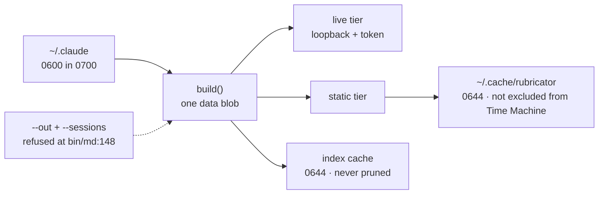

# What the tool keeps, and what it must not

> **Shipped 2026-08-26.** All six items are in; the register carries the
> numbers. Three things this document did not decide and the commits did.
>
> **The mechanism for N1** is `tmutil addexclusion` on the existing cache root,
> not a move under `~/Library/Caches`. Both reach the property this document
> asks for and only one needs a migration; the exclusion was verified
> unprivileged and reversible (`tmutil removeexclusion`) against a directory
> under `$HOME`, since a test under `/var/folders` reports `[Excluded]` before
> you do anything and proves nothing.
>
> **Mode follows intent, not content.** A page that lands in the cache unasked
> gets `0600`; a page written to a path you typed keeps your umask. `--out` is
> the one gesture that means *I intend to move this*, and quietly making that
> file private would be a different kind of surprise from the one N1 fixes.
>
> **N3 chose to scrub rather than to confess.** The item allowed either — apply
> the index's patterns to Claude's turns, or delete the comment and say the
> reader shows what is on disk. Scrubbing won because the claim was cheap to
> make true, and because the cause of the drift was that there were *two*
> lists: `transcript.py` now imports `workspace.SECRET` instead of carrying a
> shrunken copy of it, so there is nothing left to forget to update. The
> standalone fallback stays for a `transcript.py` run without the index beside
> it, and is the only copy that remains.

Rubricator makes one hard promise. `README.md:228` says *"Session data never
leaves the machine. Prompt text is scrubbed of keys, tokens, JWTs, private keys,
`.env` lines and connection strings at index time, and `--sessions` refuses
`--out` outright so it cannot be written to a shareable file."*

The refusal is real and it is one line of shell, and the index really is scrubbed
at index time — `scrub()` is called at `workspace.py:237`, and `workspace.SECRET`
(`workspace.py:184-204`) is the ten patterns that sentence lists. What the
sentence does not cover is where the same corpus ends up. The tool's own index of
every prompt you have typed in twenty directories sits in a world-readable file
with no expiry, in the one cache directory macOS does not exclude from Time
Machine, and the same corpus is baked whole into an 8 MB page on disk by a path no
flag was typed for. A second scrubber, in the transcript reader, claims the
protection this one has and does not have it.

This plan covers register items **N1–N6**, and records the refusal of **X10** —
the durable transcript archive, which is the most-wanted feature in the register
and is not being built.

---

## 1. What was measured, and when it stops being true

Everything below was run on this machine on **2026-08-23**. Half of it is a
measurement of *another product's* retention behaviour, and that half has a
shelf life. Read §1.3 before quoting any of it.

### 1.1 The corpus

Run 20:00–20:20 local; the entries are `M-RET-1` and `M-RET-3` to `M-RET-6` in
`measurements.md`.

| | |
|---|---|
| sessions in `~/.claude/history.jsonl` | **452**, back to 2026-04-17 — a span of **127.97 days** |
| main transcripts in `~/.claude/projects` | **71** |
| sessions with both | 68 — so **384 sessions (85.0%) are findable and unreadable** |
| oldest main transcript, by mtime | 29.44 days · main transcripts older than 30 days: **0** |
| oldest readable *content* | first line dated **2026-06-05 — 79 days ago** |
| transcript files older than 30 days | **443**, every one of them a subagent transcript |
| `du -sh ~/.claude/projects` | **960 MB** accumulated in one 30-day window ≈ **11.4 GB/year** |
| `cleanupPeriodDays` in `~/.claude/settings.json` | absent — the default applies |

Two of those rows correct the simple story. The sweep keys on **mtime**, not on
content age, so a session that was resumed in July keeps a June transcript alive:
the oldest surviving file holds 7,563 timestamped records running 2026-06-05 to
2026-07-19. And subagent transcripts are removed *with their parent*, so 443 files
on this machine are well past thirty days and perfectly readable. "Durable half,
volatile half" is not a clean split.

### 1.2 What rubricator leaves behind

Re-measured for this document at 21:20 local.

| | |
|---|---|
| `~/.cache/rubricator/index/sessions.json` | 1,507,930 bytes, mode **0644** |
| its contents | **3,998 prompts · 419 sessions · 1,313 file paths · 20 distinct project directories** |
| `~/.cache/rubricator/index/sessions-deep.json` | 1,577,153 bytes, mode 0644 |
| `~/.cache/rubricator/workspace-3f05aa860a.html` | 7,984,399 bytes, mode 0644, **7,792 occurrences of `"sid"`** |
| files under the cache root | **33 of 33 world-readable**, in directories mode 0755, 34 MB total |
| pruning | rendered HTML: 7 days (`bin/md:413`) · the index JSON: **never** |
| `tmutil isexcluded ~/Library/Caches` | `[Excluded]` |
| `tmutil isexcluded ~/.cache/rubricator` | **`[Included]`** |
| `transcript.SCRUB` against `workspace.SECRET` | **1 pattern against 10** |
| assistant text blocks matching `workspace.SECRET` | **118 of 7,830 (1.5%)** — the shipped reader catches **0** |

The index's twenty directories are a superset of your prompt history's eighteen,
because `load_sessions` fills a session's project path from the transcript's `cwd`
when history has no record of it. The tool knows about directories the up-arrow
does not.

### 1.3 Re-measure before you rely on this

Every figure in §1.1 describes a product that ships on its own schedule and a
retention policy its vendor can change in a point release. Every figure in §1.2
describes a directory that grows every time you run `md --sessions`.

`continue-plan.md` is the cautionary example. Its §1 said which build it was
measured against — `continue-plan.md:19`, directly above the table — but not
which date, and not in the header where a later reader would look; and two of its
rows turned out to be measuring the author's own settings rather than the
platform. That is register item **O3**. The written form of the discipline is
standing rule 12 — *never scope a design on a documented-**but-unfired** platform
feature without re-running the measurement against the then-current build* — and
its own example is `PermissionRequest`, not `continue-plan.md`. The
generalisation this section applies is one step wider: a documented behaviour
that *does* fire can still be changed in a point release, so date the table and
say what build it describes.

So: **before any N item is implemented, re-run these commands and update this
table.** They are all read-only, and they were all run to produce the numbers
above.

```
# §1.1 rows 1–3: sessions, span, and the cross-reference
python3 - <<'PY'
import json
from pathlib import Path
H = Path.home(); sess = {}
for line in (H / '.claude/history.jsonl').open(encoding='utf-8', errors='replace'):
    try: d = json.loads(line)
    except Exception: continue
    if d.get('sessionId'): sess.setdefault(d['sessionId'], d.get('timestamp', 0))
mains = list((H / '.claude/projects').glob('*/*.jsonl')); names = {p.stem for p in mains}
lo, hi = min(sess.values()) / 1000, max(sess.values()) / 1000
lost = set(sess) - names
print(len(sess), "sessions · %.2f days" % ((hi - lo) / 86400))
print(len(mains), "main transcripts ·", len(set(sess) & names), "in common ·",
      len(lost), "unreadable (%.1f%%)" % (100 * len(lost) / len(sess)))
PY

# §1.1 rows 6–8
find ~/.claude/projects -name '*.jsonl' -mtime +30 | wc -l
du -sh ~/.claude/projects
grep -c cleanupPeriodDays ~/.claude/settings.json || true    # 0 = the default applies

# §1.2 rows 1–5, 7 and 8: the cache
python3 -c "import json,os;d=json.load(open(os.path.expanduser(\
'~/.cache/rubricator/index/sessions.json')))['data'];print(len(d['prompts']),\
'prompts ·',len(d['sessions']),'sessions ·',len(d['touches']),'paths ·',\
len({m['p'] for m in d['sessions'].values()}),'dirs')"
ls -l ~/.cache/rubricator/index/ ~/.cache/rubricator/*.html
# occurrences, not lines: grep -c would say 2
for f in ~/.cache/rubricator/*.html; do
  printf '%s ' "$(basename "$f")"; grep -o '"sid"' "$f" | wc -l
done
find ~/.cache/rubricator -type f | wc -l
find ~/.cache/rubricator -type f ! -perm 600 | wc -l
du -sh ~/.cache/rubricator
tmutil isexcluded ~/Library/Caches
tmutil isexcluded ~/.cache/rubricator

# the vendor's side
curl -s https://code.claude.com/docs/en/claude-directory.md | grep -n cleanupPeriodDays
```

Five rows need more than a command, and the block deliberately does not fake
them. The two content-age rows in §1.1 — oldest main transcript by mtime, oldest
readable first line — are a walk over the transcripts reading timestamps; the
method is `M-RET-3`. The two pattern rows in §1.2 are a read of
`bin/md:413` and of the two modules, not a measurement. The scrub-gap row needs
both modules imported and `scrub()` called over every assistant text block; the
method is `M-RET-12`.

One substitution in particular must not be made. `wc -l ~/.claude/history.jsonl`
is not the session count: that file has 4,763 lines and 452 sessions, and a reader
who reaches for the shorter command is off by an order of magnitude with nothing
to warn them.

Eighty minutes of drift is enough to see why this matters. The same
cross-reference re-run at 21:20 gives **454 sessions, 79 transcripts, 70 in
common, 384 unreadable — 84.6%**. The count of lost sessions did not move at all.
The *percentage* fell, because the denominator grew. Quote the 384. Be careful
with the 85%.

---

## 2. One refusal, three ways round it

`bin/md:148-149`:

```sh
if [ -n "$out" ] && [ -n "$sessions" ]; then
  die "refusing --out with --sessions: your history stays on this machine"
fi
```

That is the right instinct and it guards exactly one edge, upstream of everything
else: the check runs before `build()` is ever called. `build()`
(`workspace.py:383`) assembles one data blob — documents, stale, sessions,
prompts, touches — and hands the same blob to whichever tier is running. The live
tier serves it over loopback with a per-run token. The static tier writes it into
a file. `--out` names that file and is refused. The default static path names it
`$CACHE/workspace-<hash>.html` and is not.



There are three ways to reach the static tier: `--static`, `-n`, and the
fall-back at `bin/md:180` when the local server does not come up —
*"could not start the local server; falling back to a static page"*. The last one
needs no flag and no intent. The 8 MB file with 7,792 references to session ids in
it is on this machine because one of those three happened on 21 August. It will
sit there for seven days, and the next fallback writes another one.

So the promise in `README.md:228` is enforced against the path a user types and
not against the path the tool takes on its own. **N1** and **N2** make it a
property of every write path instead of one.

---

## 3. The cache stops being world-readable, backup-eligible and immortal — N1, N2

Four fixes, none of them large — the code for two already exists elsewhere in the
repo.

**Permissions.** `actions.py:113` writes the settings file with
`os.chmod(tmp, 0o600)` and `actions.py:222` creates a directory with
`f.chmod(0o700)`. `workspace.py:309-317`, which writes the session index, does
neither. Claude Code keeps this data at 0600 inside a 0700 directory; rubricator
derives a copy of it and downgrades it. Thirty-three of thirty-three files under
`~/.cache/rubricator` are readable by every account on the machine, including the
`extract/` cache, which holds the *plaintext* of every PDF and Word file
`documents-plan.md` indexes — on this machine, 22 files, the largest 123,746
characters of extracted contract text.

**Location.** `tmutil isexcluded ~/Library/Caches` returns `[Excluded]`;
`tmutil isexcluded ~/.cache/rubricator` returns `[Included]`. Of the two cache
directories available on macOS, the tool picked the one the OS does not treat as
a cache, so the cross-repo prompt index is eligible for the backup destination
rather than skipped like a cache. Whether a backup is configured, and where it
writes, this measurement does not say. The exclusion status is the finding, and
it is the only part rubricator controls. The cache root is defined in three
places (`bin/md:25`,
`workspace.py:13`, `extract.py:18`), all three hardcoding `$HOME/.cache/rubricator`
behind a `RUBRICATOR_CACHE` override, so moving it is a three-site change and
**O4**'s rule applies here as it does to the four Chrome guard sites
(`scope-plan.md` §4): every site or none. A partial move leaves two cache roots
and no error.

Two ways to fix it, and the choice was a platform question until 2026-08-24.
Moving to `~/Library/Caches/rubricator` inherits the exclusion for free and
orphans whatever is in `~/.cache` today; `tmutil addexclusion` keeps the
XDG-shaped path that a Linux port would want and has to be re-asserted rather
than assumed. **Assert the property, not the mechanism** — the done-when is
`tmutil isexcluded` returning `Excluded`, whichever route gets there. Open
question 4 is answered: macOS-only is a **decision**, not a "not yet", and O4
now writes that down rather than settling it. What the answer removes is the
tiebreak, not the choice. *Keeps the path a Linux port would want* was the one
argument for `tmutil addexclusion` that did not have to be weighed on this
platform's terms, and there is no port for it to be an argument about. The two
routes are left to be judged on the merits N1's own commit can see — a three-site
change against a property that has to be re-asserted — and that judgement belongs
to the commit that makes it, not to this document and not to O4. The done-when
does not move either way, which is the point of stating it as a property.

**Expiry.** `bin/md:413` prunes rendered HTML after a week:

```sh
find "$CACHE" -maxdepth 1 -name '*.html' -mtime +7 -delete 2>/dev/null || true
```

`-maxdepth 1` does not reach `index/` and `-name '*.html'` does not match
`.json`, so `sessions.json` and `sessions-deep.json` are immortal by an accident
of two flags. Prune them on the same seven-day schedule. They are a cache of a
1.0 s computation; there is no argument for keeping them longer than the pages
built from them.

**The corpus never gets baked into a file.** `data["prompts"]` is only needed by a
page that is going to search it. The live tier can keep serving it inline, or
fetch it the way `ensureAllText` (`workspace.js:41`) already fetches document
text; the static tier should not carry it at all. Note that serve mode strips only
`docs[].text` today (`workspace.py:459`) — `prompts` is inlined in both tiers, so
this is a new split, not an existing one reused. Drop `prompts` from the static
build and the 8 MB file becomes a document index, which is what a shareable
artefact should have been all along. The user-visible cost is real and worth
naming: **a static workspace loses prompt search**. That is the correct trade —
the static tier exists to be a file you can move, and a file you can move is
exactly the thing `bin/md:149` refuses to create.

Write the rule down while it is fresh, because the next item that will cross it is
already in the register: **Q5** (`md --json`) emits the index to stdout. Its own
line stops the list at session ids and does not include prompt text. That is not
an omission to be tidied up later — it is the same rule as N2, and it belongs in
the standing rules with the reason attached.

*Done when:* `find ~/.cache/rubricator -type f ! -perm 600 | wc -l` is 0,
`tmutil isexcluded` on the cache root says Excluded, no `.html` on disk contains
prompt text, and a session index older than seven days is gone on the next run.

---

## 4. The comment that is not true — N3

`transcript.py:29`:

```python
# the same scrubbing the prompt index uses, so a conversation cannot leak a key
SCRUB = [
    (re.compile(r"\b(sk-[A-Za-z0-9_-]{16,}|[sprk]k_(?:live|test)_[A-Za-z0-9]{10,}"
                r"|gh[pousr]_[A-Za-z0-9]{20,}|xox[baprs]-[A-Za-z0-9-]{10,}"
                r"|AKIA[0-9A-Z]{12,}|AIza[0-9A-Za-z_-]{20,})"), "[key]"),
]
```

One pattern, matching vendor-prefixed key formats. `workspace.SECRET`
(`workspace.py:184-204`) has ten, including private-key blocks, JWTs, whole
authorization headers, `KEY=value`, connection strings and email addresses. The
comment is false on its face.

It is also false in a second way that matters more. `scrub()` is called at
`transcript.py:74`, `:149` and `:176` — a tool-call brief and both branches that
build **your** turns. The assistant branch at `:200` is
`cur["text"] = chunk[:MAX_TEXT]`, raw. Claude's half of every conversation is
rendered exactly as it sits on disk.

The gap is measurable, so it was measured. Both modules imported, `scrub()` called
directly on every assistant text block on this machine:

| | first run, 20:10 | re-run, 21:20 |
|---|---|---|
| assistant text blocks | 7,830 | 7,876 |
| matched by `workspace.SECRET` | **118 (1.5%)** | **119 (1.5%)** |
| matched by `transcript.SCRUB` | **0** | **0** |

The 20:10 breakdown of the 118 (`M-RET-12`): 51 emails, 30 opaque blobs, 25
credential assignments, 8 authorization headers, 3 env lines, 1 connection
string. The shipped scrubber catches none of them, and this is not a
hypothetical class of content — the vendor's own documentation says a tool that
reads a `.env` file writes that value into the transcript.

Two defensible answers.

1. **Apply `workspace.SECRET` to Claude's turns.** One import, one call site. It
   costs the reader some fidelity: `[email]` in place of an address makes a
   conversation about a bug report harder to follow, and `[blob]` accounts for 30 of
   the 118, on base64 the log did not classify.
2. **Delete the comment**, and say in the README that the transcript reader
   displays what is on disk, unmodified — which is true, is the honest description
   of a local reader, and is consistent with `--sessions` being opt-in and never
   leaving the machine.

Either is fine. The current state — a comment asserting a protection nobody
implemented — is the only one that is not, because it is the exact failure this
whole programme is about: reporting confidence that has not been earned. The
recommendation is (1), for consistency with the index now that §3 has established
the index is a file other accounts can read; (2) with a README sentence is a
complete answer and should not cost a second evening's argument.

*Done when:* the comment and the code agree, and the README says which choice was
made.

---

## 5. `⌘K` does not know which repo you are in — N4

The Sessions navigator gets this right. `sessionList()` (`workspace.js:434`)
defaults `sesScope` to `'here'` and filters on `inRepo(m.p)` at `:440`; the header
at `:1195-1197` renders a *this repo* / *everywhere* toggle; `:1203-1207` even
offers *"N more elsewhere — search everywhere"* when a query is narrowed by the
scope. Someone thought about this carefully. There is a deliberate escape hatch at
`:1709-1710`: if no session in the index belongs to this repo, the scope flips to
`all`, because a repo with no history of its own should not open on an empty list.

The palette does none of it. `palSearch` (`workspace.js:1337`) loops
`for (var sid in D.sessions)` at `:1363` with no scope filter and no indication in
the UI. `README.md:160` says *"`⌘K` is **find anything**"*, and on the first
keystroke it finds it in all twenty directories in the index.

Give it `inRepo` and the same toggle; the red team put it at ten lines. Keep the
`:1709` escape hatch — it applies to both surfaces, and without it the palette in a
fresh repo would return nothing and look broken.

This is the leak with the shortest path to a real one. Not an attacker: a demo, or
a screen share, or a colleague at your desk while you type three letters. Nobody
has been hurt by it yet — see §9.

*Done when:* `⌘K` in one repo does not surface another repo's prompts until the
toggle is used, and the toggle is visible.

---

## 6. The asymmetry, and the sentence that uses it — N5

Two files record the same history and they expire differently.

> Anthropic's documentation states: "Claude Code clients store session
> transcripts locally in plaintext under `~/.claude/projects/` for **30 days by
> default** to enable session resumption. Adjust the period with
> `cleanupPeriodDays`."
>
> — `citations.md` F1, quoting code.claude.com/docs/en/data-usage

`history.jsonl` is on the other side of the line. `citations.md` G4 — the same
fetch, recorded as `M-RET-21` — has `code.claude.com/docs/en/claude-directory`
listing it under the heading **"Kept until you delete them"**, described as
*"Every prompt you've typed, with timestamp and project path."*

That asymmetry is the whole reason rubricator's session surface works at all: it
indexes the durable file and reads the volatile one on demand. It is worth being
precise about its status. It is **documented vendor behaviour**, not a lucky
accident anyone discovered — which makes it cheaper to build on, and equally
liable to change, which is why §1.3 exists.

On this machine the asymmetry costs 384 sessions. They are in the index, they are
searchable, they have titles, and clicking one cannot show you a conversation.

### What the tool should say

The tool already knows. `navSessions` at `workspace.js:1200` renders
`N · M resumable` for whichever scope is active — on this machine, `419 · 78`
once you press *everywhere*, because `sessionList()` defaults to `sesScope` and
`sesScope` is `'here'` at `:212`. The unscoped totals are already computed:
`m["live"]` is set in `load_sessions` for exactly the sessions whose transcript
still exists, and the docstring at `workspace.py:216-222` says why in as many
words: *"A session with no transcript can still be read and searched; it cannot be
resumed. The page has to say which is which, or the resume button lies."*

What is missing is not the count. It is the **cause**. A number with no
explanation is standing rule 8 unmet — an empty result has to say which kind of
empty it is. Three changes:

1. Put the ratio in the global status strip, not only in the Sessions navigator.
   `workspace.js:1228` currently foots that navigator with
   `419 sessions · 3998 prompts`, which is the least informative pair of numbers
   available.
2. Print one sentence, once per install:

   > Claude Code deletes transcripts after 30 days by default; 384 of your 452
   > sessions have already lost theirs. To keep them: `cleanupPeriodDays` in
   > `~/.claude/settings.json`.

3. Use it as the empty state everywhere the join is empty — which is where
   **Q1** picks it up, and Q1 is marked as depending on this item.

One honesty note on the denominator. The register's done-when says the strip
should read `452 sessions · 68 readable`. The tool's own index says **419** and
**78**, because `workspace.py:233` drops every record whose text begins with `/`,
so a session in which you only ever typed slash commands never enters `meta` at
all. Either number can be defended; they must not be mixed. **Count
`history.jsonl`'s session ids directly — 452 and 68 — and label the source in the
strip.**

The reorder decides it. Under the old order **L6**, which replaces the blanket
`startswith("/")` with a skiplist, landed first and moved 419 toward 452; under
the new one N5 ships first, so an index-derived pair would be one number in the
strip this month and a different number after an unrelated phase, with nothing
between them to explain the change. The directly counted pair does not move when
L6 lands, because L6 changes what enters `meta` and not what is in
`history.jsonl`. The label is not decoration: both pairs will keep appearing —
here, in the register, and in whatever Q1 renders — and the source is the only
thing that tells a later reader which one is on the screen.

### Print the line, do not write the file

The obvious next step is a button that writes `cleanupPeriodDays` into
`~/.claude/settings.json`. It is refused.

Standing rule 1 permits rubricator to write in three places: `.rubricator/` inside
a root it was pointed at, `~/.config/rubricator/` and `~/.cache/rubricator/`, and
a path the human typed in the same gesture. `~/.claude/settings.json` is none of
them. It is also, on this machine, **51 lines** including a `hooks` block and an
`autoMode` section — a markdown reader that rewrites another tool's agent
configuration is one malformed JSON write away from bricking the thing the user
actually works in.

There is a precedent in the repo arguing the same way from the other direction:
`~/.claude/settings.json.bak-markside-20260820171025` exists, left behind by
`install-hook.sh` under the tool's old name. The tool has already edited that file
once and left litter. **P7** deletes that script in favour of a plugin manifest,
which is the right direction of travel.

Print the sentence. Let the human paste it.

*Done when:* the strip shows the ratio — **452/68, the session ids counted from
`history.jsonl` directly**, with the source labelled — the sentence appears once
per install, and nothing under `~/.claude` is written.

---

## 7. The archive, refused — X10

The register's most-wanted feature was `md sessions --archive`: copy transcripts
out of `~/.claude/projects` before the sweep takes them, and own a durable
corpus. It is dead. This section is here because a refusal of that size needs its
cost written down where it can be re-examined rather than re-argued.

### Why it is refused

**It inverts a control the vendor documents.** `claude-directory.md`'s
*Plaintext storage* section — `citations.md` G5, recorded as `M-RET-21` —
states that if a tool reads a `.env` file or a command prints a credential,
that value is written into the session transcript, and its **first** listed
mitigation is to *lower* `cleanupPeriodDays`. A feature whose entire purpose is
copying transcripts out of the swept directory into an unswept one takes that
mitigation and permanently defeats it. A user who deliberately lowered the setting
because the documentation told them to, and then installed a markdown reader, has
had that decision silently reversed.

**It survives the vendor's delete command.** The same page describes `claude
project purge` as deleting *transcripts and auto memory under `projects/`*,
*per-session `tasks/`, `debug/` and `file-history/` entries*, *matching prompt
lines in `history.jsonl`* and *the project's entry in `~/.claude.json`* —
`citations.md` G6, also part of `M-RET-21`. An archive under a rubricator-owned
directory is invisible to it. The user runs purge, gets a confirmation, and the
data is still there. That is the class of bug report that ends a small project.

**It is unscrubbed, and we now know by how much.** 118 of 7,830 assistant text
blocks match `workspace.SECRET` and the shipped transcript scrubber catches zero
of them (§4). Building a durable copy while believing you scrubbed it is worse
than building one and knowing you did not.

**It costs 960 MB per thirty days, about 11.4 GB/year**, and 589 of the 660
transcript files counted in the same pass are subagent transcripts, so the volume
is dominated by the material with the least recall value.

**And the cheap fix strictly dominates it.** Raising `cleanupPeriodDays` keeps the
transcript *where `claude --resume` can still use it*. The archive produces a
read-only copy that does not restore resumability, does not restore the
document↔session join for sessions already swept, and does not survive purge. One
integer beats 11.4 GB/year on every axis, **including the one the archive exists
for**.

### What the refusal costs

**The 384 are gone and nothing brings them back.** A settings key is prospective.
Everything already swept is already swept — no trash directory exists anywhere
under `~/.claude`, the documentation describes no recovery path, and there is no
restore command. Had the archive existed since the first session on 2026-04-17,
this machine would have all 452 sessions readable instead of 68, and the whole
127.97-day span instead of a single surviving file reaching back 79 days. That is
the entire case for the archive and it is a real one; it is simply outweighed, and
it gets weaker every day the warning ships earlier.

**Provenance coverage stays a function of an integer the tool does not control.**
`touches` is built only inside the `~/.claude/projects/*/*.jsonl` loop
(`workspace.py:255-295`): no transcript, no entry. So document↔session coverage
*is* the retention window, exactly. Two repositories on this machine sit at
opposite ends of it — repo A, first committed 2026-08-18, shows 64 of 99
documents with provenance, though all 64 come from a single session id that
touched 80 files, so the join's answer is a constant (`scope-plan.md` §7);
repo B, first committed 2026-03-22, shows 66 of 330. Two
repositories is not a finding, and the high-coverage case reduces to a single
session, so do not read a cause out of the pair. The mechanism is not in question
either way: `touches` is only ever populated from a transcript that still exists,
so coverage cannot outlive the sweep. Q1 is therefore built for the empty case
first, and its empty state is the sentence from §6.

**A user who lowers the setting deliberately gets nothing from us in exchange.**
That is correct behaviour and it is still a cost.

Two adjacent things stay out of scope, named so they do not creep back in. Marks
on a conversation turn are **X25** — an annotation keyed to a transcript that
expires would silently orphan itself, and `allAnnos()` renders nothing for a
document that has left the index, so the miss would be invisible. Grouping the
443 surviving subagent transcripts into openable workflow runs is **X28** —
twelve workflow runs over eleven weeks — a figure carried over from the register,
not re-measured here — is evidence of activity, not of pain.

**Ship the warning, harden the cache, let the hook leave one line.** That is the
whole of phase N: six items, all rated **S** in the register. Nothing here is
hard; the cost is six separate commits.

---

## 8. The hook leaves one line — N6

The hook is the tool's headline feature and the only component that opens a window
without being asked. It leaves nothing behind.

`hook_decision` (`hook.py:159-179`) returns a permission decision and a
`systemMessage` on stdout, `main()` unlinks the temp file it rendered at
`hook.py:221-223`, and the review server dies with the process. Every invocation
is a fresh ephemeral origin, so the page cannot even leave a mark that survives to
the next one. `~/.local/state/rubricator` does not exist on this machine: the hook
has fired **zero recorded reviews**, and there is no way to find out whether that
is true or whether it has fired two hundred.

Two small writes, in this order, because the first one answers the question the
second one depends on.

**One appended line per fire** — decision, plan path, item count, session id,
repo. JSONL, grep-readable, `rm`-deletable, no new UI surface, no migration, no
new command. Derive the session id from the basename of `transcript_path`, which
the hook already reads (`hook.py:35`) and which is `<session-id>.jsonl` for 79 of
the 79 main transcripts counted at 21:20; derive the repo from the process working
directory. Both come from what the hook already reads, and no payload field is
invented to get them. The two payload fields that *are* documented — `plan` and
`planFilePath` — are **K5**'s business, not this item's; N6 must not depend on K5
landing first.

**On approval only, the approved plan text plus the session id into
`.rubricator/`.** The question it answers is narrow and real: the plan Claude
executed against is the one artefact no other record keeps. `git log` shows the
result, the review itself is discarded with the process, and the transcript is
gone in thirty days by default — which is the same clock §6 and §7 are about. How
often that bites is exactly what the JSONL log measures, and it currently measures
zero, so this half lands second and only once the log shows the hook fires at all.
Where the session's working directory is not a repository there is nowhere
legitimate to put it, so nothing is written — never into `~/.claude/plans`, which
rubricator was not pointed at.

Add a navigator group for the log only if the file ever accumulates anything. This
is a named design change and should be recorded as one in **O5**: *the hook stops
being fire-and-forget and starts leaving state.*

One dependency, which the order table also carries. `.rubricator/` is kept out of
git by an exclude line `write_notes` only writes when the **first note is saved**
(`workspace.py:540-546`), and **L5** unions
`git ls-files --others --exclude-standard` into `find_docs`. So after L5, in a repo
where the hook has approved a plan but no note has ever been taken, the approved
plan appears in the tree as an untracked document.

The escape hatch this paragraph used to offer — the hook writes the exclude line
itself — is retired. **M6** stops writing that line and removes the one already
written, so a hook that wrote it in phase N would be undoing M6 a phase before M6
lands: work done twice, in opposite directions. So the item splits at its own
seam. The `reviews.jsonl` half ships here; the approved-plan-text half lands with
M6 in phase M. What M6 does not do is keep the plan text out of `find_docs` —
after M6 there is no exclude line to lean on — so whether an approved plan under
`.rubricator/` should be listed as a document or filtered out of the walk is a
question for the commit that writes it, and it is named here so that commit does
not meet it as a surprise.

### One standing rule needs an amendment

Rule 1's permitted locations, as the investigation first adopted them, were
`.rubricator/`, `~/.config/rubricator/` and `~/.cache/rubricator/`.
`~/.local/state/rubricator/reviews.jsonl` is in none of them, and the cache is
the wrong home for it twice over: §3 has just made the
cache prunable at seven days, and a review log that disappears after a week
answers no question worth asking.

The rule's substance is untouched by this — it forbids writing files git tracks
and files found by indexing, and a JSONL file in the tool's own state directory is
neither. But the rule is written as an **enumeration of locations**, and this
programme's opening lesson is that hand-maintained enumerations drift silently:
`install.sh:59` is exactly that failure, and standing rule 9 exists because of it.
So the amendment is explicit, not assumed: add `~/.local/state/rubricator/` to
rule 1's list, in **O5**, with this item as the *Justification:* line, matching the
pattern rule 1 already uses.

A second question for the same amendment. A hook fires in a working directory
nobody typed, and rule 1(a) permits `.rubricator/` only *in a root it was pointed
at*. Either the session's working directory reads as that root, or the plan-text
write is not permitted at all — O5 must say which, alongside the state directory.

`scope-plan.md` is where both land, and it answers both: rule 1 there already
carries `~/.local/state/rubricator/`, and it reads a hook's working directory as
a root the human pointed at, because the human started the session there and the
write lands in the same `.rubricator/` a note taken in that repo would. So the
plan-text half is permitted. The correction that document used to carry alongside
it — *nothing is written into your files* is not quite true, because
`workspace.py:540-546` appends `.rubricator/` to `.git/info/exclude` — is
withdrawn by **M6**, which stops appending that line and deletes the one it
already wrote. What **O5** records instead is the state after M6: the notes file
is not hidden, it stands in `git status` by design, and committing it is the
supported path under standing rule 3.

*Done when:* three hook fires leave three lines and `md` never reads the file —
that is the half this phase owns. The approved plan text follows with **M6** in
phase M, and `md` never reads that file either.

---

## 9. What this rests on, and the order

### The question this phase turned on, answered

Phase N sat fourth. Nothing here is hard and nothing here is expensive; it was
fourth because **the measured victim count was one**, and that one person was the
maintainer, who owns every prompt in the index.

That position depended entirely on **open question 3: will `md --sessions` ever
run on a machine with client work on it?** The owner answered it on
**2026-08-24: it already does.** Phase N runs **second, after K**.

The position changed because the population changed, not because a measurement
did. Not one figure in this document moved. The index still holds 3,998 prompts
across 419 sessions and 20 directories; 33 of 33 files under the cache root are
still world-readable; the static page is still 7,984,399 bytes with 7,792
references to session ids. What changed is whose prompts those are. The victim
count was never a measurement of the cache directory — it was a measurement of
the machine, and the machine had been described wrongly.

So the four readings below are the operative ones, not the branch that was
waiting on an answer:

- the index stops being a personal file and becomes a cross-client one — twenty
  directories today, at 0644, in a directory the OS does not exclude from the
  backup;
- N4 stops being an embarrassment and becomes a disclosure — `⌘K` typed in front
  of client A returns prompts from client B;
- N3 stops being a false comment and becomes a false assurance about somebody
  else's credentials;
- and the honest answer to *"should a stranger run `md --sessions`?"* is **not on
  a machine with client work on it** until §3, §4 and §5 are done — which is now
  a statement about this machine, and is the reason the phase moved.

It moves ahead of L as well, which the register hedged as *probably*. The
distinction that resolves it is one the register did not draw: L's defects are
the tool lying to its own user, which the maintainer can decide to tolerate for a
week, and N's are other people's material at mode 0644 in the one cache directory
the backup does not skip, which he cannot decide on their behalf. N is the
cheaper phase to front-load as well — six items, every one an evening, and only
N6 adds a file rather than removing an exposure — so L is delayed by about a week
and nothing in L is made harder by the wait.

Nothing in this document's *content* changes either way. Only its place in the
queue.

One correction to that last sentence, and it is not question 3's doing. §3 left
the choice between moving the cache root and excluding it where it is hanging on
**open question 4**, which was answered the same day: macOS-only is a decision.
That removes the portability argument the choice rested on, and it removes the
deferral to O4 with it — O4 writes a matrix, not a cache path. The choice itself
is still open and now belongs to N1's own commit. That is the only content in
this document the answers changed, and it changed by one argument, not one
decision.

### Order and cost

| | | |
|---|---|---|
| **N5** | the ratio and the sentence | S — and it unblocks Q1 |
| **N1** | 0600/0700, excluded from Time Machine, pruned | S |
| **N2** | no prompt corpus in a static file | S |
| **N4** | `⌘K` scoped to this repo | S |
| **N3** | the comment and the code agree | S |
| **N6** | one line per hook fire | S — the `reviews.jsonl` half here; the approved-plan-text half lands with M6 in phase M |

N6's row is the one thing the reorder actually breaks, and it breaks cleanly: the
item splits and both halves keep the number. M6 is now two phases later instead
of one earlier, and the alternative that would have let the plan-text half ship
on time — the hook writes the exclude line itself — is retired by M6, which stops
writing that line at all (§8).

N5 goes first because it is small, because it unblocks Q1, and because every day
it ships earlier is a day of history that does not have to be argued about later.
The four privacy items should be one commit each. N6 is last because it is the
only item here that adds a file rather than removing an exposure, and it should
land after the rules that govern it are written down.

### Cross-references

`install-plan.md` — K5 (the hook reads the plan Claude Code hands it) and the
hand-maintained-inventory lesson behind standing rule 9. `signals-plan.md` — L6
(the prompt index stops discarding 13.6% of what you typed), and the empty-state
discipline this document leans on.
`scope-plan.md` — O3 (the `continue-plan.md` correction that produced §1.3), O5
(the standing rules, including the amendment in §8), P7 (deleting
`install-hook.sh`). `documents-plan.md` — the extraction cache in §3.
Register: **N1–N6**, **X10**, **X25**, **X28**, standing rules 1, 3, 8, 9 and 12,
open questions 3 and 4, both answered 2026-08-24.
