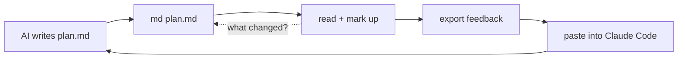

# Reading AI plans, and talking back

The use case: an AI writes a plan or summary as markdown. You read it, and while
reading you want to *respond* — approve this, cut that, question this line, tell it
to refactor that section. Today the loop is: read in the window, switch to the
terminal, retype from memory what you meant, hope the AI finds the right paragraph.

Everything below optimises three things:

1. **No retyping.** What you point at becomes the quote.
2. **Anchors the AI can act on.** `plan.md:42-48` plus the quoted text, so it edits
   the right lines instead of guessing.
3. **Surviving the rewrite.** The AI regenerates the doc; you should only have to
   re-read what changed.



## What the platform allows

Measured in Chrome on a `file://` page, because it decides what needs a server:

| Capability | Available | Consequence |
|---|:---:|---|
| `isSecureContext`, Clipboard API | yes | clipboard export works with no server |
| `localStorage` | yes | annotations survive closing the window |
| `showSaveFilePicker` | yes | the page can write a file itself, with a prompt |
| `fetch()` of a `file://` URL | **no** | live reload / following links need a server |
| `marked.lexer()` raw offsets | exact | source line numbers are reliable |

> [!NOTE]
> All `file://` pages share one origin, so one `localStorage` store holds the
> annotations for every document, keyed by path. Quota is ~5 MB — thousands of comments.

---

# Tier 0 — built ✓

> [!TIP]
> Everything in this tier now ships in `md`. Select text or press a verb key to try it
> on this very document, then hit ⌘⏎ and paste the result into Claude Code.

## 1. Line anchors on every block

The foundation for everything else. `marked.lexer(src)` returns top-level tokens whose
`.raw` strings rejoin to the source exactly (verified), so accumulating their lengths
gives byte offsets, and offsets give line numbers. Attach them to the rendered blocks:

```js
const tokens = marked.lexer(body).filter(t => t.type !== 'space');
let off = 0;
tokens.forEach((t, i) => {
  const start = frontMatterLines + body.slice(0, off).split('\n').length;
  const el = doc.children[i];
  el.dataset.lineStart = start;
  el.dataset.lineEnd   = start + t.raw.trimEnd().split('\n').length - 1;
  off += t.raw.length;
});
```

**Effort:** ~30 lines. **Risk:** the token↔element 1:1 mapping breaks for tokens that
render to nothing (link definitions); filter those too.

## 2. Selection popover

Select any text → a small floating toolbar appears at the selection, the way Medium and
Notion do it. Buttons are *verbs*, not a generic "comment":

| Verb | Meaning to the AI |
|------|-------------------|
| **Change** | rewrite this, here's how |
| **Question** | explain or justify this |
| **Cut** | remove this entirely |
| **Expand** | too thin, go deeper |
| **Approve** | explicitly keep this as-is |

Technically: `selectionchange` event, `getSelection().getRangeAt(0).getBoundingClientRect()`
to position the popover, then walk up from both range ends to the nearest
`[data-line-start]` to get the source range. The selected string is the quote.

**Effort:** ~80 lines.

## 3. Reactions without typing

For a long plan, typing a note on every section is the bottleneck. Hover any section,
press one key: `a` approve, `x` cut, `?` question, `e` expand, `c` comment (opens input).
Most of a review becomes keystrokes; you only type where you have something specific to say.

**Effort:** ~30 lines on top of #2.

## 4. The feedback tray

A collapsible panel (right side, or bottom sheet) listing every annotation in document
order: verb chip, quoted line, your note, and a jump-to-anchor. Editable and deletable.
Count badge in the top bar so you always know how many items are pending.

**Effort:** ~90 lines including storage.

## 5. Export — the part that actually matters

One keystroke (`⌘⏎`) builds this and puts it on the clipboard:

```
Feedback on docs/plan.md — 3 items. Apply them; don't restructure anything I didn't mention.

1. CHANGE — plan.md:42-48 — "Phase 2 — Auth"
   > We'll use Auth0 for SSO.
   No third-party IdP — we self-host. Use our own OIDC.

2. QUESTION — plan.md:88 — bash code block
   > pnpm build
   This repo uses bun. Intentional?

3. CUT — plan.md:120-134 — "Nice-to-haves"
```

Then `⌘Tab`, `⌘V`. The preamble line is configurable — that's where you encode your
standing instructions ("don't restructure", "answer questions inline, don't edit").

Worth having two or three export templates behind a dropdown: *apply feedback*,
*answer my questions*, *raw notes*.

**Effort:** ~40 lines. Clipboard API is available; keep a `document.execCommand('copy')`
fallback for the case where the window isn't focused.

## 6. Persistence and staleness

Store under `md-review:<hash of abs path>`: the doc hash, and per item the line range,
quote, quote-hash, verb and note. When you reopen the file after the AI rewrote it:

- quote still present → annotation still attached, re-anchored to its new line numbers
- quote gone → mark it **possibly addressed**, show it greyed in the tray

That gives you an "unresolved" list across iterations instead of starting fresh each round.

**Effort:** ~60 lines.

> **Since then.** The quote-hash was never built. `share/review.js:119` is
> `raw.indexOf(it.anchor)` — the stored anchor text, exact substring, first
> occurrence, no normalisation, no offset hint and no fallback. The first bullet
> therefore holds only for text that survived byte for byte, and the second
> shipped harder than it was written: a miss sets `state = 'stale'`, and *stale*
> is then reported as **resolved** at `:347`, tagged `gone` at `:370`, dropped
> from the export at `:414`, and filtered out by six `workspace.js` sites. Nothing
> in the shipped tray says *possibly addressed*. One bit was carrying two facts —
> *your text was edited* and *your text was deleted* — and the tool reports the
> second as an accomplishment. M1–M4 replace it: all occurrences collected and the
> one nearest the stored `lineStart` chosen; on a miss, the anchor's own lines
> tried longest-first, which recovers **62.6% / 40.2% of vanished anchors at
> 98.6% / 96.5% precision** measured over 2,985 commit pairs in five
> repositories; and one bit
> becomes three anchor states — `attached` · `moved` · `orphaned` — with an
> orphaned *Approve* surfaced in a header line rather than filed under *resolved*.
> That also answers the first of the open questions at the end of this document.
> The stale/resolved distinction did not hold up, and what it needed was not an
> explicit human *done* state — that stays deferred until someone has run a second
> round — but an honest account of which of the two things happened.

> [!TIP]
> Items 1, 2, 5 and 6 are the 80%. Roughly 270 lines in `template.html` plus passing the
> absolute source path through `META`. No new dependencies, no server, no daemon.

---

# Tier 1 — needs a tiny local server (`md --review`)

`fetch()` of `file://` is blocked, which is the single reason these need one. A stdlib
`python3 http.server` on `127.0.0.1` with a random port and a random path token
(any page in your browser can reach localhost, so the token and an `Origin` check matter).
~150 lines.

## 7. Live reload with changed-section highlighting

The AI rewrites `plan.md` while the window is open; the page updates in place via SSE,
and every section whose content hash changed gets a badge. You re-read only the diff.
This is the feature that makes the iteration loop feel like a conversation rather than
a series of reloads.

**Tech:** poll `mtime` in a thread → SSE `event: change` → page re-renders, compares
per-heading hashes against the previous render, badges the deltas, keeps annotations
attached by quote matching.

## 8. Sidecar file instead of clipboard

`POST /feedback` writes `plan.review.md` next to the source. Then you just say
"read plan.review.md" — nothing on the clipboard, and the feedback is a durable artifact
you can diff and keep. Or have the server pipe straight to `pbcopy`, which sidesteps
browser clipboard permissions entirely.

## 9. Blocking mode — the CLI-native shape

```bash
claude "$(md --review plan.md)"
```

`md --review` opens the window and *blocks*. You mark up the document, hit Done, the
server prints the feedback to stdout and exits. It composes with the shell like any
other Unix filter, and there's no copy-paste step at all.

## 10. Following links

Plans reference other plans. Clicking a relative `.md` link currently opens raw text;
with a server it renders in place, with back/forward. Without one, `md --follow` could
pre-render the whole link graph and rewrite hrefs to cache paths — cruder, but serverless.

---

# Tier 2 — bigger swings

## 11. Dedicated Chrome profile

Launching with `--user-data-dir=~/.cache/md-render/chrome` gives `md` its own Chrome
process, which means launch flags actually apply (they're ignored when your main Chrome
is already running) — including `--allow-file-access-from-files`, which would unblock
`fetch()` and give live reload *without* a server. Cost: separate profile, no extensions,
slower first launch. It makes `md` feel like a standalone reader app.

## 12. Inline editing → patch

Make blocks `contenteditable`. Fix the wording yourself instead of describing the fix,
and export a before/after patch. Strongest for small corrections where explaining
costs more than editing. Larger change; needs care to map edits back to source ranges.

## 13. Version diff view

Keep the previous source in the cache dir per file. A toggle shows a word-level diff of
what the AI changed since your last read — independent of your annotations. ~60 lines
with a small LCS implementation.

## 14. Fold / outline mode

`z` collapses all sections to headings; click to expand. For a 3000-word plan the outline
*is* the review surface — you decide which sections deserve reading.

---

# Decisions made while building Tier 0

- [x] **Quote *and* `file:line`.** Long quotes collapse to their first lines plus
      `… (N lines)`, since the range already pins them exactly. A 4-item review is ~750
      characters instead of ~1400.
- [x] **Clipboard, not a sidecar file.** Nothing is written to the repo. The sidecar
      stays a Tier 1 idea, where a server can write it.
- [x] **State keys off the absolute path**, but re-anchoring matches on *content* — so
      notes follow their text when the AI rewrites around them, and go stale when it's gone.
- [x] **Heading reactions cover the whole section**, anchored to the heading line so an
      edit inside the section doesn't orphan the note.
- [ ] Still open: `md -` (stdin) has no path — anchors fall back to the section title.

# Open questions

- [ ] Does the stale/resolved distinction hold up over several rounds, or does it need an
      explicit "done" state you set yourself?
- [ ] Should `Approve` items even be exported? They cost tokens and say "change nothing".
      Maybe collapse them into one line: *approved as-is: sections 2, 4, 7*.
