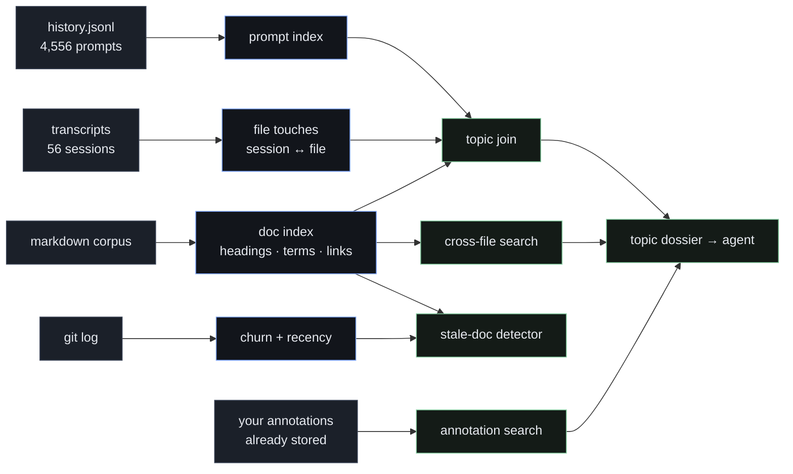
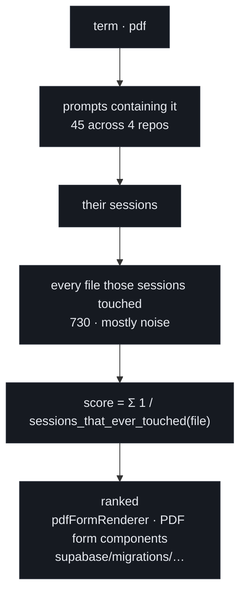
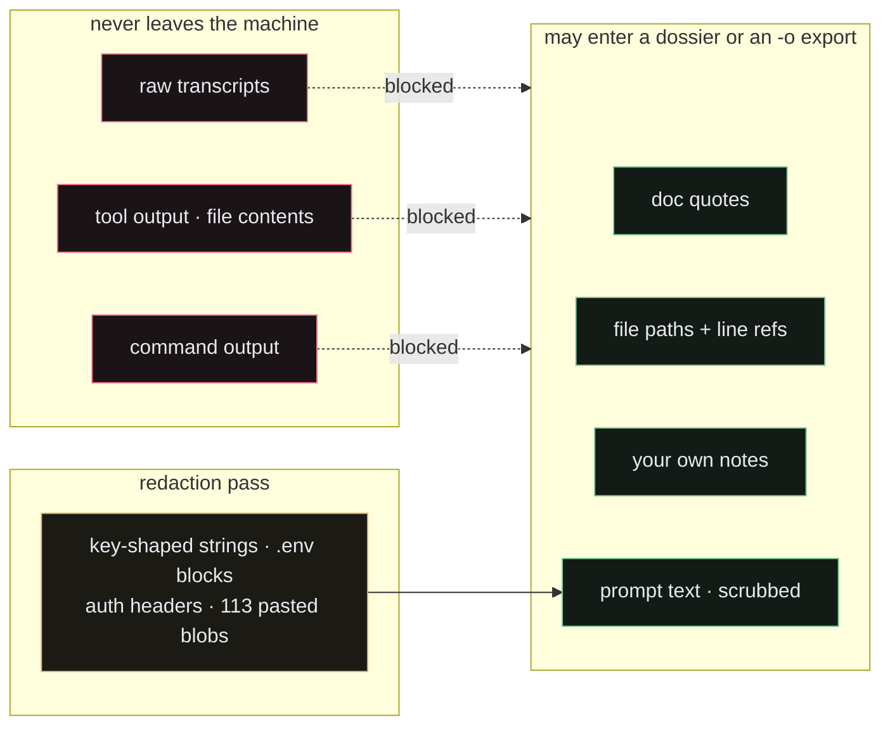
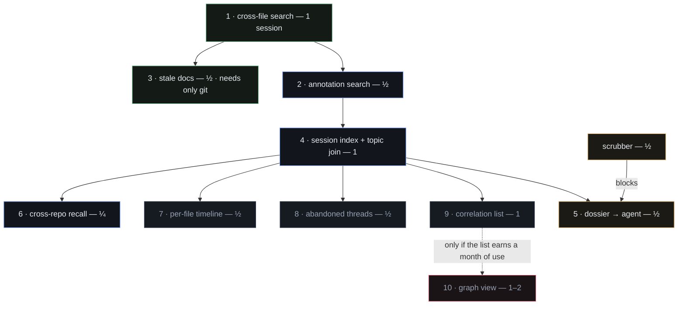

# Workspace mode

> Point rubricator at your work — the markdown, the git history, and your own past sessions —
> and answer the question a file-by-file reader cannot: **where did I note, discuss or decide
> that?**

The whole plan comes from one sentence: *"often I ask myself where I noted something."* The
uncomfortable half of that is that frequently **you didn't note it** — you discussed it in a
session, decided, and moved on. Your markdown can't answer that. Your history can.

Every number below was measured on a real machine, not estimated.

---

## 1. What we have to work with

| Source | Size | What it gives |
|---|---|---|
| repo `*.md` | varies | the corpus: headings, terms, links |
| `~/.claude/history.jsonl` | 2.1 MB · **4,556 prompts** | every prompt, keyed by session + project + time |
| `~/.claude/projects/*/*.jsonl` | 640 MB · 56 sessions · 11 projects | every `file_path` a tool touched, with timestamps |
| `~/.claude/plans/*.md` | 40 KB | the plans themselves |
| `git log` | — | what actually shipped, and churn per file |

**The find is `history.jsonl`.** Two megabytes holding every question you have asked,
already keyed by session and project, with no need to parse the 640 MB behind it.

### It is fast enough to need no daemon

| Operation | Measured |
|---|---|
| extract file-touches from 478 MB across 56 sessions | **0.6 s** |
| full *topic → sessions → files* join | **0.13 s** |
| resulting index | 1,588 files, 4,556 prompts — a few hundred KB |

So there is **no index to maintain, no watcher, no staleness**. Rebuild on demand, every
time. That preserves the property that makes rubricator rubricator.

---

## 2. Shape of the thing

Four indexes, rebuilt in under a second, feeding five views. Nothing is stored that cannot
be recomputed.

---

## 3. The join, and the finding that decides it

The naive version is **useless noise**: searching `migration` matched 22 sessions, and those
sessions touched **523 files** between them — a session touches whatever it touches.

The fix is to rank by **specificity**, not presence:

A file touched in every session is background; a file touched only in the matching ones is
signal. Verified: `pdf` routes to `pdfFormRenderer`, `migration` to `supabase/migrations/`.

Three refinements the measurement exposed:

- **Filter scratch paths.** `/private/tmp/claude-*` session scratch dominates raw results
  and is never the answer.
- **The score saturates.** One touch in one matching session ties with three in three.
  Tie-break by match count, or require ≥ 2 before ranking.
- **History outlives transcripts.** Many `sessionId`s have no transcript left on disk.
  Degrade to *"prompt only, files unknown"* rather than dropping the hit.

---

## 4. The trust boundary

Transcripts contain **everything**: file contents, command output, pasted credentials,
client data. rubricator inlines its data into a self-contained page, and `-o` makes that page
shareable. Getting this wrong turns a memory aid into a leak with a share button.

Rules, not preferences:

1. The session index is **local-only**. `--workspace --sessions` refuses `-o`.
2. Index **metadata and prompt text only** — never tool output, never file contents.
3. Prompt text is itself sensitive (113 of your prompts carry pasted blobs), so it passes
   the scrubber before it can reach a dossier.

**Build the scrubber early.** The dossier is worth more than everything else here and is
blocked without it.

> **Since then.** Rule 1 shipped and is enforced — `bin/md:149` dies with
> *"refusing --out with --sessions: your history stays on this machine"* — but it
> guards one write path. The default static build takes the other one: every
> `md --workspace --sessions` leaves `~/.cache/rubricator/workspace-<hash>.html`
> on disk, **7,984,399 bytes at mode 0644**, carrying **7,792 occurrences of
> `"sid"`** and the prompt text with them. That is the same corpus the flag
> refuses to hand to `--out`, written without being asked, world-readable, in the
> one cache directory macOS does not exclude from Time Machine, and never pruned.
> The rule was right and the enforcement was partial. N2 drops `prompts` from any
> static build and serves them instead, so that no `.html` on disk contains prompt
> text and the refusal at `bin/md:149` becomes true of every write path rather
> than one; N1 takes the cache to 0600, excludes it from backup, and gives the
> session index a seven-day life.

---

## 5. The features

### 5.1 Cross-file search — *the foundation*

Walk the tree (respecting `.gitignore`), index every `.md`, and search all of them at once,
with matches in context grouped by file. Click through to the normal reader at that line.

Reuses the existing search machinery, renderer and design system. New: a walker, an inlined
index, a results view. **One session.**

### 5.2 Annotation search — *the distinctive one*

The review store already knows every note you have made, keyed by path. Surface it across
documents: filter by verb, by file, by unresolved. *"Show me every open Question."*
*"Where did I mark something Cut?"*

What you are hunting is often **your own reaction**, not the text — and nothing else can do
this, because nothing else made your notes. **Half a session.**

### 5.3 Stale-doc detector — *the one that pays immediately*

For each document: how much did the code it describes change since the doc was last touched?
Scope churn to the files the doc **mentions or links**, not the whole repo.

A crude repo-wide version already found real hits here:

| Doc | Untouched | Commits since |
|---|---|---|
| repo B, a requirements document | 152 days | 604 |
| repo B, a roadmap | 125 days | 586 |
| repo C, a directory of feature specs | 210+ days | ~2,300 |

Pure git plus the corpus — **no session data needed**, so it can ship before any of the
archaeology. **Half a session.**

> **Since then.** It shipped, and it is not the one that pays. Measured against
> five repositories it is the least trustworthy signal in the tool. On
> repo A the detector resolved **zero targets for 87 of 99 documents** and
> printed *"Nothing looks stale — every document that names code has been touched
> since that code last changed"* anyway. The navigator glyph and this surface use
> different predicates, so repo C shows **231 triangles against 129 rows**,
> of which **40** are displayed with nothing said about the other 89. `repo_churn`
> is computed once per document — 26% of the git pass — and read by no JavaScript
> at all. Of the documents it *can* judge it fires on 71.5% (repo C) to
> 92.4% (repo D). The obvious repair, widening the target whitelist so more
> documents resolve, was measured and declined: **5.03 s on repo C, eleven
> times the entire current index**, and it takes the navigator from 46% to 62%
> flagged — worse on the half it does not fix (X14). L4 keeps the surface and
> makes it honest: the glyph goes, `repo_churn` goes, the empty state distinguishes
> *nothing is stale* from *nothing could be judged*, the truncation says
> `showing 40 of 154`, and the name changes to what the subhead already says —
> *documents whose named files kept changing after the document stopped*.
> Staleness as the product's thesis is refused outright (X13): the ordering
> correlates **r = 0.84** with how many paths a document quotes and **r = 0.12**
> with its age, so what this ranks is verbosity.

### 5.4 Session index + topic join — *the engine*

Extract prompts from `history.jsonl` and file-touches from the transcripts, apply the
specificity ranking from §3, and answer: *these documents mention it, these sessions
discussed it, this is the code that changed while they did.* **One session.**

### 5.5 Topic dossier — *the reason this is rubricator and not a browser*

Take everything the join returned and export it as agent context: the specs, the decisions,
the files, and your unresolved questions on the topic. The tool already exists to feed an
agent; this makes your corpus and your history feed it too.

Gated on the scrubber. **Half a session** on top of the join.

### 5.6 Cross-repo recall — *"have I solved this before?"*

`history.jsonl` never split by project, so this is nearly free. Topics genuinely recur here:

| Term | Prompts | Repos |
|---|---|---|
| `cloudflare` | 37 | **7** |
| `email` | 118 | 5 |
| `pdf` | 45 | 4 |
| `migration` | 30 | 3 |

For someone running many small repos solo, *"where did I do this last time, and what did it
end up looking like?"* is worth more than searching one repo well. **A quarter of a session**
once the index exists.

### 5.7 Per-file timeline

Open a file, see its life in one column: git commits, the sessions that touched it, the
prompts from those sessions, any plan that named it. The detail view the join implies.
**Half a session.**

### 5.8 Abandoned threads

Sessions that touched files but were followed by no commit — work you started and dropped.
Computable exactly from session timestamps against `git log`. Pair with recency so a topic
reads as *hot* or *cold*. **Half a session.**

### 5.9 Correlation list, then maybe a graph

For a document or a term: which others share links, headings, or rare terms (TF-IDF over the
corpus — deterministic, offline, explainable). Ship it as a **list** first.

The graph view is the classic feature that looks superb in a screenshot and gets opened
twice; Obsidian's is the cautionary tale. **Gate it**: build the visual only after the list
has earned a month of use.

### 5.10 Deliberately not building

- **Rhythm and usage dashboards** — sessions per week, time of day, streaks. Measures
  something real, tells you nothing you would act on.
- **"This plan is 60% implemented"** — the plan → session → files → commits *link* is exact
  and useful; the percentage is a guess dressed as a metric. Ship the link, not the number.
- **Embeddings** — better at synonyms, worse at everything else: a dependency, a cost, and
  an edge you cannot justify. Not until TF-IDF demonstrably fails.

---

## 6. Order of work

Each step is independently useful — **stop after any of them**. If only three get built:
**§5.3 stale docs** (pays off immediately, needs no session data), **§5.5 dossier** (makes
the whole thing rubricator-shaped), **§5.6 cross-repo recall** (the cheapest genuine surprise).

Roughly **3½ sessions** to the dossier; ~6 for everything except the graph.

---

## 7. The architectural fork

rubricator today is a hard rule: one file in, one self-contained page out, no server, no state.
Workspace mode breaks it — indexing means a build step, and staying fresh means watching.

So it is a **second door, not a change to the first**. `md file.md` stays exactly what it is.
`md --workspace [dir]` is a different entry point into the same renderer. If workspace mode
ever forces a compromise on the single-file path, the answer is no.

The sizing lets us keep the character: 200 documents at 8 KB is 1.6 MB, which inlines into
one static page. **Workspace mode can stay serverless**, rebuilt on demand in well under a
second — with the exception of watch mode, which has its own plan.

---

## 8. Open questions

- [ ] Index cached in `~/.cache/rubricator` with an mtime check, or rebuilt every time? At
      0.6 s, rebuilding may simply be simpler than invalidating.
- [ ] Does `md` with no arguments in a repo root become workspace mode, or stay README?
- [ ] Whole tree, or `docs/**` plus a `--include` glob?
- [ ] One workspace per repo, or a saved set of roots searched together? Cross-repo recall
      (§5.6) argues for the latter.
- [ ] The transcript JSONL schema is undocumented and moves with releases. The extractor
      leans on `"file_path":"…"` — stable in practice, not guaranteed. It must degrade to
      fewer results, never to a crash or a wrong answer.
