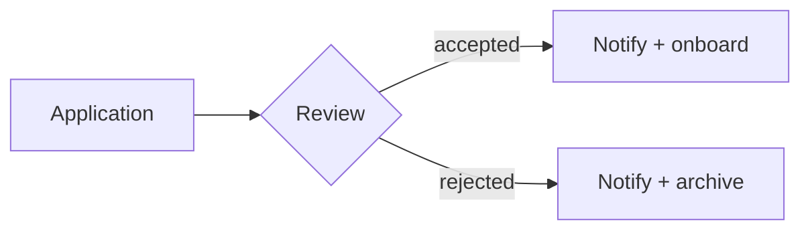

# Applications portal — implementation plan

## Context

The portal accepts applications, tracks their state and sends notifications.
This plan covers phase one only.

## 1. Data model

Three tables: `applications`, `people`, `attachments`.

```sql
CREATE TABLE applications (
  id uuid PRIMARY KEY,
  status text NOT NULL,
  received_at timestamptz NOT NULL DEFAULT now()
);
```

| Column | Type | Required | Notes |
|--------|------|:--------:|-------|
| `id` | uuid | yes | primary key |
| `status` | text | yes | one of: open, accepted, rejected |
| `received_at` | timestamptz | yes | defaults to now() |

## 2. Authentication

We use a third-party identity provider for single sign-on, which saves building
our own user management.

> [!NOTE]
> Hosting region matters here — check before committing to a vendor.

## 3. Notifications

Email through a transactional provider, templates kept as markdown in the repo.



## 4. Open questions

- [ ] Retention periods for rejected applications
- [ ] Load test before go-live
- [x] Pick a queue for outbound mail
